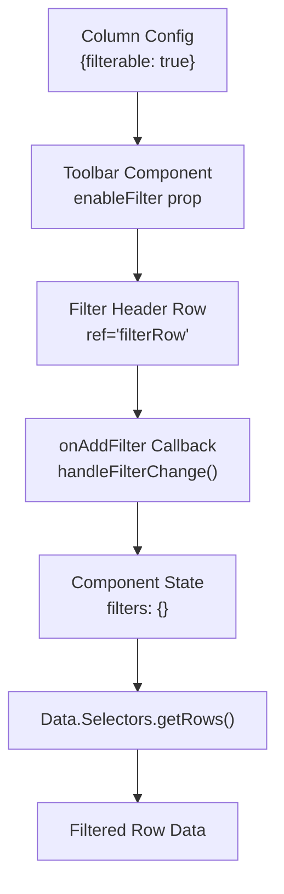
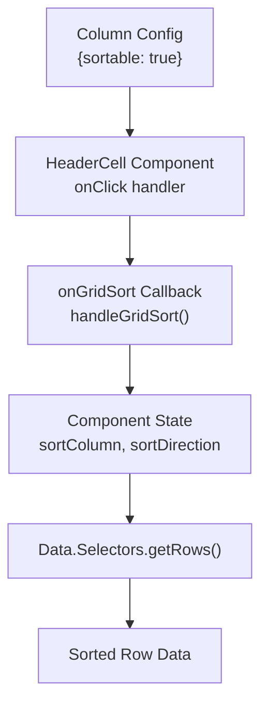
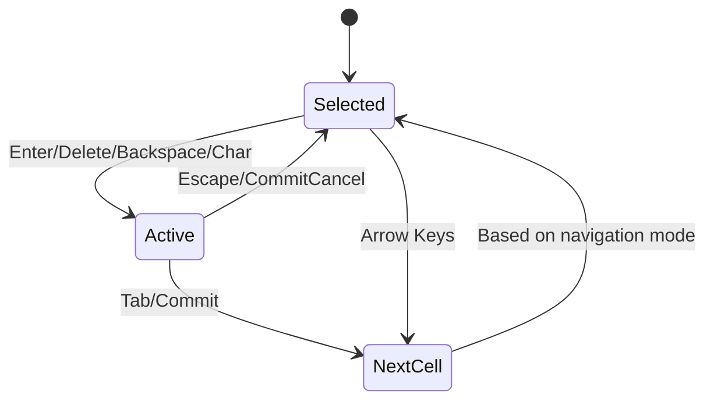
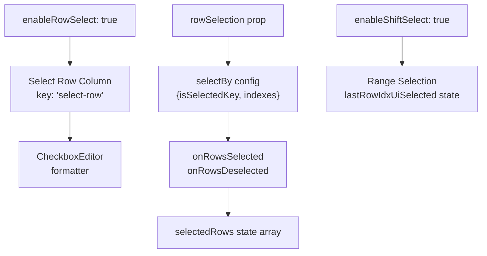
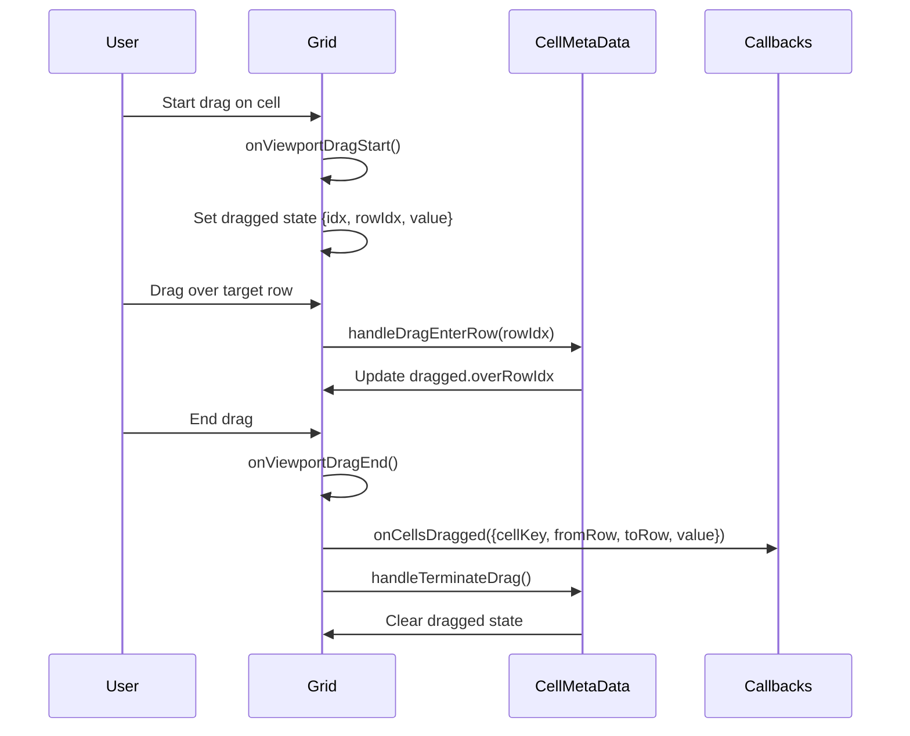
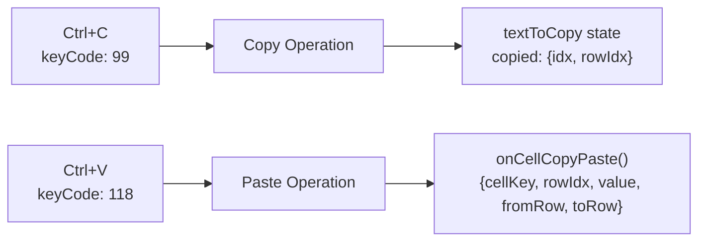
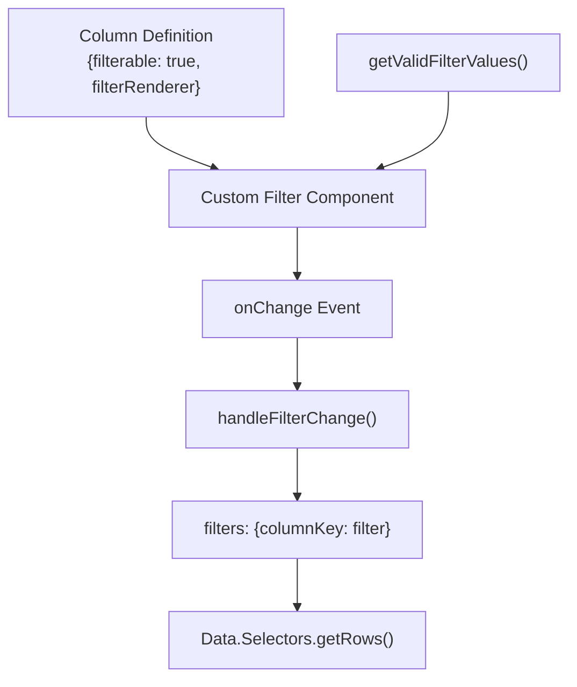
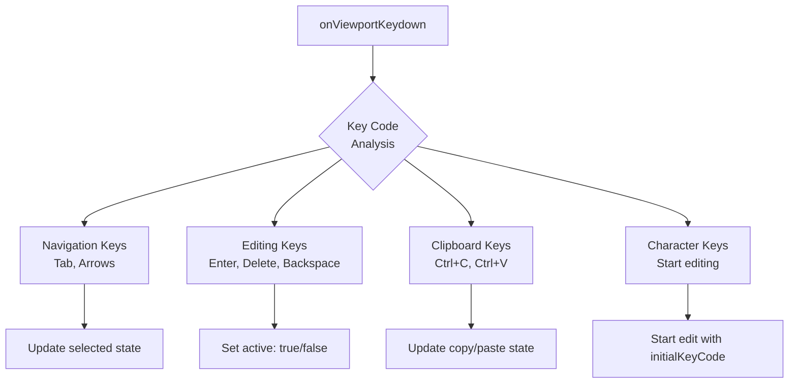

# Advanced Features

Relevant source files

The following files were used as context for generating this wiki page:

- [examples/examples.less](examples/examples.less)
- [examples/scripts/example09-filterable-grid.js](examples/scripts/example09-filterable-grid.js)
- [examples/scripts/example16-filterable-sortable-grid.js](examples/scripts/example16-filterable-sortable-grid.js)
- [examples/scripts/example21-grouping.js](examples/scripts/example21-grouping.js)
- [examples/scripts/example22-custom-filters.js](examples/scripts/example22-custom-filters.js)
- [src/addons/__tests__/Grid.spec.js](src/addons/__tests__/Grid.spec.js)

This document covers the sophisticated capabilities of the React Data Grid that extend beyond basic data display and editing. These features include filtering, sorting, grouping, advanced selection modes, drag-and-drop operations, and keyboard navigation patterns. For basic grid setup and component structure, see [Core Components](#3). For editor-specific functionality, see [Editor System](#4).

## Filtering and Sorting System

The React Data Grid provides hooks for implementing custom filtering and sorting logic through callback props and column configuration flags.

### Column-Level Configuration

Filtering and sorting are enabled per column through boolean flags:

| Property | Type | Description |
|----------|------|-------------|
| `filterable` | boolean | Enables filter input for the column |
| `sortable` | boolean | Makes column header clickable for sorting |
| `filterRenderer` | Component | Custom filter component (optional) |

**Filtering Implementation**

Sources: [examples/scripts/example09-filterable-grid.js:96-104](), [examples/scripts/example16-filterable-sortable-grid.js:106-114]()

**Sorting Implementation**

Sources: [examples/scripts/example16-filterable-sortable-grid.js:101-104]()

### Toolbar Integration

The grid integrates with the `ReactDataGridPlugins.Toolbar` component to provide filtering UI:

- `toolbar={<Toolbar enableFilter={true}/>}` - Enables filter toggle button
- `onAddFilter={handleFilterChange}` - Callback for filter changes  
- `onClearFilters={handleClearFilters}` - Callback for clearing all filters
- `getValidFilterValues={getValidValues}` - Provides autocomplete data for filters

Sources: [examples/scripts/example09-filterable-grid.js:119-122](), [src/addons/__tests__/Grid.spec.js:126-138]()

## Cell Selection and Navigation

The grid supports multiple cell navigation modes controlled by the `cellNavigationMode` prop.

### Navigation Modes

| Mode | Description | Tab Behavior | Arrow Key Behavior |
|------|-------------|--------------|-------------------|
| `'none'` (default) | Stay within current cell | No movement | Normal directional movement |
| `'changeRow'` | Move between rows | Next/previous row | Cross row boundaries |
| `'loopOverRow'` | Loop within row | First/last cell in row | Wrap around row edges |

**Cell Navigation State Management**

Sources: [src/addons/__tests__/Grid.spec.js:241-379]()

### Selection State Structure

The grid maintains selection state in the format:
- `selected: {idx: number, rowIdx: number, active?: boolean, initialKeyCode?: string}`
- `copied: {idx: number, rowIdx: number}` - For copy/paste operations
- `dragged: {idx: number, rowIdx: number, value: any, overRowIdx?: number}` - For drag operations

Sources: [src/addons/__tests__/Grid.spec.js:834-847]()

## Row Selection Features

Advanced row selection supports individual selection, multi-selection with shift-click, and header checkbox for select-all functionality.

### Row Selection Configuration

Sources: [src/addons/__tests__/Grid.spec.js:157-168](), [src/addons/__tests__/Grid.spec.js:414-455]()

### Selection Events

The row selection system provides callbacks for selection changes:
- `onRowsSelected(selectedRows)` - Called when rows are selected
- `onRowsDeselected(deselectedRows)` - Called when rows are deselected  
- `onCellSelected(position)` - Called when individual cells are selected
- `onCellDeSelected(position)` - Called when cells are deselected

Each callback receives row objects with `{rowIdx, row}` structure for the affected rows.

Sources: [src/addons/__tests__/Grid.spec.js:436-447](), [src/addons/__tests__/Grid.spec.js:382-411]()

## Drag and Drop Operations

The grid supports drag and drop for both cell values and column reordering.

### Cell Drag and Drop

**Drag State Flow**

Sources: [src/addons/__tests__/Grid.spec.js:741-794]()

### Column Drag and Drop (Grouping)

Row grouping is implemented through draggable column headers using the `ReactDataGridPlugins.Draggable.Container`:

- `enableDragAndDrop={true}` - Enables drag functionality on the grid
- `draggable: true` - Column property to make headers draggable
- `onColumnGroupAdded(columnName)` - Callback when column is dropped for grouping
- `onRowExpandToggle({columnGroupName, name, shouldExpand})` - Controls group expansion

Sources: [examples/scripts/example21-grouping.js:158-176]()

## Copy and Paste Operations

The grid implements copy/paste functionality through keyboard shortcuts and clipboard integration.

### Copy/Paste Key Bindings

| Key Combination | Action | State Changes |
|----------------|--------|---------------|
| Ctrl+C | Copy cell value | Sets `textToCopy` and `copied` state |
| Ctrl+V | Paste cell value | Triggers `onCellCopyPaste` callback |

**Copy/Paste Data Flow**

Sources: [src/addons/__tests__/Grid.spec.js:615-652]()

## Custom Filter Implementation

Advanced filtering supports custom filter components for specialized data types.

### Built-in Filter Types

The `ReactDataGridPlugins.Filters` namespace provides several filter components:

| Filter Type | Component | Use Case |
|-------------|-----------|----------|
| Default | Text input | String matching |
| `NumericFilter` | Number input with operators | Numeric comparisons |
| `AutoCompleteFilter` | Dropdown with suggestions | Enumerated values |

**Custom Filter Integration**

Sources: [examples/scripts/example22-custom-filters.js:33-74](), [examples/scripts/example22-custom-filters.js:92-105]()

## Keyboard Navigation System

The grid implements comprehensive keyboard shortcuts for navigation and cell manipulation.

### Key Bindings

| Key | Default Action | With Selection | Notes |
|-----|---------------|----------------|-------|
| Tab | Move to next cell | Follows navigation mode | Respects row boundaries |
| Arrow Keys | Directional movement | Normal navigation | Stops at grid edges |
| Enter | Activate cell for editing | Start edit mode | Only if `editable: true` |
| Escape | Cancel edit | Deactivate cell | Returns to selection mode |
| Delete/Backspace | Start edit with clear | Activate with key code | Clears existing content |
| Ctrl+C | Copy cell value | Store in clipboard state | Sets `textToCopy` |
| Ctrl+V | Paste cell value | Apply clipboard content | Triggers callback |

**Keyboard Event Processing**

Sources: [src/addons/__tests__/Grid.spec.js:549-719]()

The keyboard system integrates with the cell metadata object (`cellMetaData`) which coordinates events between the grid and individual cell components through functions like `onCellClick`, `onCommit`, `onCommitCancel`, and `handleDragEnterRow`.

Sources: [src/addons/__tests__/Grid.spec.js:834-847]()
