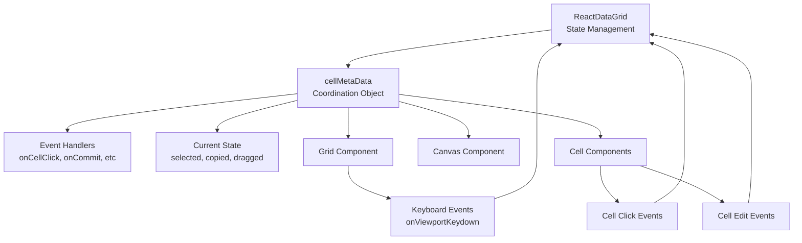
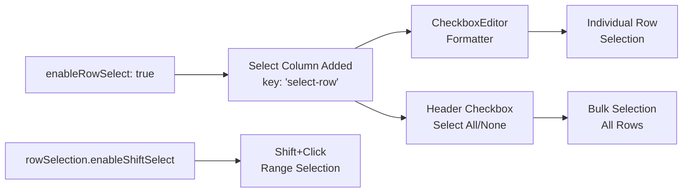
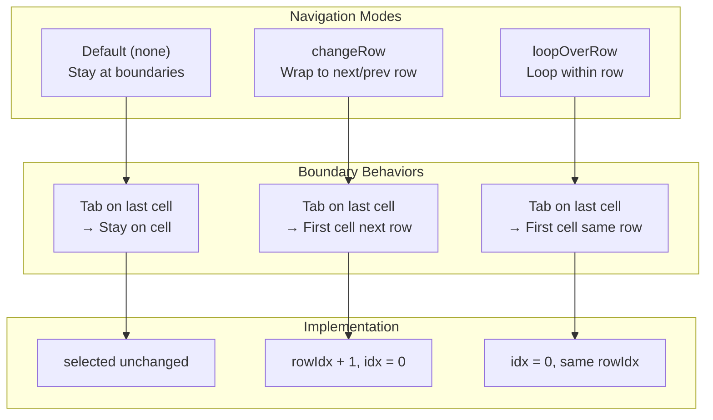
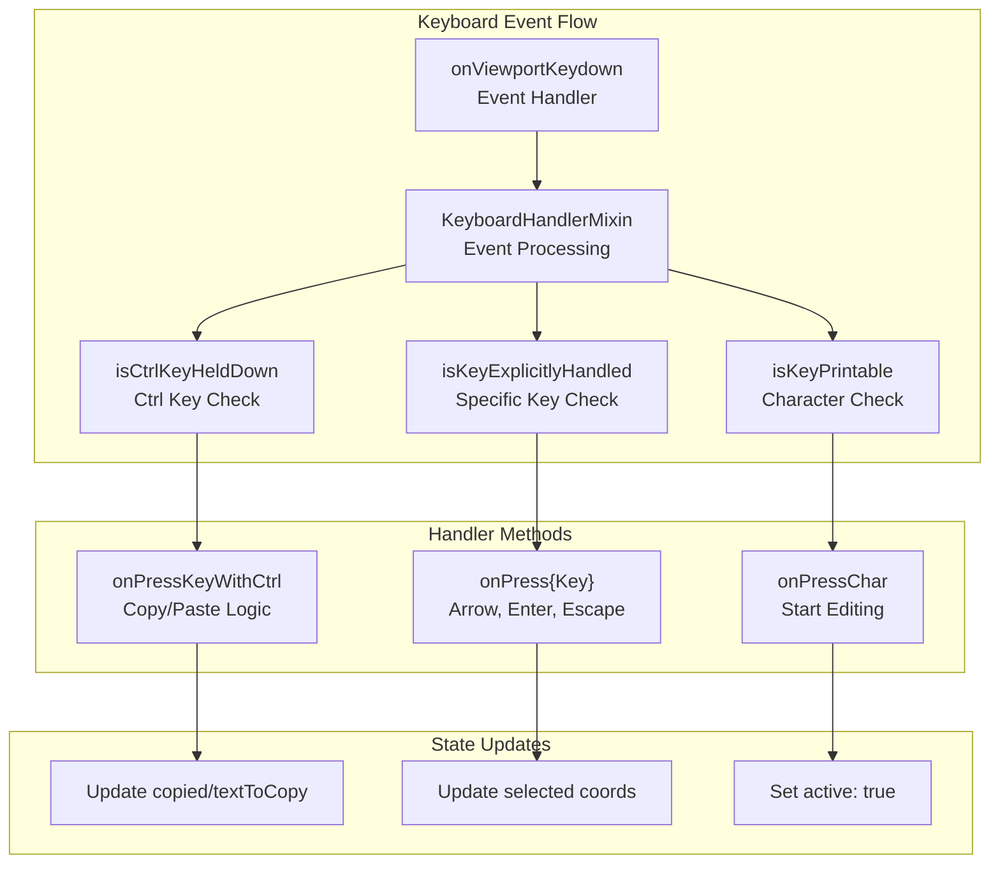
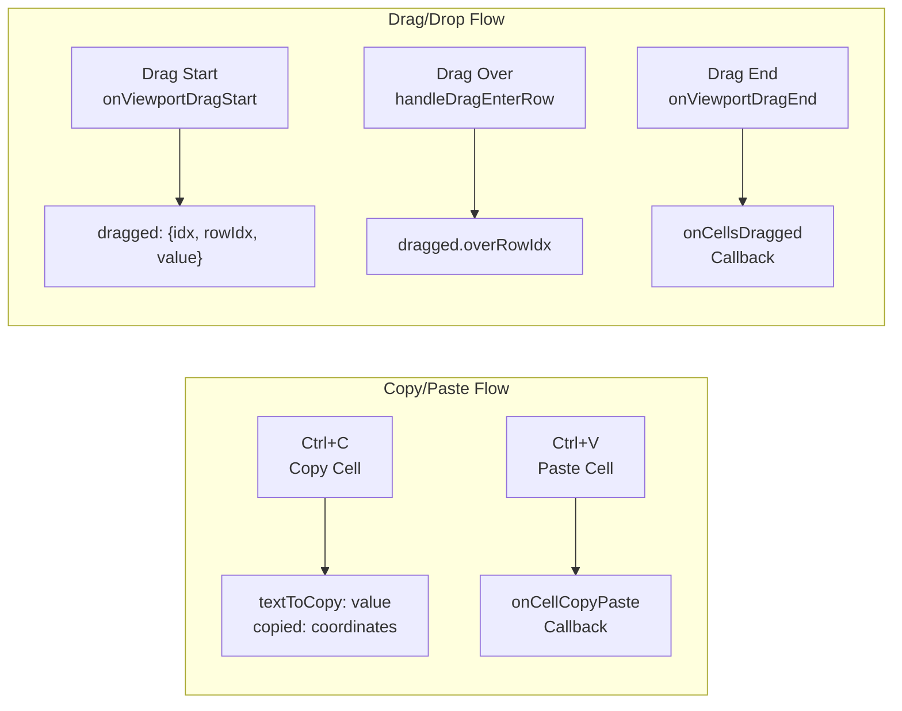

# Cell Selection and Navigation

Relevant source files

The following files were used as context for generating this wiki page:

- [src/KeyboardHandlerMixin.js](src/KeyboardHandlerMixin.js)
- [src/RowUtils.js](src/RowUtils.js)
- [src/ViewportScrollMixin.js](src/ViewportScrollMixin.js)
- [src/__tests__/KeyboardHandlerMixin.spec.js](src/__tests__/KeyboardHandlerMixin.spec.js)
- [src/addons/__tests__/Grid.spec.js](src/addons/__tests__/Grid.spec.js)
- [src/addons/__tests__/data/MockStateObject.js](src/addons/__tests__/data/MockStateObject.js)

This document covers the cell selection and navigation system in react-data-grid, including selection modes, keyboard navigation patterns, and user interaction behaviors. The system provides flexible navigation options and comprehensive keyboard support for efficient data entry and editing workflows.

For information about cell editing and editors, see [Editor System](#4). For details about row-level operations like filtering and sorting, see [Filtering and Sorting](#6.1).

## Overview

The react-data-grid selection and navigation system manages user interactions through a centralized state management approach. Selection state is maintained in the main ReactDataGrid component and propagated to child components via the `cellMetaData` object, enabling coordinated behavior across the grid.

The system supports multiple selection and navigation modes:
- **Cell Selection**: Individual cell focus and selection with `enableCellSelect` 
- **Row Selection**: Full row selection with `enableRowSelect`
- **Navigation Modes**: Different boundary behaviors when navigating between cells
- **Keyboard Navigation**: Comprehensive arrow key and shortcut support

Sources: [src/addons/__tests__/Grid.spec.js:141-155](), [src/addons/__tests__/data/MockStateObject.js:32-35]()

## Selection State Management

The grid maintains selection state through several key properties in the component state:

| State Property | Type | Description |
|---|---|---|
| `selected` | `{idx: number, rowIdx: number, active?: boolean}` | Currently selected cell coordinates |
| `selectedRows` | `Array<{id: any, isSelected: boolean}>` | Row selection state when row selection enabled |
| `copied` | `{idx: number, rowIdx: number}` | Coordinates of copied cell |
| `dragged` | `{idx: number, rowIdx: number, value: any, overRowIdx?: number}` | Drag operation state |

The `cellMetaData` object serves as the central coordination mechanism, providing event handlers and current state to all child components:

Sources: [src/addons/__tests__/Grid.spec.js:834-847](), [src/addons/__tests__/data/MockStateObject.js:1-46]()

## Cell Selection Modes

### Basic Cell Selection

When `enableCellSelect` is enabled, the grid tracks a single selected cell with coordinates `{idx, rowIdx}`. The selection state defaults to `{rowIdx: 0, idx: 0}` when cell selection is enabled, and `{rowIdx: -1, idx: -1}` when disabled.

### Row Selection 

The `enableRowSelect` prop adds a special select column at the beginning of the grid with key `select-row`. This column uses a CheckboxEditor formatter and provides:
- Individual row selection via checkbox clicks
- Select all/deselect all via header checkbox
- Shift-click range selection when `rowSelection.enableShiftSelect` is enabled

Sources: [src/addons/__tests__/Grid.spec.js:157-169](), [src/addons/__tests__/Grid.spec.js:204-238]()

## Navigation Patterns

The grid supports three distinct navigation modes controlled by the `cellNavigationMode` prop:

### Default Navigation (none)
- Navigation stops at row boundaries
- Tab on last cell stays on the same cell
- Arrow left on first cell stays on the same cell
- Provides contained navigation within visible cells

### Change Row Navigation
- Tab on last cell moves to first cell of next row  
- Arrow left on first cell moves to last cell of previous row
- Enables continuous navigation across row boundaries
- Navigation stops at grid boundaries (first/last row)

### Loop Over Row Navigation
- Tab on last cell moves to first cell of same row
- Arrow left on first cell moves to last cell of same row  
- Provides circular navigation within individual rows
- Each row acts as an independent navigation loop

Sources: [src/addons/__tests__/Grid.spec.js:241-380]()

## Keyboard Navigation

The keyboard handling system provides comprehensive navigation and interaction capabilities through the `KeyboardHandlerMixin`:

### Arrow Key Navigation
- **ArrowUp/ArrowDown**: Navigate between rows (`rowIdx ± 1`)
- **ArrowLeft/ArrowRight**: Navigate between columns (`idx ± 1`)
- **Tab**: Forward navigation (respects navigation mode)
- **Shift+Tab**: Backward navigation

### Cell Activation Keys
- **Enter**: Activate selected cell for editing
- **Delete/Backspace**: Activate cell and clear content
- **Printable Characters**: Activate cell and start typing

### Special Function Keys
- **Ctrl+C**: Copy cell value to clipboard state
- **Ctrl+V**: Paste copied value to current cell
- **Escape**: Cancel cell editing and deactivate

Sources: [src/KeyboardHandlerMixin.js:1-71](), [src/addons/__tests__/Grid.spec.js:549-720]()

## Advanced Selection Features

### Copy and Paste Operations

The grid supports cell-level copy and paste operations:
- **Copy** (Ctrl+C): Stores cell value in `textToCopy` state and records source coordinates in `copied`
- **Paste** (Ctrl+V): Calls `onCellCopyPaste` callback with source/destination information

### Drag and Drop Selection

Drag operations are tracked through the `dragged` state object:
- **Drag Start**: Records source cell coordinates and value
- **Drag Over**: Updates `overRowIdx` to track destination
- **Drag End**: Triggers `onCellsDragged` callback with complete operation details

### Selection Event Callbacks

The grid provides optional callbacks for selection events:
- `onCellSelected`: Called when a cell gains focus
- `onCellDeSelected`: Called when a cell loses focus  
- `rowSelection.onRowsSelected`: Called when rows are selected
- `rowSelection.onRowsDeselected`: Called when rows are deselected

Sources: [src/addons/__tests__/Grid.spec.js:615-652](), [src/addons/__tests__/Grid.spec.js:741-795]()

## Row Selection Integration

When using the `rowSelection` prop, the grid integrates with external selection state management:

### Selection Configuration
- **selectBy.indexes**: Array of selected row indices
- **selectBy.keys**: Object with `rowKey` and `values` for key-based selection
- **selectBy.isSelectedKey**: String property name for boolean selection state

### Range Selection
When `enableShiftSelect` is enabled, the grid supports shift-click range selection by tracking `lastRowIdxUiSelected` state and selecting all rows between the last selected and newly clicked rows.

Sources: [src/addons/__tests__/Grid.spec.js:414-547](), [src/RowUtils.js:9-18]()

## Integration with Viewport System

The selection system integrates with the viewport scrolling system to maintain selection state during virtualization. The `ViewportScrollMixin` manages which rows are currently rendered while preserving selection coordinates that may reference non-visible rows.

Selection coordinates (`idx`, `rowIdx`) remain stable regardless of scrolling position, allowing selection to persist across virtual scrolling operations.

Sources: [src/ViewportScrollMixin.js:37-52](), [src/ViewportScrollMixin.js:54-82]()
