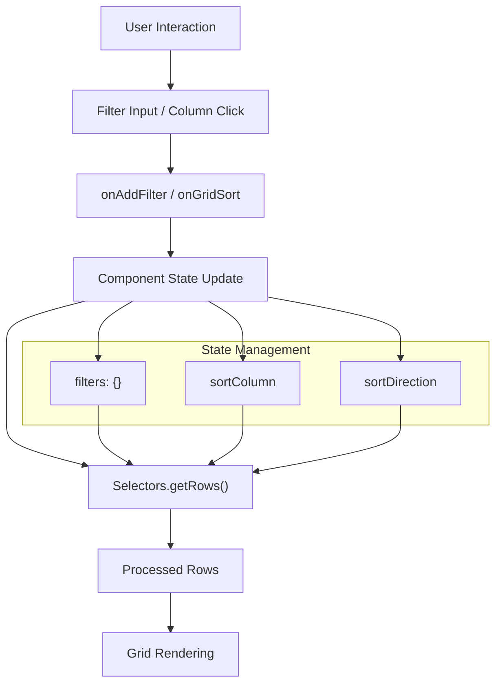
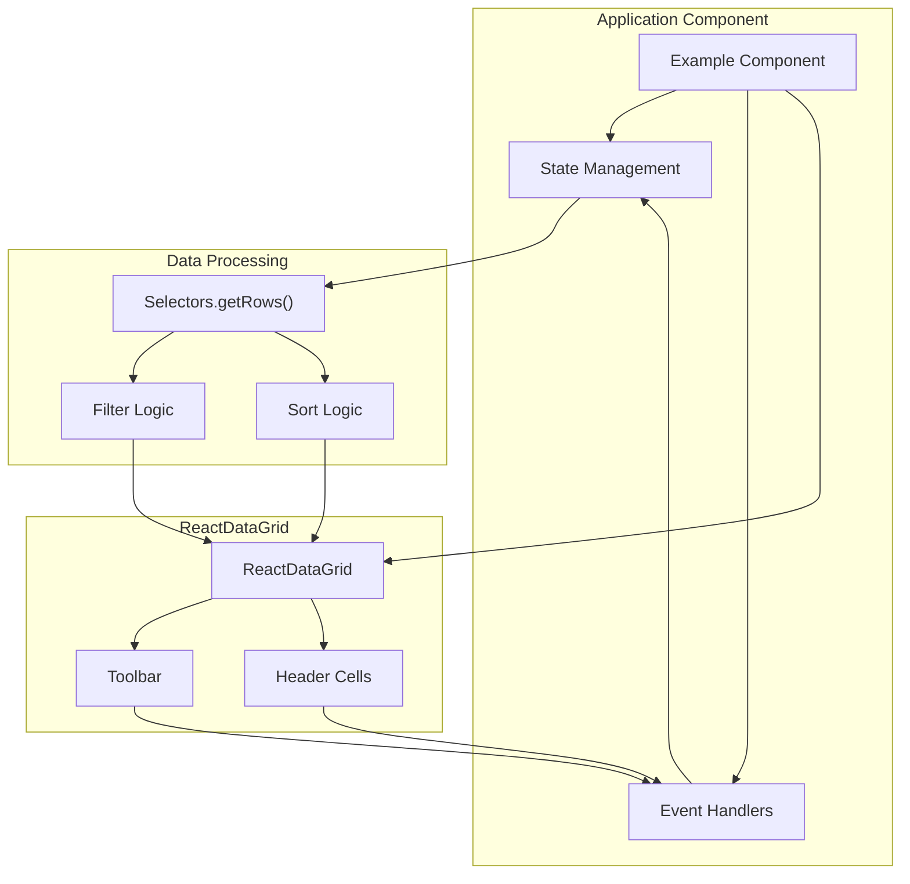

# Filtering and Sorting

<details>
<summary>Relevant source files</summary>

The following files were used as context for generating this wiki page:

- [examples/examples.less](examples/examples.less)
- [examples/scripts/example09-filterable-grid.js](examples/scripts/example09-filterable-grid.js)
- [examples/scripts/example16-filterable-sortable-grid.js](examples/scripts/example16-filterable-sortable-grid.js)
- [examples/scripts/example21-grouping.js](examples/scripts/example21-grouping.js)
- [examples/scripts/example22-custom-filters.js](examples/scripts/example22-custom-filters.js)

</details>


This document covers the filtering and sorting capabilities of React Data Grid, including column-level configuration, event handling, data processing, and custom filter implementations. These features enable users to dynamically filter rows and sort columns in the grid interface.

For information about row selection and keyboard navigation, see [Cell Selection and Navigation](#6.2). For details about the plugin architecture that powers these features, see [Plugin System and Addons](#5).

## Overview

React Data Grid provides hooks for implementing custom filtering and sorting functionality rather than built-in filtering/sorting logic. The grid handles the UI interactions and delegates the actual data processing to the consuming application through callback props and plugin components.

## Basic Filtering Implementation

### Column Configuration

Filtering is enabled per column by setting the `filterable` property:

| Property | Type | Description |
|----------|------|-------------|
| `filterable` | `boolean` | Enables filter input UI for the column |
| `filterRenderer` | `Component` | Custom filter component (optional) |

### Grid Props for Filtering

The ReactDataGrid component accepts these filtering-related props:

| Prop | Type | Description |
|------|------|-------------|
| `onAddFilter` | `function` | Callback when filter value changes |
| `onClearFilters` | `function` | Callback when all filters are cleared |
| `getValidFilterValues` | `function` | Returns valid values for autocomplete filters |
| `toolbar` | `Component` | Toolbar component with filter controls |

### Filter Event Handling

When a user interacts with filter inputs, the grid triggers callbacks with filter objects containing:

- `column`: The column definition object
- `filterTerm`: The filter value entered by the user

The application manages filter state and processes the data accordingly.

**Sources:** [examples/scripts/example09-filterable-grid.js:96-104](), [examples/scripts/example16-filterable-sortable-grid.js:106-114]()

## Basic Sorting Implementation

### Column Configuration

Sorting is enabled per column by setting the `sortable` property:

```javascript
{
  key: 'task',
  name: 'Title',
  sortable: true
}
```

### Grid Props for Sorting

| Prop | Type | Description |
|------|------|-------------|
| `onGridSort` | `function` | Callback when column header is clicked for sorting |

### Sort Event Handling

When a sortable column header is clicked, `onGridSort` receives:
- `sortColumn`: The column key being sorted
- `sortDirection`: Either `'ASC'` or `'DESC'`

**Sources:** [examples/scripts/example16-filterable-sortable-grid.js:101-104]()

## Data Processing Architecture

The filtering and sorting system uses a centralized data processing approach through the `ReactDataGridPlugins.Data.Selectors` module.

### Filter and Sort Flow Diagram



### State Structure

Applications typically maintain this state structure:

```javascript
{
  rows: [], // Original data
  filters: {}, // Active filters by column key
  sortColumn: null, // Currently sorted column
  sortDirection: null // 'ASC' or 'DESC'
}
```

**Sources:** [examples/scripts/example16-filterable-sortable-grid.js:84-86](), [examples/scripts/example09-filterable-grid.js:78-81]()

## Plugin Components

### Toolbar Component

The `ReactDataGridPlugins.Toolbar` provides filter management UI:

```javascript
<Toolbar enableFilter={true}/>
```

This toolbar includes:
- Filter toggle controls
- Clear all filters functionality
- Integration with grid filter state

### Data Selectors

`ReactDataGridPlugins.Data.Selectors.getRows(state)` processes the raw data through filtering and sorting operations based on the component state.

**Sources:** [examples/scripts/example09-filterable-grid.js:6](), [examples/scripts/example16-filterable-sortable-grid.js:6-7]()

## Custom Filters

### Available Filter Types

The grid supports custom filter renderers for specialized filtering needs:

| Filter Type | Component | Use Case |
|-------------|-----------|----------|
| Default | Text input | Basic string filtering |
| `NumericFilter` | Number input with operators | Numeric comparisons |
| `AutoCompleteFilter` | Dropdown with suggestions | Predefined value selection |

### Custom Filter Configuration

```javascript
{
  key: 'priority',
  name: 'Priority',
  filterable: true,
  filterRenderer: ReactDataGridPlugins.Filters.AutoCompleteFilter
}
```

### Filter Renderer Props

Custom filter components receive:
- `onChange`: Callback for filter value changes
- `column`: Column definition
- `filterTerm`: Current filter value

**Sources:** [examples/scripts/example22-custom-filters.js:38-40](), [examples/scripts/example22-custom-filters.js:49-50]()

## Complete Implementation Example

### Component Architecture Diagram



### Key Implementation Methods

| Method | Purpose | Returns |
|--------|---------|---------|
| `getRows()` | Get processed data | Filtered and sorted rows |
| `getSize()` | Get row count | Number of visible rows |
| `rowGetter()` | Get row by index | Single row object |
| `handleFilterChange()` | Process filter updates | State update |
| `handleGridSort()` | Process sort changes | State update |

**Sources:** [examples/scripts/example16-filterable-sortable-grid.js:88-104](), [examples/scripts/example09-filterable-grid.js:83-109]()

## Integration Patterns

### Filter State Management

Applications manage filters as a key-value object where keys are column identifiers:

```javascript
// Filter state structure
filters: {
  'columnKey': {
    column: columnDefinition,
    filterTerm: 'user input'
  }
}
```

### Clearing Filters

The clear filters functionality removes all active filters:

```javascript
onClearFilters: function() {
  this.setState({filters: {}});
}
```

**Sources:** [examples/scripts/example09-filterable-grid.js:106-109](), [examples/scripts/example22-custom-filters.js:107-109]()

## Advanced Features

### Valid Filter Values

For autocomplete filters, applications can provide valid values through `getValidFilterValues`:

```javascript
getValidFilterValues(columnId) {
  let values = this.state.rows.map(r => r[columnId]);
  return values.filter((item, i, a) => { return i == a.indexOf(item); });
}
```

This enables intelligent filtering suggestions based on actual data values.

**Sources:** [examples/scripts/example22-custom-filters.js:102-105](), [examples/scripts/example22-custom-filters.js:121]()
