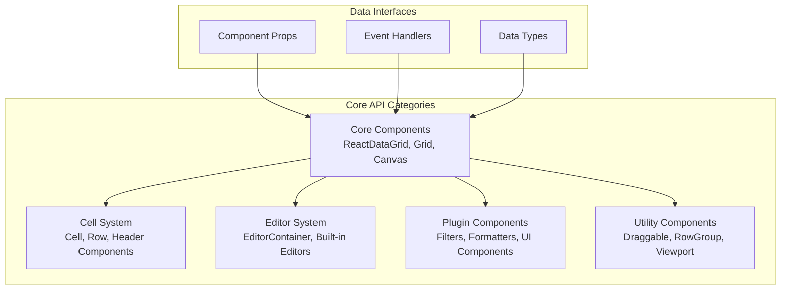
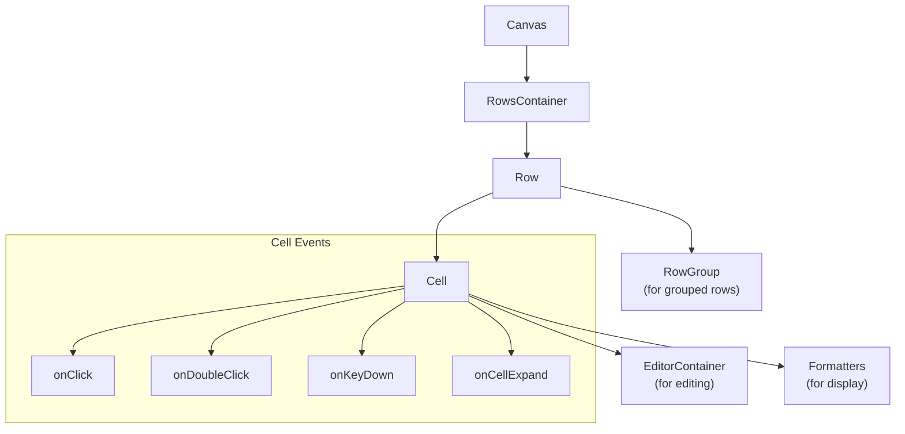
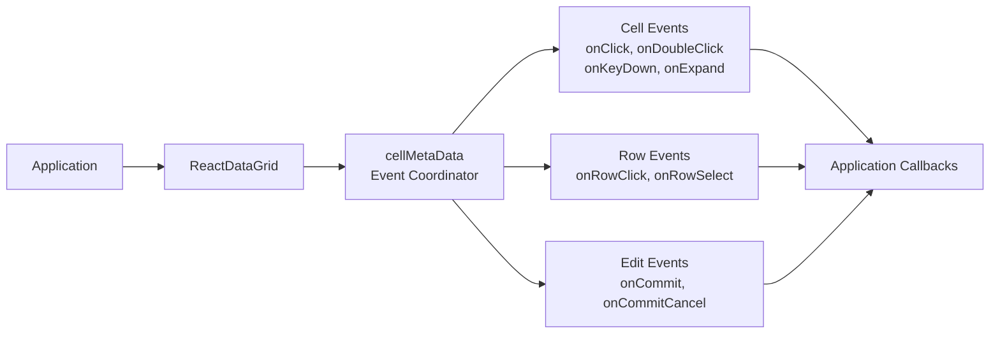

# API Reference

<details>
<summary>Relevant source files</summary>

The following files were used as context for generating this wiki page:

- [docs/api/docs.json](docs/api/docs.json)
- [docs/markdowns/ReactDataGrid.md](docs/markdowns/ReactDataGrid.md)
- [docs/readme.md](docs/readme.md)
- [examples/assets/js/docs.js](examples/assets/js/docs.js)
- [examples/docs/markdowns/ReactDataGrid.md](examples/docs/markdowns/ReactDataGrid.md)

</details>


This document provides comprehensive API documentation for all components, props, methods, and interfaces in the react-data-grid library. It serves as the definitive reference for developers integrating and extending the grid functionality.

For implementation examples and usage patterns, see [Examples and Demos](#7). For information about the plugin system architecture, see [Plugin System and Addons](#5).

## API Structure Overview

The react-data-grid API is organized into several categories of components that work together to provide a complete data grid solution:



**Sources:** [docs/api/docs.json:1-25000](), [docs/readme.md:1-39]()

## Core Components

### ReactDataGrid

The primary component that orchestrates the entire grid system. All other components are composed within or extend from this main component.

#### Props

| Prop | Type | Required | Default | Description |
|------|------|----------|---------|-------------|
| `columns` | `union(object\|array)` | Yes | - | Column definitions |
| `rowGetter` | `func` | Yes | - | Function to retrieve row data |
| `rowsCount` | `number` | Yes | - | Total number of rows |
| `minHeight` | `number` | Yes | `350` | Minimum grid height |
| `rowHeight` | `number` | Yes | `35` | Height of each row |
| `cellNavigationMode` | `enum('none'\|'loopOverRow'\|'changeRow')` | No | `'none'` | Cell navigation behavior |
| `enableCellSelect` | `bool` | No | `false` | Enable cell selection |
| `enableRowSelect` | `union(bool\|string)` | No | `false` | Enable row selection |
| `enableDragAndDrop` | `bool` | No | - | Enable drag and drop |
| `rowKey` | `string` | No | `'id'` | Key field for row identification |
| `tabIndex` | `number` | No | `-1` | Tab index for keyboard navigation |

#### Event Handlers

| Event | Type | Description |
|-------|------|-------------|
| `onCellSelected` | `func` | Fired when a cell is selected |
| `onCellDeSelected` | `func` | Fired when a cell is deselected |
| `onRowClick` | `func` | Fired when a row is clicked |
| `onRowSelect` | `func` | Fired when a row is selected |
| `onGridRowsUpdated` | `func` | Fired when row data is updated |
| `onGridSort` | `func` | Fired when column sorting is triggered |
| `onFilter` | `func` | Fired when filtering is applied |
| `onCellCopyPaste` | `func` | Fired on copy/paste operations |
| `onGridKeyDown` | `func` | Fired on keyboard events |

**Sources:** [docs/api/docs.json:6000-6500](), [docs/markdowns/ReactDataGrid.md:1-210]()

### Grid

The main container component that manages the overall grid layout and coordinates between header and body sections.

#### Props

| Prop | Type | Required | Default | Description |
|------|------|----------|---------|-------------|
| `rowGetter` | `union(array\|func)` | Yes | - | Data source for rows |
| `columns` | `union(array\|object)` | No | - | Column configurations |
| `columnMetrics` | `object` | No | - | Column width calculations |
| `minHeight` | `number` | No | `350` | Minimum grid height |
| `totalWidth` | `union(number\|string)` | No | - | Total grid width |
| `headerRows` | `union(array\|func)` | No | - | Header row configurations |
| `rowHeight` | `number` | No | `35` | Default row height |
| `rowRenderer` | `union(element\|func)` | No | - | Custom row renderer |
| `emptyRowsView` | `func` | No | - | Component for empty grid state |
| `rowsCount` | `number` | No | - | Total number of rows |
| `rowOffsetHeight` | `number` | Yes | - | Offset for row calculations |

#### Methods

| Method | Return Type | Description |
|--------|-------------|-------------|
| `getStyle()` | `{overflow: string, outline: number, position: string, minHeight: number}` | Returns grid container styles |

**Sources:** [docs/api/docs.json:1195-1591]()

### Canvas

Handles virtualization and rendering of the grid body, managing which rows are visible and rendered for performance optimization.

#### Props

| Prop | Type | Required | Default | Description |
|------|------|----------|---------|-------------|
| `rowRenderer` | `union(func\|element)` | No | `require('./Row')` | Component for rendering rows |
| `rowHeight` | `number` | Yes | - | Height of each row |
| `height` | `number` | Yes | - | Canvas height |
| `width` | `number` | No | - | Canvas width |
| `totalWidth` | `union(number\|string)` | No | - | Total content width |
| `displayStart` | `number` | Yes | - | First visible row index |
| `displayEnd` | `number` | Yes | - | Last visible row index |
| `rowsCount` | `number` | Yes | - | Total number of rows |
| `rowGetter` | `union(func\|array)` | No | - | Function to get row data |
| `columns` | `union(object\|array)` | Yes | - | Column definitions |
| `cellMetaData` | `shape` | Yes | - | Cell interaction metadata |
| `selectedRows` | `array` | No | `[]` | Array of selected rows |
| `rowScrollTimeout` | `number` | No | `0` | Scroll debounce timeout |

#### Methods

| Method | Parameters | Return Type | Description |
|--------|------------|-------------|-------------|
| `onRows()` | - | - | Row rendering callback |
| `onScroll(e)` | `e: any` | - | Scroll event handler |
| `getRows(displayStart, displayEnd)` | `displayStart: number, displayEnd: number` | `Array<any>` | Gets rows for rendering |
| `getScroll()` | - | `{scrollTop: number, scrollLeft: number}` | Gets current scroll position |
| `setScrollLeft(scrollLeft)` | `scrollLeft: number` | - | Sets horizontal scroll position |
| `isRowSelected(idx, row)` | `idx, row` | `boolean` | Checks if row is selected |

**Sources:** [docs/api/docs.json:2-481]()

## Cell and Row System

### Cell

Represents individual cells within the grid, handling rendering, editing, selection, and user interactions.

#### Props

| Prop | Type | Required | Default | Description |
|------|------|----------|---------|-------------|
| `rowIdx` | `number` | Yes | - | Row index |
| `idx` | `number` | Yes | - | Column index |
| `column` | `shape` | Yes | - | Column definition |
| `value` | `union(string\|number\|object\|bool)` | Yes | `''` | Cell value |
| `rowData` | `object` | Yes | - | Complete row data |
| `cellMetaData` | `shape` | Yes | - | Cell interaction metadata |
| `selected` | `shape{idx: number}` | No | - | Selection state |
| `height` | `number` | No | - | Cell height |
| `tabIndex` | `number` | No | `-1` | Tab index |
| `isExpanded` | `bool` | No | `false` | Expansion state |
| `isRowSelected` | `bool` | No | - | Row selection state |
| `expandableOptions` | `object` | Yes | - | Expandable cell options |

#### Key Methods

| Method | Parameters | Return Type | Description |
|--------|------------|-------------|-------------|
| `onCellClick(e)` | `e` | - | Handles cell click events |
| `onCellDoubleClick(e)` | `e` | - | Handles cell double-click events |
| `onCellKeyDown(e)` | `e` | - | Handles keyboard events |
| `isCellSelectionChanging(nextProps)` | `nextProps: {idx: number, cellMetaData: {selected: {idx: number}}}` | `boolean` | Checks if selection is changing |
| `getFormatter()` | - | - | Gets cell formatter component |
| `isSelected()` | - | - | Checks if cell is selected |
| `isActive()` | - | - | Checks if cell is active |
| `canEdit()` | - | - | Checks if cell is editable |

**Sources:** [docs/api/docs.json:482-1086]()

### Row

Handles rendering of complete table rows, managing cell layout and row-level interactions.

#### Component Hierarchy



**Sources:** [docs/api/docs.json:482-1086](), [src/Canvas.js:170-181](), [src/Cell.js:486-551]()

## Header System

### Header

Container for the entire header section, managing header row rendering and column interactions.

#### Props

| Prop | Type | Required | Default | Description |
|------|------|----------|---------|-------------|
| `columnMetrics` | `object` | No | - | Column metrics for sizing |
| `onSort` | `func` | No | - | Sort event handler |
| `onColumnResize` | `func` | No | - | Column resize handler |
| `height` | `number` | No | `35` | Header height |
| `headerRows` | `array` | No | - | Header row definitions |

### HeaderCell

Individual header cell component handling column titles, sorting, filtering, and resizing.

#### Props

| Prop | Type | Required | Default | Description |
|------|------|----------|---------|-------------|
| `column` | `object` | Yes | - | Column definition |
| `onSort` | `func` | No | - | Sort callback |
| `onResize` | `func` | No | - | Resize callback |
| `height` | `number` | Yes | - | Cell height |
| `name` | `string` | No | - | Column name |
| `sortDirection` | `enum('ASC'\|'DESC'\|'NONE')` | No | - | Current sort direction |
| `resizable` | `bool` | No | - | Whether column is resizable |

**Sources:** [docs/api/docs.json:1592-2500]()

## Editor System

### EditorContainer

Manages the lifecycle of cell editors, handling editor mounting, validation, and data commitment.

#### Props

| Prop | Type | Required | Description |
|------|------|----------|-------------|
| `rowData` | `object` | No | Row data for editing context |
| `value` | `any` | No | Current cell value |
| `column` | `object` | Yes | Column configuration |
| `onCommit` | `func` | No | Commit callback |
| `onCommitCancel` | `func` | No | Cancel callback |
| `rowIdx` | `number` | No | Row index |
| `idx` | `number` | No | Column index |

### EditorBase

Base class for all cell editors, providing common editor functionality and lifecycle methods.

#### Interface

| Method | Description |
|--------|-------------|
| `getValue()` | Returns current editor value |
| `getInputNode()` | Returns DOM input node |
| `hasResults()` | Checks if editor has validation results |
| `isSelectOpen()` | Checks if dropdown/select is open |

### Built-in Editors

#### AutoCompleteEditor

Provides autocomplete functionality with configurable data sources and filtering.

#### CheckboxEditor  

Boolean value editor with checkbox input.

#### DropDownEditor

Select dropdown editor with configurable options.

#### DateRangeEditor

Date range picker for date/datetime values.

**Sources:** [docs/api/docs.json:7000-9000]()

## Plugin Components

### Filter Components

#### FilterableHeaderCell

Enhanced header cell with integrated filtering capabilities.

#### AutoCompleteFilter

Autocomplete-based filter for text columns.

#### NumericFilter  

Numeric range and comparison filters.

#### DateRangeFilter

Date range filtering component.

### UI Enhancement Components

#### ContextMenu

Right-click context menu for grid interactions.

#### Toolbar Components

- `Toolbar` - Basic toolbar container
- `AdvancedToolbar` - Feature-rich toolbar with grouping
- `GroupedColumnButton` - Column grouping control
- `GroupedColumnsPanel` - Column grouping management panel

### Drag and Drop Components

#### DragDropContainer

Container providing drag and drop context.

#### DraggableHeaderCell

Header cell with drag reordering capability.

#### RowActionsCell

Cell with action buttons for row operations.

**Sources:** [docs/api/docs.json:10000-15000]()

## Formatter Components

Formatters control how cell values are displayed without affecting the underlying data.

### SimpleCellFormatter

Default formatter for basic text display.

### ImageFormatter  

Displays images from URLs or base64 data.

### DropDownFormatter

Shows display text for dropdown values.

### DateRangeFormatter

Formats date ranges for display.

## Data Types and Interfaces

### Column Definition

```typescript
interface Column {
  key: string;
  name: string;
  width?: number;
  resizable?: boolean;
  sortable?: boolean;
  filterable?: boolean;
  editor?: React.Component;
  formatter?: React.Component;
  headerRenderer?: React.Component;
  cellClass?: string | function;
  events?: object;
}
```

### CellMetaData

```typescript
interface CellMetaData {
  selected: {
    idx: number;
    rowIdx: number;
  };
  dragged: object;
  copied: object;
  onCellClick: function;
  onCellDoubleClick: function;
  onCommit: function;
  onCommitCancel: function;
  getCellActions: function;
}
```

### RowSelection Configuration

```typescript
type RowSelection = 
  | { indexes: number[] }
  | { isSelectedKey: string }  
  | { keys: { values: any[], rowKey: string } };
```

**Sources:** [docs/api/docs.json:373-480](), [docs/api/docs.json:1035-1042](), [docs/api/docs.json:424-472]()

## Event System

### Grid Events

The grid uses a centralized event system coordinated through the `cellMetaData` object:



### Event Handler Signatures

| Event | Signature | Description |
|-------|-----------|-------------|
| `onCellSelected` | `(coordinates: {rowIdx, idx})` | Cell selection |
| `onGridRowsUpdated` | `(updateInfo: {fromRow, toRow, updated, action})` | Bulk row updates |
| `onRowClick` | `(rowIdx: number, row: object)` | Row click |
| `onCellCopyPaste` | `(copyInfo: {fromRow, toRow, fromCol, toCol})` | Copy/paste operations |

**Sources:** [docs/api/docs.json:6100-6500](), [src/ReactDataGrid.js:200-300]()
