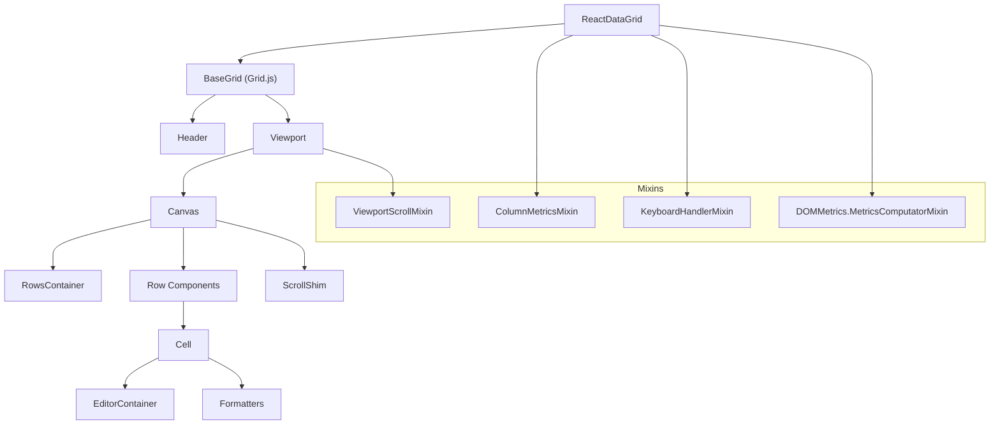
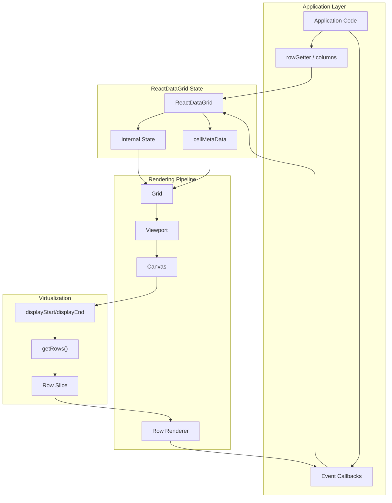
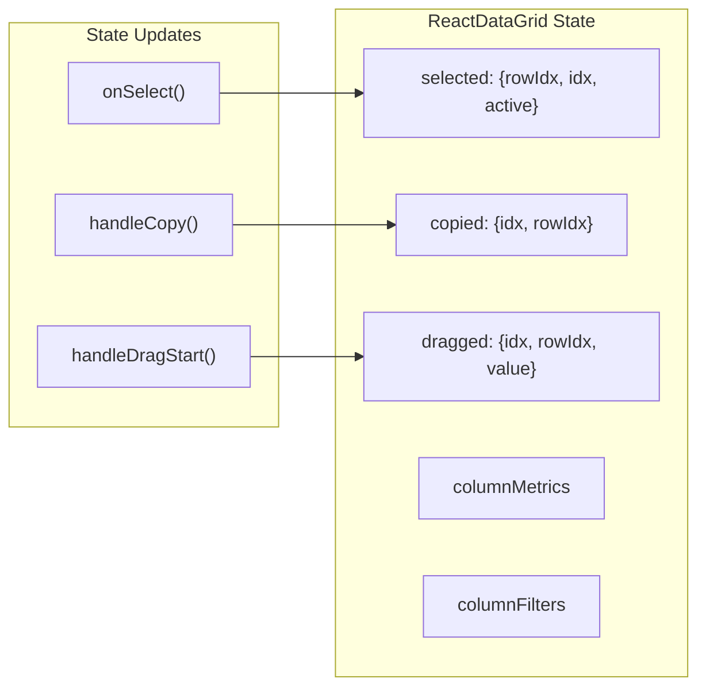
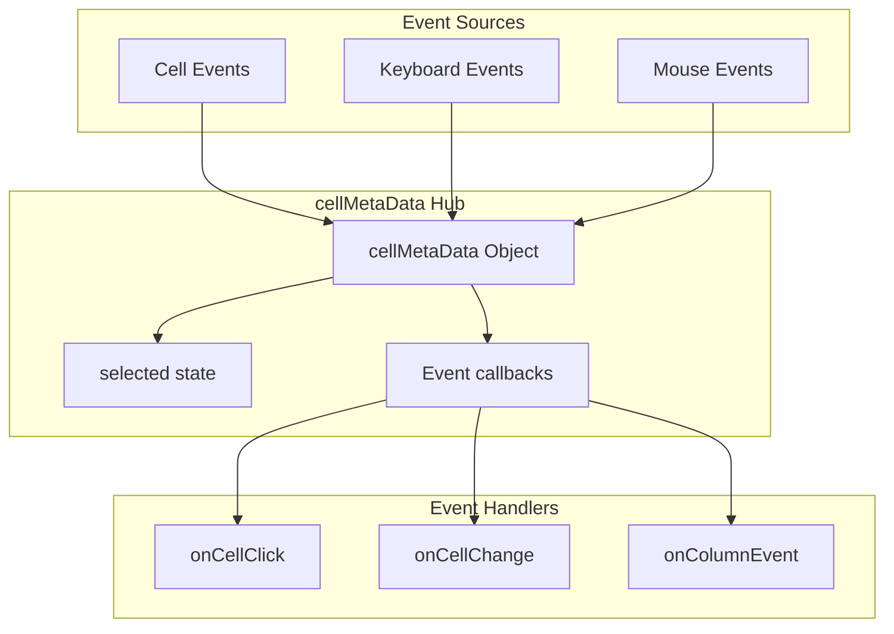

# Core Architecture

Relevant source files

The following files were used as context for generating this wiki page:

- [docs/api/docs.json](docs/api/docs.json)
- [docs/markdowns/ReactDataGrid.md](docs/markdowns/ReactDataGrid.md)
- [examples/docs/markdowns/ReactDataGrid.md](examples/docs/markdowns/ReactDataGrid.md)
- [src/AppConstants.js](src/AppConstants.js)
- [src/Canvas.js](src/Canvas.js)
- [src/Grid.js](src/Grid.js)
- [src/ReactDataGrid.js](src/ReactDataGrid.js)
- [src/Viewport.js](src/Viewport.js)
- [src/__tests__/AppConstants.spec.js](src/__tests__/AppConstants.spec.js)
- [themes/react-data-grid.css](themes/react-data-grid.css)

This document explains the fundamental architectural design of the React Data Grid system, covering the component hierarchy, data flow patterns, and core responsibilities of major system components. 

For information about specific component APIs and props, see [API Reference](#9). For details about the plugin system and extensibility, see [Plugin System and Addons](#5).

## Component Hierarchy

The React Data Grid follows a hierarchical component architecture where each layer has specific responsibilities for rendering and data management.

**Sources:** [src/ReactDataGrid.js:44-48](), [src/Grid.js:9-61](), [src/Canvas.js:1-14](), [src/Viewport.js:1-8]()

## Data Flow Architecture

The data flow follows a unidirectional pattern from the main `ReactDataGrid` component down through the rendering layers, with events flowing back up through callback props.

**Sources:** [src/ReactDataGrid.js:124-133](), [src/Grid.js:79-132](), [src/Canvas.js:189-211](), [src/Viewport.js:45-56]()

## Key Architectural Patterns

### Mixin-Based Functionality

The `ReactDataGrid` component uses React mixins to compose functionality rather than inheritance:

| Mixin | Responsibility | Key Methods |
|-------|---------------|-------------|
| `ColumnMetricsMixin` | Column layout calculations | `createColumnMetrics()`, `getColumn()` |
| `KeyboardHandlerMixin` | Keyboard navigation | `onPressArrowUp()`, `onPressEnter()` |
| `DOMMetrics.MetricsComputatorMixin` | DOM measurements | Size and position calculations |

**Sources:** [src/ReactDataGrid.js:44-48](), [src/ColumnMetricsMixin.js](), [src/KeyboardHandlerMixin.js]()

### State Management Pattern

The main component maintains centralized state with specific patterns:

**Sources:** [src/ReactDataGrid.js:124-133](), [src/ReactDataGrid.js:164-187](), [src/ReactDataGrid.js:361-373]()

## Core Component Responsibilities

### ReactDataGrid Component

The main entry point component handles:
- **State Management**: Cell selection, copying, dragging states [src/ReactDataGrid.js:124-133]()
- **Event Coordination**: Keyboard handling, cell interactions [src/ReactDataGrid.js:213-253]()
- **Column Setup**: Dynamic column configuration including row selection [src/ReactDataGrid.js:796-822]()

### Grid Component  

Acts as the layout container:
- **Structure**: Renders `Header` and `Viewport` components [src/Grid.js:84-132]()
- **Props Delegation**: Passes configuration down to child components [src/Grid.js:85-123]()
- **Conditional Rendering**: Shows empty state when no rows [src/Grid.js:99-129]()

### Canvas Component

Handles virtualization and row rendering:
- **Row Virtualization**: Calculates visible row range [src/Canvas.js:189-211]()
- **Scroll Management**: Processes scroll events and updates display range [src/Canvas.js:128-158]()  
- **Row Rendering**: Delegates to row renderer or renders placeholders [src/Canvas.js:260-288]()
- **Performance Optimization**: Placeholder rendering during rapid scrolling [src/Canvas.js:274-279]()

### Viewport Component

Manages the scrollable area:
- **Scroll Coordination**: Updates Canvas scroll state [src/Viewport.js:45-56]()
- **Layout Container**: Positions Canvas within scrollable bounds [src/Viewport.js:66-106]()
- **Scroll Delegation**: Forwards scroll events to parent components [src/Viewport.js:53-55]()

## Event Flow and cellMetaData System

The architecture uses a centralized event coordination system through the `cellMetaData` object:

**Sources:** [src/ReactDataGrid.js:146-162](), [src/Cell.js:865-906](), [src/Canvas.js:35-35]()

## Plugin Integration Points

The architecture provides several integration points for the plugin system:

- **Global Plugin Registry**: `window.ReactDataGridPlugins` for component extensions
- **Column Events**: Custom event handlers attached to column definitions [src/ReactDataGrid.js:146-162]()
- **Custom Renderers**: `rowRenderer`, `rowGroupRenderer` props for rendering customization
- **Editor Integration**: `EditorContainer` system for custom cell editors

**Sources:** [src/ReactDataGrid.js:796-822](), [src/addons/index.js]()

This layered architecture enables efficient rendering of large datasets through virtualization while maintaining flexibility for customization through the plugin system and event-driven interactions.
