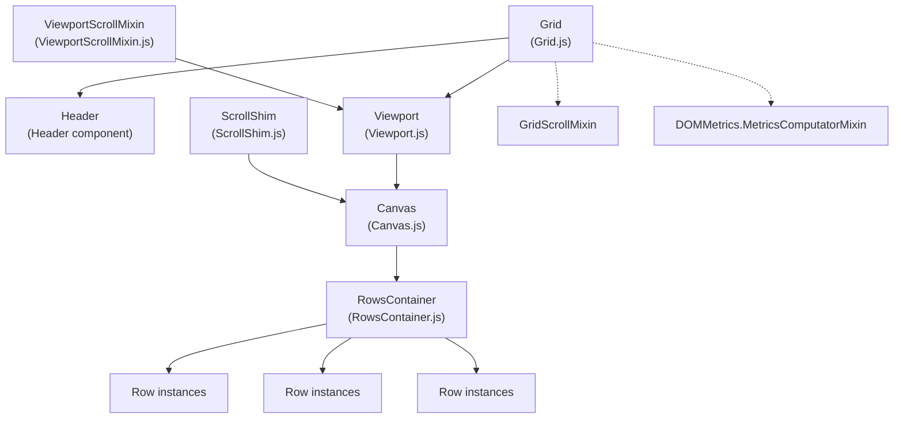
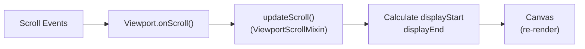
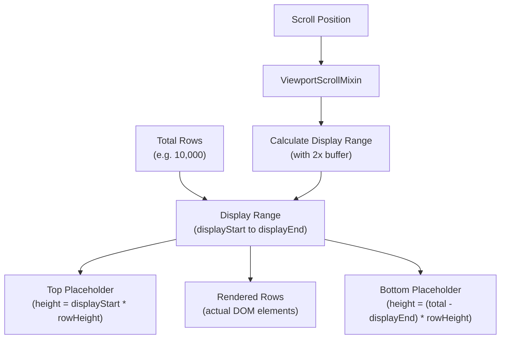
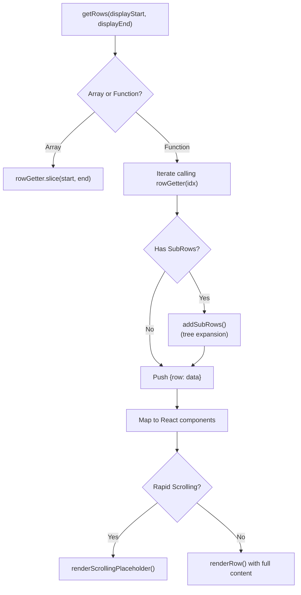
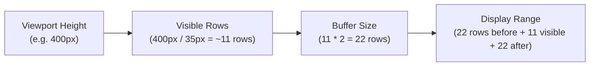

# Grid Rendering System

Relevant source files

The following files were used as context for generating this wiki page:

- [src/Canvas.js](src/Canvas.js)
- [src/Grid.js](src/Grid.js)
- [src/KeyboardHandlerMixin.js](src/KeyboardHandlerMixin.js)
- [src/RowUtils.js](src/RowUtils.js)
- [src/Viewport.js](src/Viewport.js)
- [src/ViewportScrollMixin.js](src/ViewportScrollMixin.js)
- [src/__tests__/KeyboardHandlerMixin.spec.js](src/__tests__/KeyboardHandlerMixin.spec.js)
- [src/addons/__tests__/data/MockStateObject.js](src/addons/__tests__/data/MockStateObject.js)

The Grid Rendering System is the core virtualization and rendering pipeline that efficiently displays large datasets by rendering only the visible rows plus a buffer. This system consists of three main components working together: Grid, Viewport, and Canvas, along with the ViewportScrollMixin that handles virtualization calculations.

For information about the main ReactDataGrid component that coordinates the entire grid system, see [2.1](#2.1). For details about individual cell and row components, see [3.1](#3.1).

## Architecture Overview

The rendering system follows a hierarchical component structure where each layer has specific responsibilities:

Sources: [src/Grid.js:1-136](), [src/Viewport.js:1-109](), [src/Canvas.js:1-382](), [src/ViewportScrollMixin.js:1-124]()

## Grid Component

The `Grid` component serves as the top-level container that orchestrates the header and viewport areas. It manages the overall grid layout and delegates rendering responsibilities to its child components.

| Property | Purpose | Type |
|----------|---------|------|
| `rowGetter` | Function or array providing row data | `PropTypes.oneOfType([PropTypes.array, PropTypes.func])` |
| `columnMetrics` | Column layout calculations | `PropTypes.object` |
| `rowHeight` | Height of individual rows | `PropTypes.number` |
| `rowsCount` | Total number of rows in dataset | `PropTypes.number` |
| `minHeight` | Minimum grid height | `PropTypes.number` |

The Grid component renders two main areas:
- **Header area**: Contains column headers, sorting, and filtering controls
- **Viewport area**: Contains the scrollable data rows with virtualization

Sources: [src/Grid.js:10-56](), [src/Grid.js:79-132]()

## Viewport Component

The `Viewport` component manages the scrollable area and integrates with the virtualization system through the `ViewportScrollMixin`. It acts as the bridge between scroll events and the Canvas rendering.

Key responsibilities:
- Position itself absolutely below the header using `rowOffsetHeight`
- Handle scroll events and delegate to ViewportScrollMixin
- Pass calculated `displayStart` and `displayEnd` to Canvas
- Maintain scroll position through `setScrollLeft()` method

Sources: [src/Viewport.js:7-43](), [src/Viewport.js:45-56](), [src/Viewport.js:66-106]()

## Canvas Component and Virtualization

The `Canvas` component implements the core virtualization logic by rendering only the rows that are visible or near-visible, plus placeholder elements for the non-rendered portions.

### Virtualization Strategy

The Canvas uses a sophisticated virtualization approach:

The virtualization process works as follows:

1. **Range Calculation**: ViewportScrollMixin calculates `displayStart` and `displayEnd` based on scroll position
2. **Row Rendering**: Canvas renders only rows within this range using `getRows(displayStart, displayEnd)`
3. **Placeholder Generation**: Empty placeholder divs maintain correct scrollbar dimensions
4. **Scroll Optimization**: During rapid scrolling, lightweight placeholders replace full row rendering

Sources: [src/Canvas.js:189-211](), [src/Canvas.js:323-354](), [src/ViewportScrollMixin.js:54-82]()

### Row Rendering Process

The Canvas component handles row rendering with several optimization strategies:

The rendering optimization includes:
- **Scroll timeout**: During rapid scrolling, render lightweight placeholders instead of full rows
- **Sub-row support**: Handle expandable/tree-like row structures
- **Row selection**: Track selected rows and apply appropriate styling

Sources: [src/Canvas.js:189-211](), [src/Canvas.js:260-288](), [src/Canvas.js:290-309]()

## ViewportScrollMixin

The `ViewportScrollMixin` contains the mathematical calculations that make virtualization possible by determining which rows should be rendered based on scroll position.

### Virtualization Calculations

| Calculation | Formula | Purpose |
|-------------|---------|---------|
| `renderedRowsCount` | `ceil(height / rowHeight)` | Rows visible in viewport |
| `visibleStart` | `floor(scrollTop / rowHeight)` | First visible row index |
| `visibleEnd` | `min(visibleStart + renderedRowsCount, length)` | Last visible row index |
| `displayStart` | `max(0, visibleStart - renderedRowsCount * 2)` | First row to render (with buffer) |
| `displayEnd` | `min(visibleStart + renderedRowsCount * 2, length)` | Last row to render (with buffer) |

The key insight is the 2x buffer strategy: render twice as many rows as visible to provide smooth scrolling while minimizing DOM elements.

Sources: [src/ViewportScrollMixin.js:41-52](), [src/ViewportScrollMixin.js:54-82]()

## Scroll Performance Optimizations

The system includes several performance optimizations for smooth scrolling:

### Scroll Timeout Mechanism

During rapid scrolling, the Canvas switches to rendering lightweight placeholders:

- **Detection**: Compare scroll distance to display range to detect rapid scrolling
- **Placeholder Rendering**: Show simple colored rectangles instead of full cell content
- **Timeout Recovery**: After scrolling stops, render full content after configurable delay

### Scroll Shim

The `ScrollShim` mixin provides cross-browser scroll handling and maintains scroll synchronization between header and body.

Sources: [src/Canvas.js:128-158](), [src/Canvas.js:290-309]()

## Integration Points

The rendering system integrates with other grid subsystems through several key interfaces:

- **Cell Metadata**: `cellMetaData` prop provides event handlers and selection state to rendered cells
- **Column Metrics**: Column width and positioning information from the column management system
- **Row Data**: Integration with data sources through `rowGetter` prop
- **Event Propagation**: Scroll events bubble up through `onScroll` callbacks

Sources: [src/Canvas.js:16-56](), [src/Grid.js:79-132](), [src/Viewport.js:45-56]()
