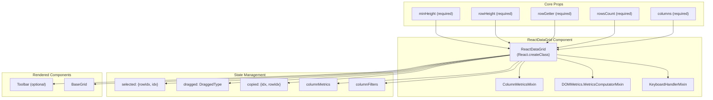
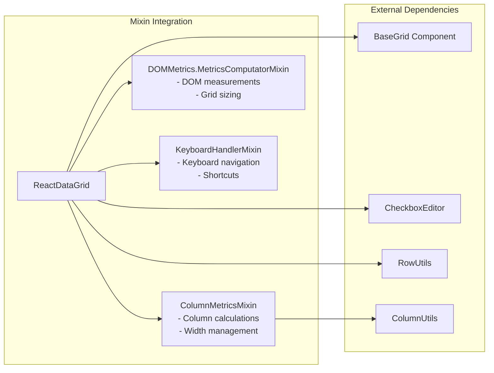
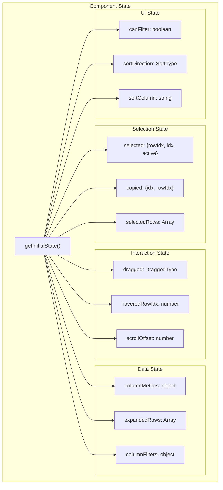
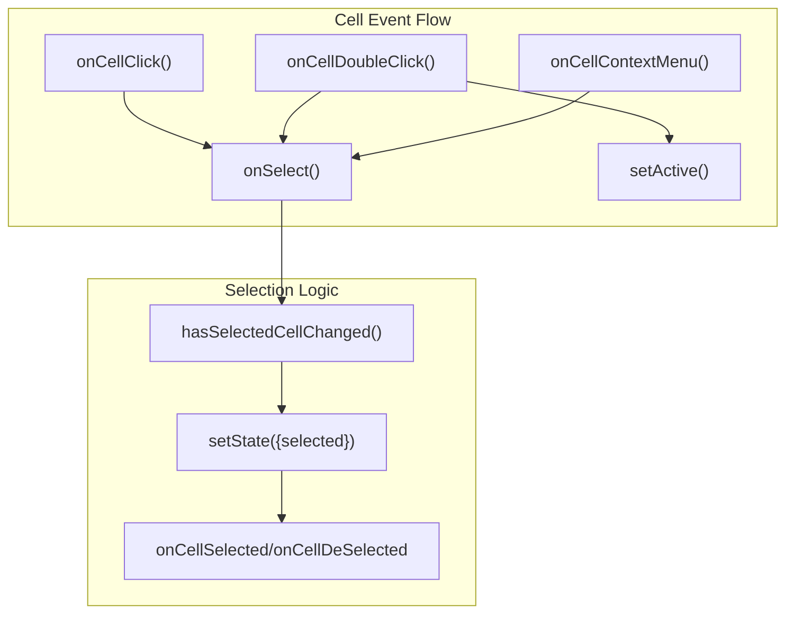
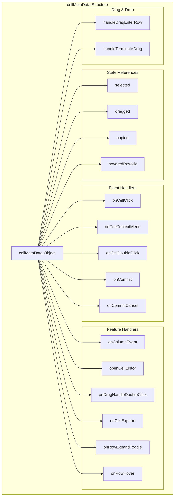
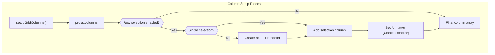
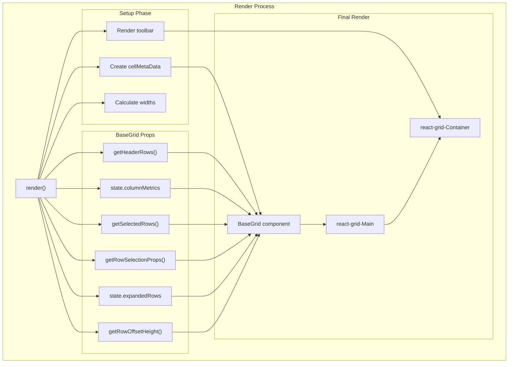

# Main ReactDataGrid Component

Relevant source files

The following files were used as context for generating this wiki page:

- [docs/api/docs.json](docs/api/docs.json)
- [docs/markdowns/ReactDataGrid.md](docs/markdowns/ReactDataGrid.md)
- [examples/docs/markdowns/ReactDataGrid.md](examples/docs/markdowns/ReactDataGrid.md)
- [src/AppConstants.js](src/AppConstants.js)
- [src/ReactDataGrid.js](src/ReactDataGrid.js)
- [src/__tests__/AppConstants.spec.js](src/__tests__/AppConstants.spec.js)
- [themes/react-data-grid.css](themes/react-data-grid.css)

## Purpose and Scope

This document covers the main `ReactDataGrid` component, which serves as the primary entry point and orchestrator for the entire data grid system. The `ReactDataGrid` component is responsible for state management, event coordination, and rendering the complete grid interface including headers, cells, and interactive features.

For information about the underlying rendering pipeline, see [Grid Rendering System](#2.2). For details about individual cell and row components, see [Cell and Row Components](#3.1). For editor functionality, see [Editor System](#4).

## Component Overview

The `ReactDataGrid` component is defined in [src/ReactDataGrid.js]() and serves as the main interface for consumers of the data grid library. It combines multiple mixins to provide column metrics calculation, DOM measurements, and keyboard handling capabilities.

**Sources:** [src/ReactDataGrid.js:42-48](), [src/ReactDataGrid.js:124-133]()

## Component Architecture and Mixins

The `ReactDataGrid` component utilizes three key mixins that provide essential functionality:

| Mixin | Purpose | Key Methods |
|-------|---------|-------------|
| `ColumnMetricsMixin` | Calculates column widths and positioning | `createColumnMetrics()`, `getColumn()` |
| `DOMMetrics.MetricsComputatorMixin` | Handles DOM measurements | `gridWidth()`, `DOMMetrics` |
| `KeyboardHandlerMixin` | Manages keyboard navigation and shortcuts | Arrow key handlers, `onPressTab()`, `onPressEnter()` |

**Sources:** [src/ReactDataGrid.js:44-48](), [src/ReactDataGrid.js:1-13]()

## Props Interface

The component accepts numerous props for configuration, with several required props and many optional ones for extending functionality:

### Required Props

| Prop | Type | Purpose |
|------|------|---------|
| `columns` | `object \| array` | Column definitions with keys, names, and configuration |
| `rowsCount` | `number` | Total number of rows to display |
| `rowGetter` | `function` | Function to retrieve row data by index |
| `rowHeight` | `number` | Height of each row in pixels (default: 35) |
| `minHeight` | `number` | Minimum height of the grid (default: 350) |

### Selection and Interaction Props

| Prop | Type | Default | Purpose |
|------|------|---------|---------|
| `enableCellSelect` | `boolean` | `false` | Enable individual cell selection |
| `enableRowSelect` | `boolean \| string` | `false` | Enable row selection (true/false/'single') |
| `cellNavigationMode` | `enum` | `'none'` | Cell navigation behavior |
| `rowSelection` | `object` | - | Advanced row selection configuration |

**Sources:** [src/ReactDataGrid.js:50-109](), [src/ReactDataGrid.js:111-122]()

## State Management

The component maintains several pieces of state to coordinate user interactions and grid behavior:

**Sources:** [src/ReactDataGrid.js:124-133]()

## Event Handling and Coordination

The `ReactDataGrid` component acts as a central event coordinator, handling user interactions and delegating to appropriate handlers:

### Cell Events

### Keyboard Navigation

The component provides comprehensive keyboard navigation through inherited mixin methods:

| Key | Handler | Action |
|-----|---------|--------|
| Arrow Keys | `onPressArrow*()` | Move selection in grid |
| Tab | `onPressTab()` | Move to next/previous cell |
| Enter | `onPressEnter()` | Activate cell for editing |
| Delete/Backspace | `onPressDelete()/onPressBackspace()` | Clear cell and enter edit mode |
| Ctrl+C/Ctrl+V | `onPressKeyWithCtrl()` | Copy/paste operations |

**Sources:** [src/ReactDataGrid.js:213-277](), [src/ReactDataGrid.js:189-207]()

## cellMetaData Object

A critical aspect of the component architecture is the `cellMetaData` object, which serves as a communication mechanism between the main component and child components:

**Sources:** [src/ReactDataGrid.js:841-860]()

## Grid Column Setup

The component dynamically configures columns based on props, potentially adding selection columns:

**Sources:** [src/ReactDataGrid.js:796-822]()

## Render Method and Component Integration

The `render()` method orchestrates the final grid assembly:

**Sources:** [src/ReactDataGrid.js:840-901]()
