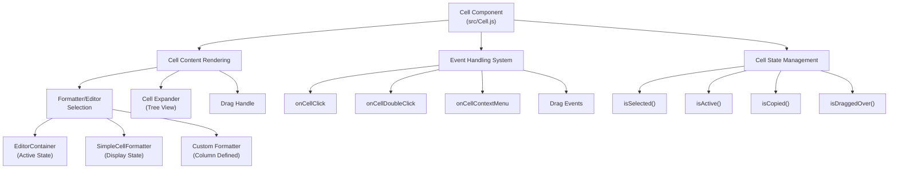
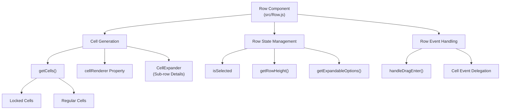
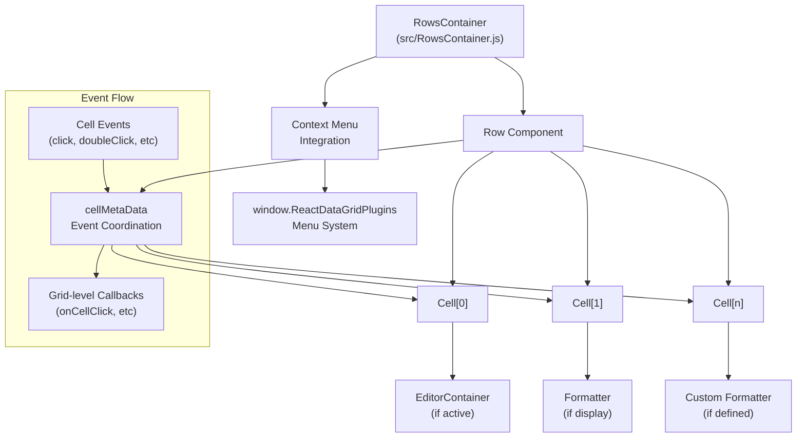
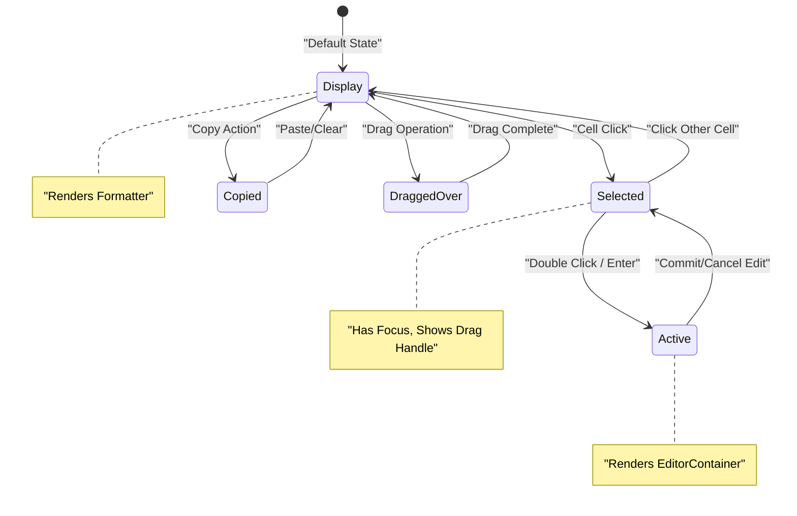
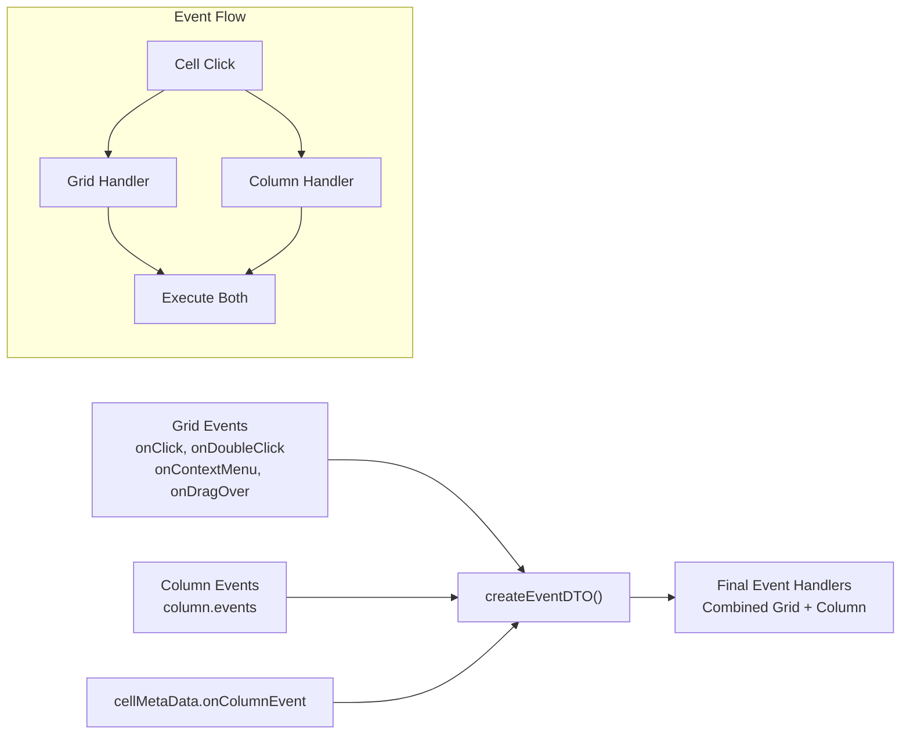
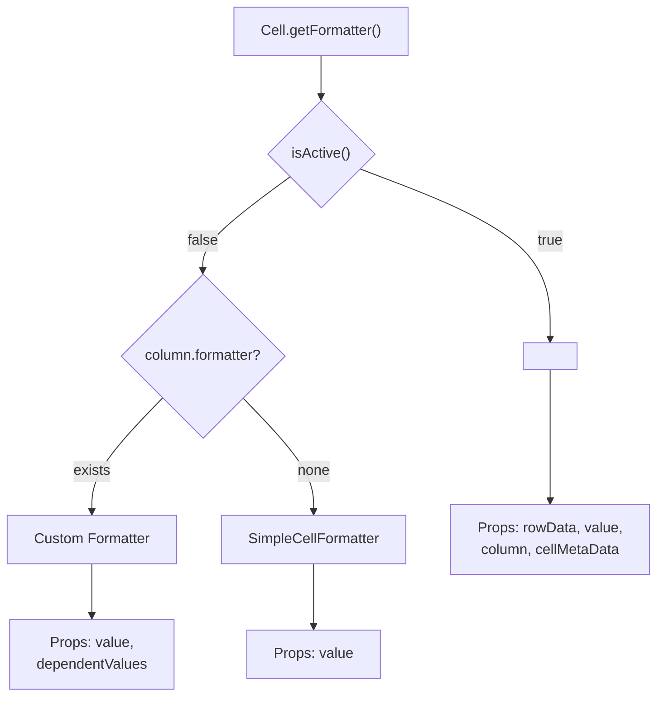
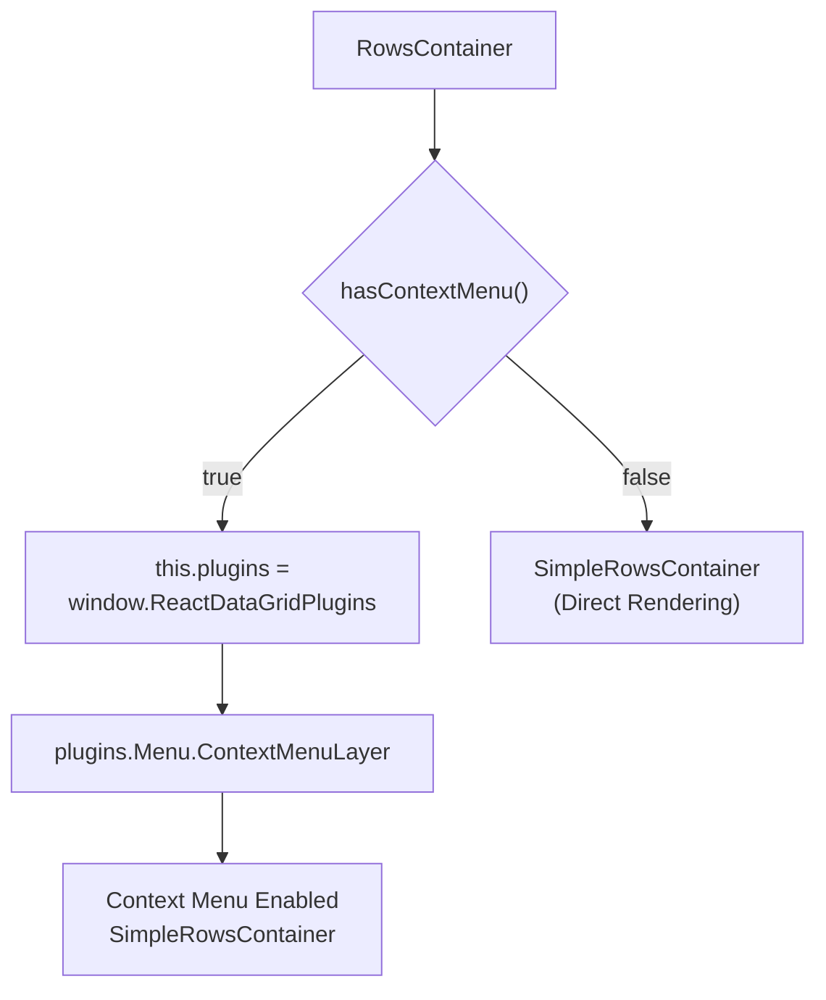

# Cell and Row Components

Relevant source files

The following files were used as context for generating this wiki page:

- [src/Cell.js](src/Cell.js)
- [src/Row.js](src/Row.js)
- [src/RowsContainer.js](src/RowsContainer.js)
- [src/__tests__/Cell.spec.js](src/__tests__/Cell.spec.js)
- [src/__tests__/RowsContainer.spec.js](src/__tests__/RowsContainer.spec.js)
- [src/addons/index.js](src/addons/index.js)

This document covers the core rendering components of the react-data-grid system: the `Cell` and `Row` components, along with their container `RowsContainer`. These components form the foundation of the grid's visual presentation and handle user interactions, editing, and data display. For information about the editor system that integrates with these components, see [Editor System](#4). For details about the overall grid rendering pipeline, see [Grid Rendering System](#2.2).

## Component Architecture Overview

The cell and row rendering system follows a hierarchical structure where `RowsContainer` manages multiple `Row` components, and each `Row` manages multiple `Cell` components. The components coordinate through a shared `cellMetaData` object that handles event propagation and state management.

### Cell Component Structure

Sources: [src/Cell.js:1-480]()

### Row Component Structure

Sources: [src/Row.js:1-214]()

## Component Hierarchy and Data Flow

The following diagram shows how data and events flow between the row and cell components:

Sources: [src/RowsContainer.js:16-61](), [src/Row.js:78-109](), [src/Cell.js:89-131]()

## Cell Component Lifecycle and States

The `Cell` component manages several distinct states that determine its rendering behavior and user interaction capabilities:

| State Method | Purpose | Key Properties |
|--------------|---------|----------------|
| `isSelected()` | Cell is currently selected | `cellMetaData.selected.rowIdx` and `idx` match |
| `isActive()` | Cell is in edit mode | `isSelected()` and `cellMetaData.selected.active === true` |
| `isCopied()` | Cell is in clipboard | `cellMetaData.copied` matches cell coordinates |
| `isDraggedOver()` | Cell is being dragged over | `cellMetaData.dragged.overRowIdx` matches |

### Cell State Transitions

Sources: [src/Cell.js:202-217](), [src/Cell.js:278-304]()

## Event Handling System

The cell and row components implement a comprehensive event system that supports both grid-level and column-level event handlers:

### Cell Event Processing

The `Cell` component's `getEvents()` method merges grid events with column-specific events:

Sources: [src/Cell.js:414-429](), [src/Cell.js:386-412]()

### Row Event Delegation

The `Row` component handles drag-and-drop operations and delegates cell-specific events:

- **`handleDragEnter()`**: Manages row-level drag operations [src/Row.js:54-59]()
- **Cell event propagation**: Passes `cellMetaData` to all child cells for event coordination [src/Row.js:86-99]()

## Editor Integration

When a cell becomes active (`isActive()` returns true), the rendering switches from formatters to the editor system:

### Editor vs Formatter Decision Logic

Sources: [src/Cell.js:146-153](), [src/Cell.js:431-449]()

## Plugin System Integration

The components integrate with the global plugin system through `window.ReactDataGridPlugins`:

### RowsContainer Plugin Integration

The `RowsContainer` component demonstrates plugin usage for context menus:

Sources: [src/RowsContainer.js:19-33](), [src/addons/index.js:10-11]()

## CSS Classes and Styling

The components apply dynamic CSS classes based on state:

### Cell CSS Classes

The `getCellClass()` method applies classes conditionally:

| Class Name | Condition | Purpose |
|------------|-----------|---------|
| `react-grid-Cell` | Always | Base cell styling |
| `react-grid-Cell--locked` | `column.locked` | Locked column styling |
| `row-selected` | `isRowSelected` | Row selection indicator |
| `selected` | `isSelected() && !isActive()` | Cell selection styling |
| `editing` | `isActive()` | Active edit mode styling |
| `copied` | `isCopied()` | Clipboard operation styling |
| `active-drag-cell` | `isSelected() || isDraggedOver()` | Drag operation styling |

Sources: [src/Cell.js:166-184]()

### Row CSS Classes

Row styling includes alternating row colors and selection states:

- **`react-grid-Row`**: Base row class
- **`react-grid-Row--even/odd`**: Alternating row styling based on `idx % 2`
- **`row-selected`**: Applied when `isSelected` prop is true
- **`row-context-menu`**: Applied when context menu is displayed

Sources: [src/Row.js:188-196]()

## Performance Optimizations

Both components implement `shouldComponentUpdate()` methods to minimize re-renders:

### Cell Update Conditions

The Cell component updates only when necessary properties change:
- Column width or position changes
- Height changes
- Row index changes  
- Selection state changes
- Drag/copy state changes
- Value changes
- Dependent values change (via `hasChangedDependentValues()`)

Sources: [src/Cell.js:73-87](), [src/Cell.js:236-249]()

### Row Update Conditions

The Row component optimizes updates by checking:
- Column configuration changes
- Selected cell presence in row
- Drag operations affecting row
- Row data changes
- Selection state changes

Sources: [src/Row.js:42-52]()
