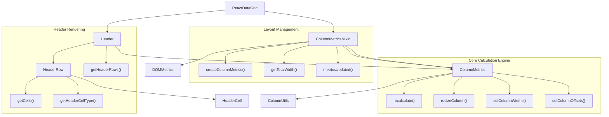
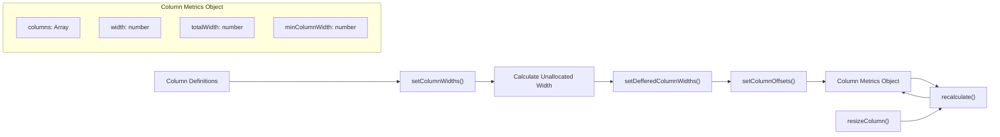
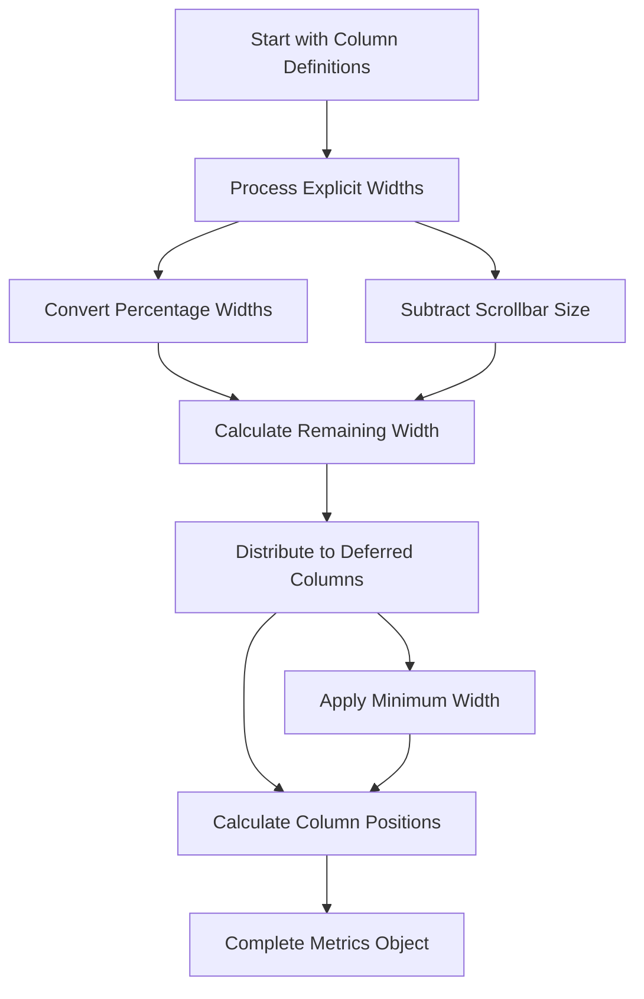
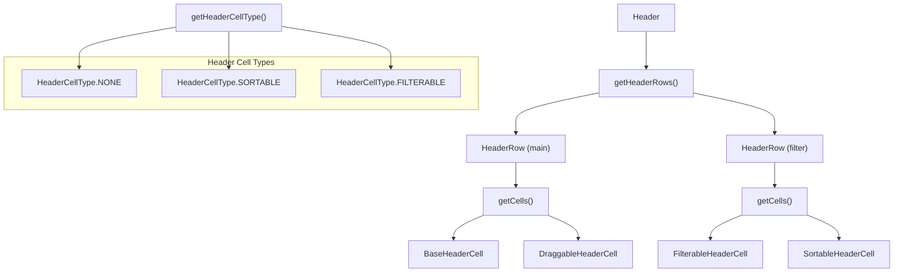
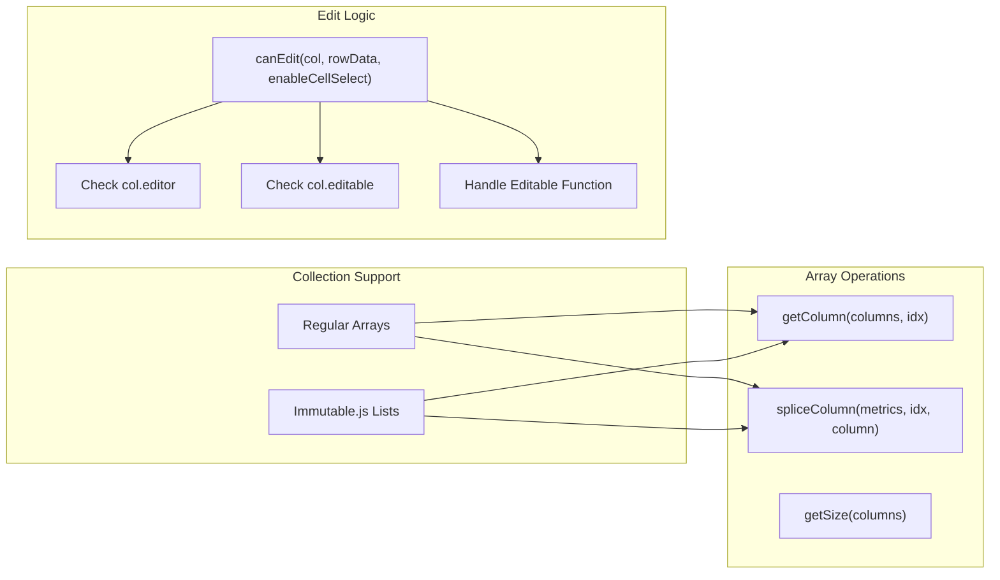
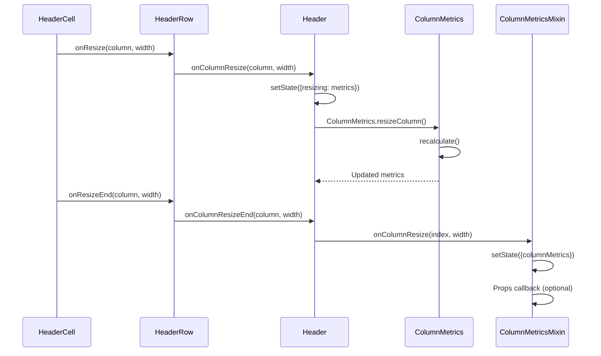

# Column Management

Relevant source files

The following files were used as context for generating this wiki page:

- [src/ColumnMetrics.js](src/ColumnMetrics.js)
- [src/ColumnMetricsMixin.js](src/ColumnMetricsMixin.js)
- [src/ColumnUtils.js](src/ColumnUtils.js)
- [src/Header.js](src/Header.js)
- [src/HeaderRow.js](src/HeaderRow.js)
- [src/__tests__/ColumnUtils.spec.js](src/__tests__/ColumnUtils.spec.js)
- [src/__tests__/Header.spec.js](src/__tests__/Header.spec.js)

## Purpose and Scope

Column management in React Data Grid encompasses the calculation, sizing, positioning, and rendering of grid columns. This system handles column width calculations, layout metrics, header rendering, and column-related utilities. The column management system is responsible for determining how columns are displayed, resized, and positioned within the grid viewport.

For information about cell rendering and row components, see [Cell and Row Components](#3.1). For details about the header system's sorting and filtering capabilities, see [Header System](#3.2).

## Architecture Overview

The column management system consists of several interconnected components that work together to handle column layout and rendering:

**Column Management System Architecture**

Sources: [src/ColumnMetrics.js:1-155](), [src/ColumnMetricsMixin.js:1-119](), [src/Header.js:1-191](), [src/HeaderRow.js:1-169]()

## Column Metrics System

The `ColumnMetrics` module serves as the core calculation engine for column layout. It provides functions to compute column widths, positions, and handle resizing operations.

**Column Metrics Data Flow**

The core data structures and functions include:

| Function | Purpose | Input | Output |
|----------|---------|-------|--------|
| `recalculate()` | Recalculates all column metrics | `ColumnMetricsType` | Updated metrics |
| `resizeColumn()` | Resizes a specific column | metrics, index, width | Updated metrics |
| `setColumnWidths()` | Sets widths for columns with defined widths | columns, totalWidth | Updated columns |
| `setDefferedColumnWidths()` | Sets widths for columns without defined widths | columns, unallocatedWidth, minWidth | Updated columns |
| `setColumnOffsets()` | Calculates left position for each column | columns | Updated columns with positions |

Sources: [src/ColumnMetrics.js:18-104]()

## Column Layout and Sizing

Column width calculation follows a two-phase approach: first calculating widths for columns with explicit widths, then distributing remaining space among columns without defined widths.

**Width Calculation Process**

The `ColumnMetricsMixin` integrates this calculation system with React components:

- **`createColumnMetrics()`** [src/ColumnMetricsMixin.js:102-109]() - Creates initial column metrics from props
- **`getTotalWidth()`** [src/ColumnMetricsMixin.js:58-66]() - Determines total available width using DOM measurements or fallback calculation
- **`onColumnResize()`** [src/ColumnMetricsMixin.js:111-117]() - Handles column resize events and updates metrics

Sources: [src/ColumnMetrics.js:31-84](), [src/ColumnMetricsMixin.js:58-117]()

## Header Management System

The header system manages the rendering of column headers through a hierarchical component structure. The `Header` component coordinates multiple `HeaderRow` components, each responsible for rendering individual header cells.

**Header Component Hierarchy**

The header rendering process involves:

1. **Header Row Creation** [src/Header.js:76-120]() - Creates multiple header rows with proper positioning
2. **Cell Type Determination** [src/HeaderRow.js:56-64]() - Determines whether cells should be sortable, filterable, or plain
3. **Cell Rendering** [src/HeaderRow.js:108-138]() - Renders appropriate header cells with proper event handlers

Sources: [src/Header.js:76-120](), [src/HeaderRow.js:56-138]()

## Column Utilities

The `ColumnUtils` module provides utility functions for working with column collections, supporting both regular JavaScript arrays and Immutable.js collections.

**Column Utility Functions**

Key utility functions:

- **`getColumn(columns, idx)`** [src/ColumnUtils.js:3-9]() - Safely retrieves column by index from arrays or Immutable lists
- **`spliceColumn(metrics, idx, column)`** [src/ColumnUtils.js:11-18]() - Replaces column at specified index
- **`getSize(columns)`** [src/ColumnUtils.js:20-26]() - Returns collection size regardless of type
- **`canEdit(col, rowData, enableCellSelect)`** [src/ColumnUtils.js:30-35]() - Determines if column is editable based on configuration

Sources: [src/ColumnUtils.js:1-36]()

## Column Resizing Process

Column resizing involves coordination between header components and the metrics system to provide real-time visual feedback and final metric updates.

**Column Resize Flow**

The resize process maintains a temporary resizing state in the `Header` component [src/Header.js:47-66]() while providing immediate visual feedback, then commits the final changes through the `ColumnMetricsMixin` [src/ColumnMetricsMixin.js:111-117]().

Sources: [src/Header.js:47-74](), [src/ColumnMetricsMixin.js:111-117]()
