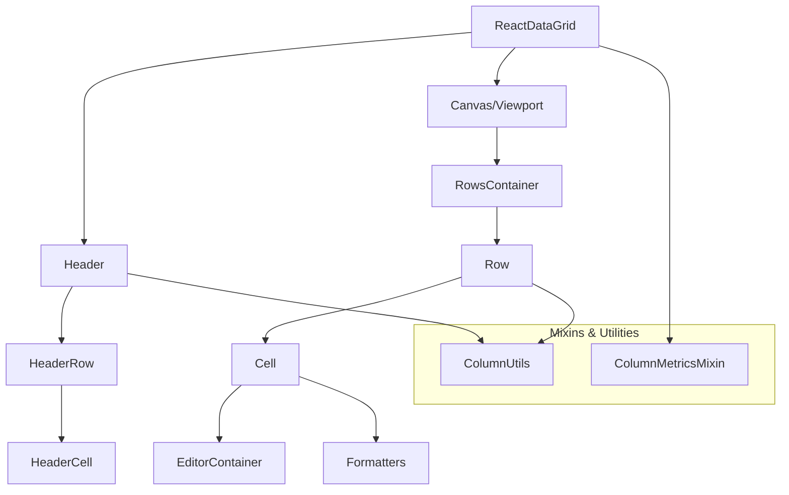
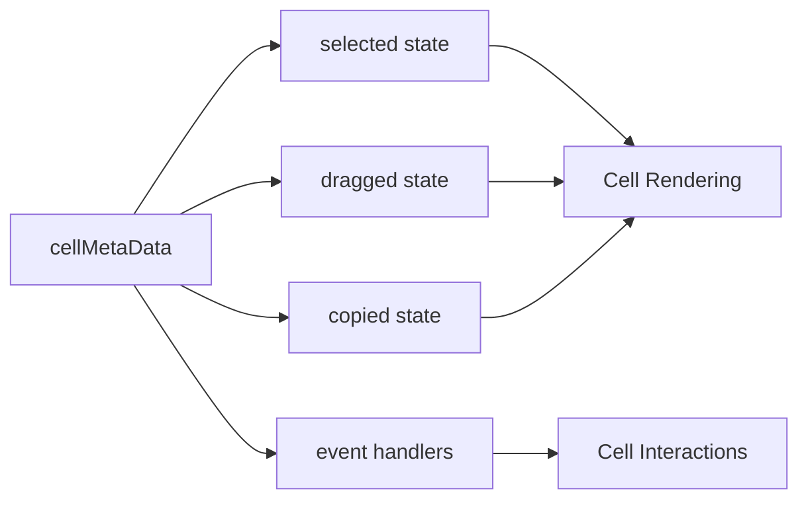
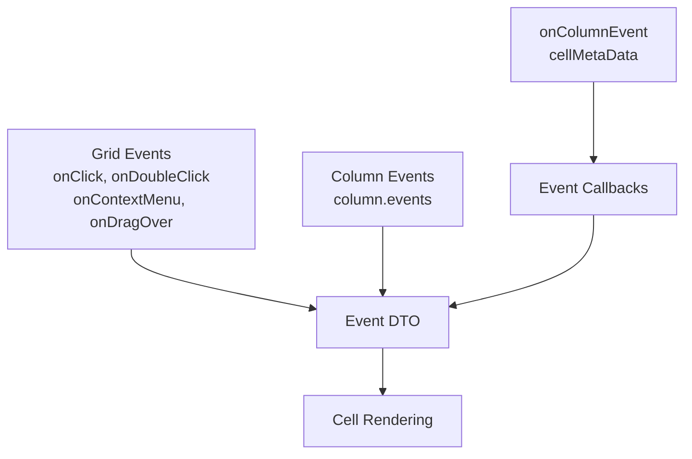
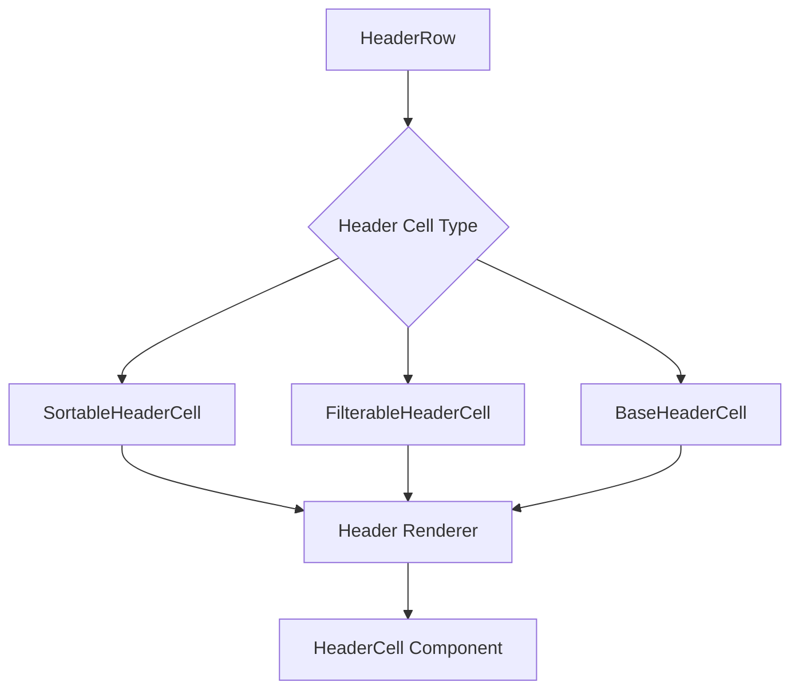
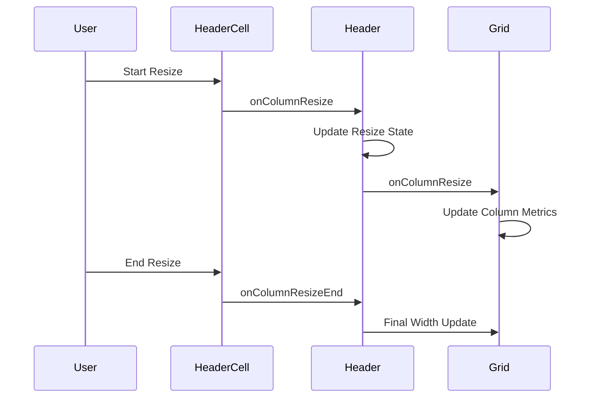
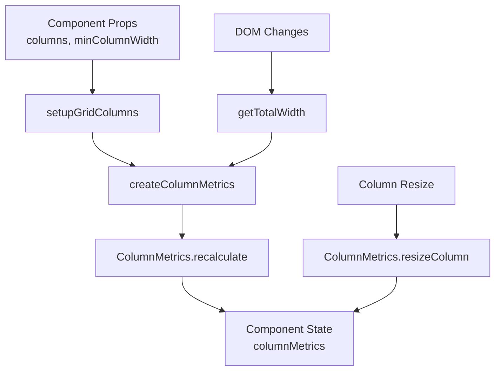
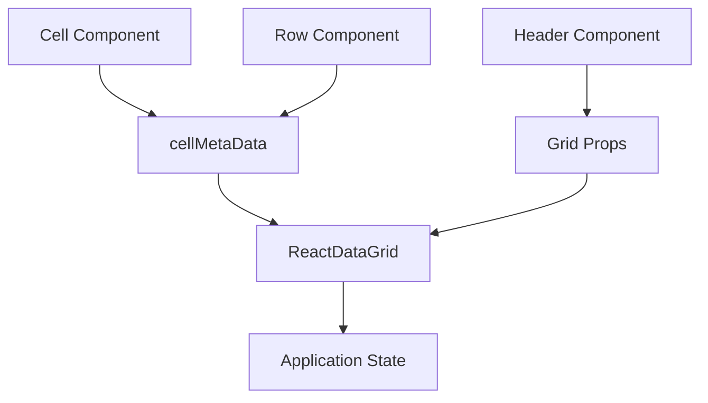
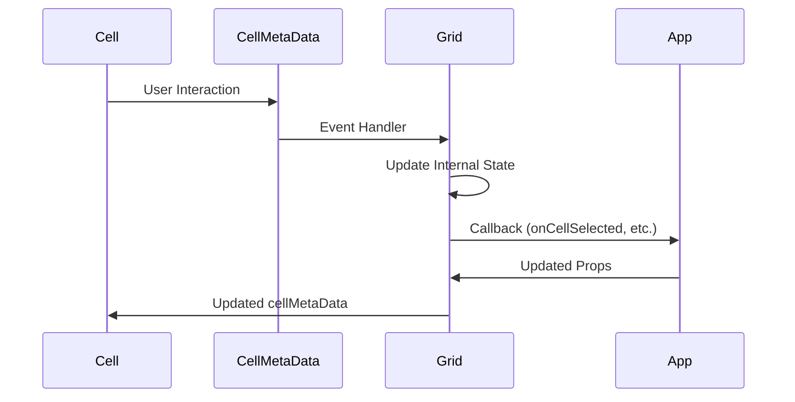

# Core Components

<details>
<summary>Relevant source files</summary>

The following files were used as context for generating this wiki page:

- [src/Cell.js](src/Cell.js)
- [src/ColumnMetricsMixin.js](src/ColumnMetricsMixin.js)
- [src/Header.js](src/Header.js)
- [src/HeaderRow.js](src/HeaderRow.js)
- [src/Row.js](src/Row.js)
- [src/__tests__/Cell.spec.js](src/__tests__/Cell.spec.js)

</details>


This document covers the fundamental building blocks that compose the React Data Grid system. These components handle the essential rendering, interaction, and layout management for grid functionality. For information about the overall grid architecture and main ReactDataGrid component, see [Core Architecture](#2). For details about the editor system specifically, see [Editor System](#4).

The core components form a hierarchical structure where the main grid delegates rendering responsibilities to specialized components for headers, rows, and individual cells. Each component manages its own state and interactions while coordinating through a centralized metadata system.

## Component Hierarchy and Relationships

The core components are organized in a clear hierarchy that mirrors the visual structure of the grid:



Sources: [src/Cell.js](), [src/Row.js](), [src/HeaderRow.js](), [src/Header.js](), [src/ColumnMetricsMixin.js]()

## Cell Component

The `Cell` component is the most complex core component, responsible for rendering individual data cells and managing their interactions. It serves as the primary interface between the grid's data and user interactions.

### Core Responsibilities

| Responsibility | Implementation |
|----------------|----------------|
| **Content Rendering** | Uses formatters or displays raw values via `SimpleCellFormatter` |
| **Edit Mode** | Switches to `EditorContainer` when cell becomes active |
| **Selection State** | Manages visual states for selected, copied, and dragged cells |
| **Event Handling** | Processes click, double-click, context menu, and keyboard events |
| **Focus Management** | Controls focus behavior within the grid viewport |
| **Drag Operations** | Handles drag-and-drop functionality with visual feedback |

The Cell component uses an intelligent update strategy through `shouldComponentUpdate` to optimize performance:

```javascript
shouldComponentUpdate(nextProps) {
  return this.props.column.width !== nextProps.column.width
    || this.props.column.left !== nextProps.column.left
    || this.props.height !== nextProps.height
    || this.props.rowIdx !== nextProps.rowIdx
    || this.isCellSelectionChanging(nextProps)
    || this.isDraggedCellChanging(nextProps)
    || this.isCopyCellChanging(nextProps)
    // ... additional checks
}
```

### State Management and Interaction

The Cell component coordinates with the grid through the `cellMetaData` prop, which contains centralized state and event handlers:



Sources: [src/Cell.js:12-477](), [src/__tests__/Cell.spec.js:10-22]()

### Cell Event System

The Cell component implements a sophisticated event system that supports both grid-level and column-specific events. Events can be defined at the column level and are merged with default grid events:



Sources: [src/Cell.js:414-429](), [src/Cell.js:380-412]()

## Row Component

The `Row` component manages collections of cells and handles row-level state and interactions. It serves as the container for horizontal data presentation and coordinates cell rendering.

### Key Features

The Row component provides several essential capabilities:

- **Cell Collection Management**: Creates and manages `Cell` components for each column
- **Row Selection**: Handles visual styling and state for selected rows  
- **Expandable Rows**: Supports hierarchical data with expandable/collapsible functionality
- **Scroll Synchronization**: Coordinates horizontal scrolling for locked columns
- **Performance Optimization**: Uses intelligent update logic to minimize re-renders

### Cell Rendering Strategy

The Row component uses a flexible cell rendering approach that supports both locked and regular columns:

```javascript
getCells(): Array<ReactElement> {
  let cells = [];
  let lockedCells = [];
  
  this.props.columns.forEach((column, i) => {
    let cell = (<CellRenderer /* ... props */ />);
    if (column.locked) {
      lockedCells.push(cell);
    } else {
      cells.push(cell);
    }
  });
  
  return cells.concat(lockedCells);
}
```

Sources: [src/Row.js:78-109]()

### Row State Detection

The Row component implements efficient change detection for various row states:

| State Check | Method | Purpose |
|-------------|--------|---------|
| **Selected Cell** | `doesRowContainSelectedCell` | Determines if row contains the currently selected cell |
| **Drag Operations** | `willRowBeDraggedOver` | Checks if row will be affected by drag operations |
| **Copy Operations** | `hasRowBeenCopied` | Identifies if row is part of copy selection |
| **Context Menu** | `isContextMenuDisplayed` | Manages context menu visibility |

Sources: [src/Row.js:42-52](), [src/Row.js:143-170]()

## Header System

The header system consists of two main components that work together to provide column management functionality.

### HeaderRow Component

The `HeaderRow` component manages individual header rows and supports different header cell types:



The HeaderRow determines the appropriate cell type based on column configuration:

```javascript
getHeaderCellType(column) {
  if (column.filterable) {
    if (this.props.filterable) return HeaderCellType.FILTERABLE;
  }
  if (column.sortable) return HeaderCellType.SORTABLE;
  return HeaderCellType.NONE;
}
```

Sources: [src/HeaderRow.js:56-64](), [src/HeaderRow.js:22-41]()

### Header Component

The `Header` component orchestrates multiple header rows and manages column resizing operations:

- **Multi-Row Support**: Renders multiple `HeaderRow` components with proper positioning
- **Resize Management**: Handles column resizing state and coordinate updates
- **Scroll Coordination**: Synchronizes horizontal scrolling with the grid body
- **Filter Row Support**: Provides special handling for filter rows with increased height

### Column Resizing Flow



Sources: [src/Header.js:47-74](), [src/Header.js:76-120]()

## Column Metrics System

The `ColumnMetricsMixin` provides essential column layout calculations and management functionality used throughout the core components.

### Core Functionality

The ColumnMetricsMixin handles:

- **Width Calculations**: Computes column widths based on available space
- **Column Positioning**: Determines left positioning for absolute-positioned cells  
- **Resize Operations**: Manages column resizing with minimum width constraints
- **Grid Metrics**: Provides access to overall grid dimensions

### Metrics Calculation Flow



### Integration with Components

The mixin pattern allows core components to access column metrics through a consistent interface:

```javascript
// Accessing column information
getColumn(idx) {
  let columns = this.state.columnMetrics.columns;
  return Array.isArray(columns) ? columns[idx] : columns.get(idx);
}

// Handling resize operations  
onColumnResize(index: number, width: number) {
  let columnMetrics = ColumnMetrics.resizeColumn(
    this.state.columnMetrics, index, width
  );
  this.setState({columnMetrics});
}
```

Sources: [src/ColumnMetricsMixin.js:21-118](), [src/ColumnMetricsMixin.js:79-95](), [src/ColumnMetricsMixin.js:111-117]()

## Component Communication Patterns

The core components coordinate through well-defined communication patterns:

### Event Propagation Pattern



### State Update Pattern



This communication pattern ensures that user interactions are properly propagated up to the application level while maintaining efficient re-rendering through controlled state updates.

Sources: [src/Cell.js:89-108](), [src/Row.js:54-68](), [src/Header.js:47-74]()
