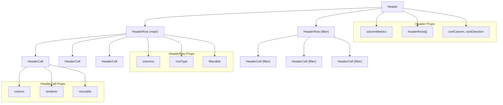
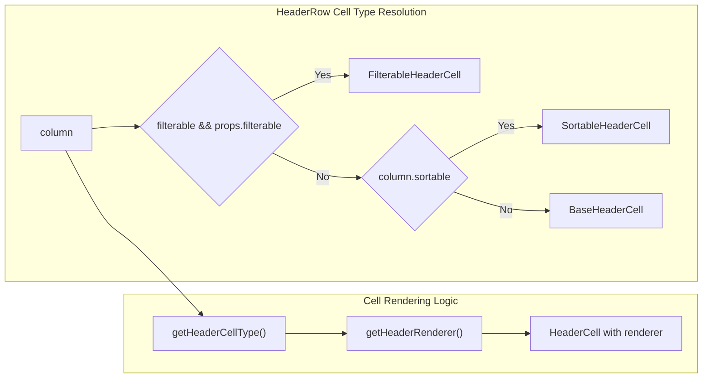
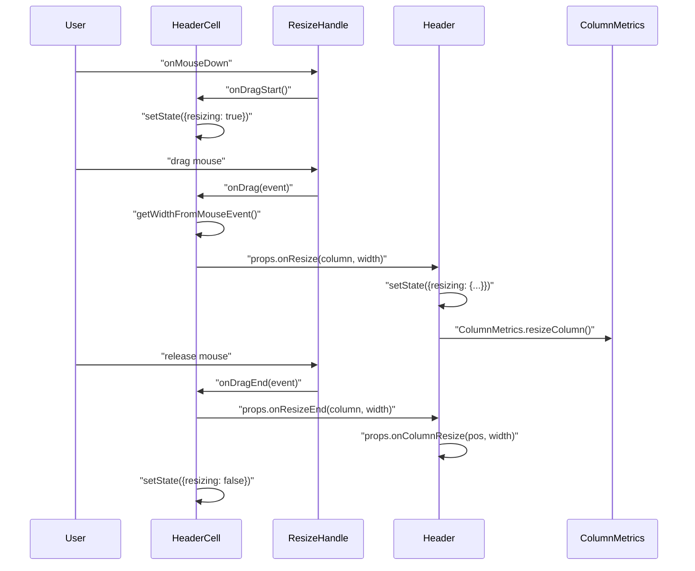
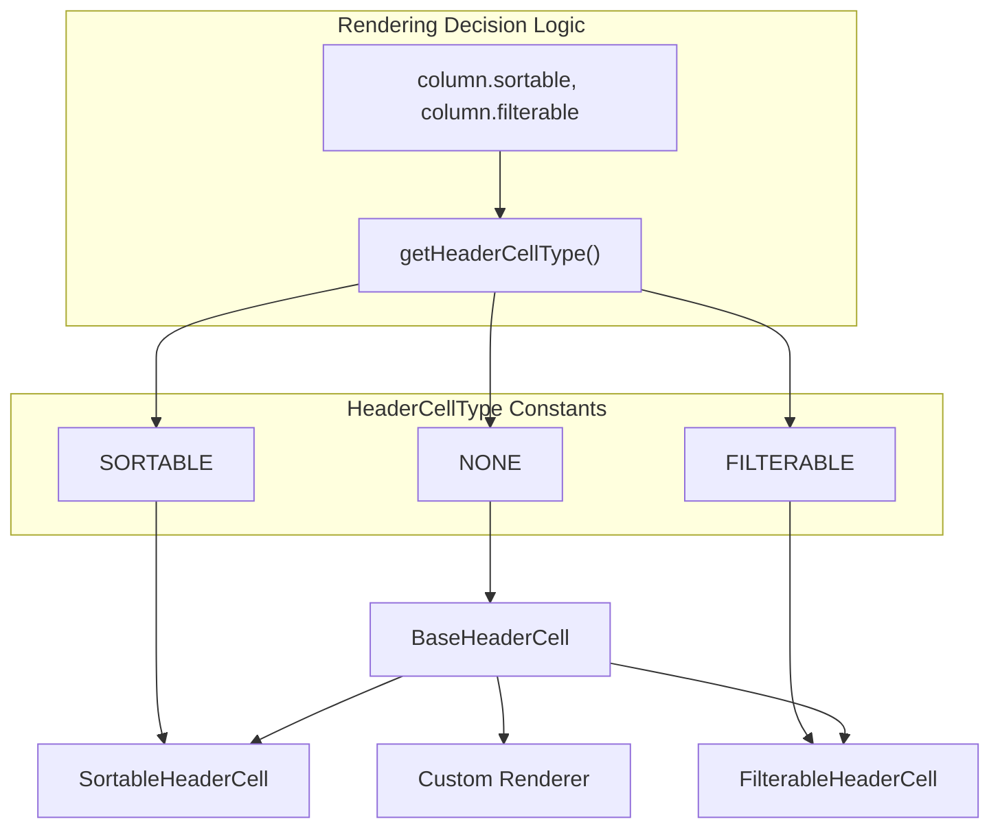
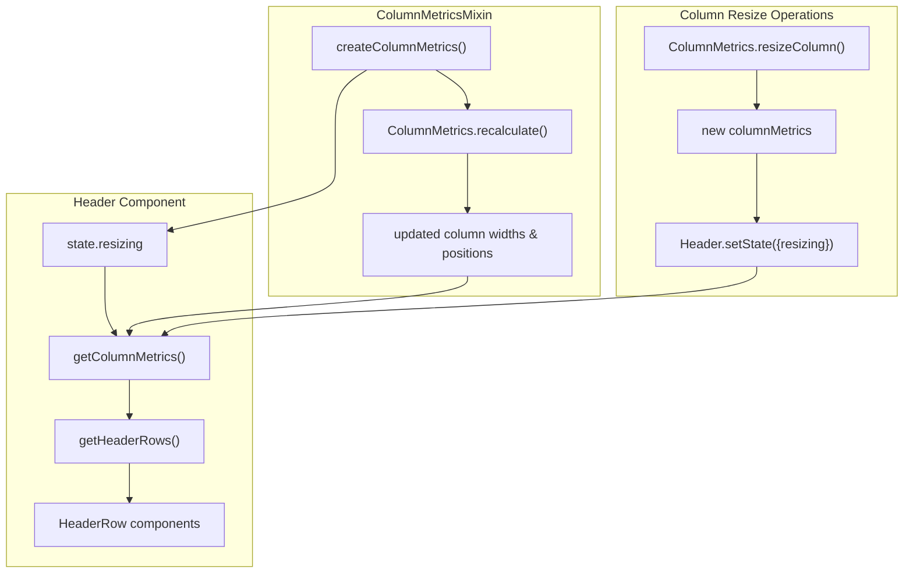
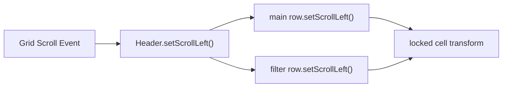

# Header System

<details>
<summary>Relevant source files</summary>

The following files were used as context for generating this wiki page:

- [src/ColumnMetricsMixin.js](src/ColumnMetricsMixin.js)
- [src/Draggable.js](src/Draggable.js)
- [src/Header.js](src/Header.js)
- [src/HeaderCell.js](src/HeaderCell.js)
- [src/HeaderRow.js](src/HeaderRow.js)
- [src/ResizeHandle.js](src/ResizeHandle.js)
- [src/__tests__/HeaderCell.spec.js](src/__tests__/HeaderCell.spec.js)
- [src/addons/editors/__tests__/AutoCompleteEditor-integration.spec.js](src/addons/editors/__tests__/AutoCompleteEditor-integration.spec.js)

</details>


## Purpose and Scope

The Header System manages the rendering and interaction of column headers in the React Data Grid. This system handles header row layout, individual header cell rendering, column resizing, sorting indicators, filtering controls, and column management operations. The system is built on a hierarchical component structure that integrates with the grid's column metrics and plugin architecture.

For information about column width calculations and metrics, see [Column Management](#3.3). For details about sorting and filtering functionality, see [Filtering and Sorting](#6.1).

## Component Hierarchy

The header system follows a three-tier component architecture where the `Header` component manages multiple `HeaderRow` components, each containing multiple `HeaderCell` components.

### Header Component Architecture



Sources: [src/Header.js:14-188](), [src/HeaderRow.js:22-166](), [src/HeaderCell.js:12-111]()

### Header Component (`Header`)

The `Header` component serves as the container for all header rows and manages global header state including column resizing operations.

| Property | Type | Purpose |
|----------|------|---------|
| `columnMetrics` | Object | Column width and layout information |
| `headerRows` | Array | Configuration for multiple header row types |
| `height` | Number | Default height for header rows |
| `onColumnResize` | Function | Column resize event handler |
| `sortColumn` | String | Currently sorted column key |
| `sortDirection` | String | Sort direction ('ASC', 'DESC', 'NONE') |

The component maintains resizing state and coordinates between header rows: [src/Header.js:29-31](), [src/Header.js:47-74]().

Sources: [src/Header.js:14-27](), [src/Header.js:76-120]()

### HeaderRow Component (`HeaderRow`)

The `HeaderRow` component renders a single row of header cells and determines the appropriate cell type based on column configuration.



The component uses `HeaderCellType` constants to determine cell behavior: [src/HeaderRow.js:56-64](), [src/HeaderRow.js:79-97]().

Sources: [src/HeaderRow.js:22-41](), [src/HeaderRow.js:108-138]()

### HeaderCell Component (`HeaderCell`)

The `HeaderCell` component handles individual cell rendering, resize operations, and user interactions.

| Feature | Implementation | File Reference |
|---------|---------------|----------------|
| Cell Rendering | Custom renderer or default | [src/HeaderCell.js:61-67]() |
| Resize Handle | Conditional rendering for resizable columns | [src/HeaderCell.js:89-96]() |
| Drag Events | Mouse/touch event handling | [src/HeaderCell.js:33-53]() |
| Styling | Absolute positioning with calculated width/left | [src/HeaderCell.js:69-80]() |

Sources: [src/HeaderCell.js:12-21](), [src/HeaderCell.js:88-110]()

## Column Resizing System

The header system implements a sophisticated column resizing mechanism that involves drag detection, width calculation, and state management across multiple components.

### Resize Event Flow



Sources: [src/HeaderCell.js:33-53](), [src/Header.js:47-74](), [src/ResizeHandle.js:4-21]()

### Resize Handle Implementation

The resize system uses a `ResizeHandle` component that wraps the `Draggable` utility:

- **ResizeHandle**: Provides visual resize cursor and positioning [src/ResizeHandle.js:4-21]()
- **Draggable**: Handles mouse/touch events and drag state management [src/Draggable.js:4-78]()
- **Width Calculation**: Uses mouse coordinates relative to cell position [src/HeaderCell.js:55-59]()

Sources: [src/ResizeHandle.js:1-24](), [src/Draggable.js:1-81](), [src/HeaderCell.js:55-59]()

## Header Cell Types and Rendering

The header system supports multiple cell types with different rendering and interaction capabilities.

### Cell Type Hierarchy



Sources: [src/HeaderRow.js:7-8](), [src/HeaderRow.js:56-64](), [src/HeaderRow.js:74-91]()

### Default Cell Renderer

The default header cell renderer displays the column name with ellipsis text overflow:

```javascript
function simpleCellRenderer(objArgs: {column: {name: string}}): ReactElement {
  return <div className="widget-HeaderCell__value">{objArgs.column.name}</div>;
}
```

Sources: [src/HeaderCell.js:8-10](), [src/HeaderCell.js:23-27]()

### Custom Header Renderers

Columns can specify custom header renderers through the `headerRenderer` or `filterRenderer` properties:

- **Column-level**: `column.headerRenderer` overrides default rendering [src/HeaderRow.js:81-84]()
- **Filter-specific**: `column.filterRenderer` for filterable headers [src/HeaderRow.js:66-71]()
- **Component-level**: React elements or render functions [src/HeaderCell.js:61-67]()

Sources: [src/HeaderRow.js:79-97](), [src/HeaderRow.js:66-72]()

## Integration with Column Metrics

The header system integrates closely with the column metrics system for layout calculations and width management.

### Column Metrics Flow



The `Header` component manages temporary resize state separately from permanent column metrics: [src/Header.js:122-130](), [src/Header.js:47-67]().

Sources: [src/Header.js:47-67](), [src/Header.js:122-130](), [src/ColumnMetricsMixin.js:111-117]()

### Locked Column Handling

The header system supports locked (frozen) columns with special scroll behavior:

- **Locked Cell Identification**: Based on `column.locked` property [src/HeaderRow.js:130-137]()
- **Scroll Synchronization**: `setScrollLeft()` method for locked column positioning [src/HeaderCell.js:82-86](), [src/Header.js:163-172]()
- **Rendering Order**: Locked cells rendered after regular cells [src/HeaderRow.js:137]()

Sources: [src/HeaderRow.js:130-137](), [src/HeaderCell.js:82-86](), [src/Header.js:163-172]()

## Multiple Header Row Support

The header system supports multiple header rows with different purposes and configurations.

### Header Row Configuration

| Row Type | Purpose | Configuration |
|----------|---------|---------------|
| `main` | Standard column headers | Default height, sorting/resizing |
| `filter` | Filter controls | Auto height (500px), filter renderers |
| Custom | Application-specific | Custom height and renderers |

The `Header` component processes the `headerRows` array to create multiple `HeaderRow` instances: [src/Header.js:82-118]().

### Filter Row Styling

Filter rows receive special styling to accommodate filter UI components:

```javascript
let rowHeight = 'auto';
if (row.rowType === 'filter') {
  rowHeight = '500px';
}
```

Sources: [src/Header.js:82-96](), [src/HeaderRow.js:114-116]()

## Scroll Synchronization

The header system maintains scroll synchronization between header rows and the grid body for horizontal scrolling.

### Scroll Management



Each header row manages scroll positioning for its locked columns independently: [src/HeaderRow.js:140-146]().

Sources: [src/Header.js:163-172](), [src/HeaderRow.js:140-146](), [src/HeaderCell.js:82-86]()
