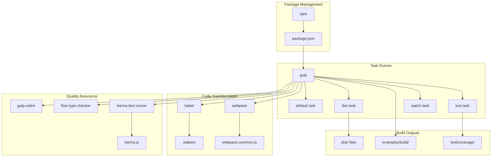
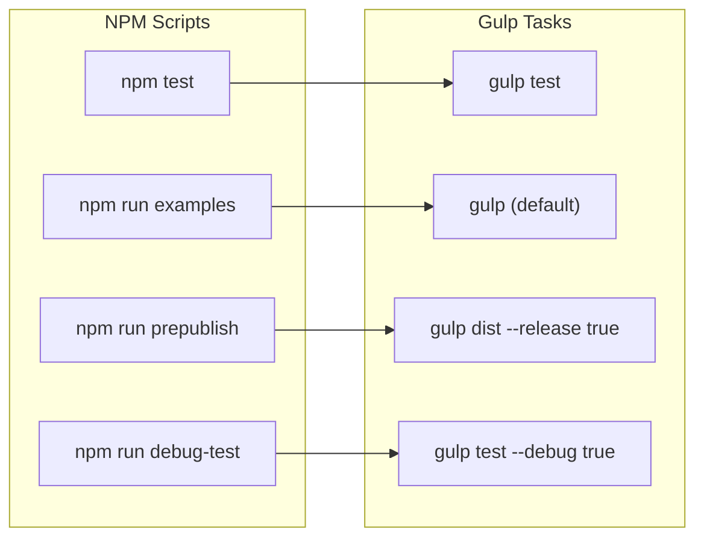
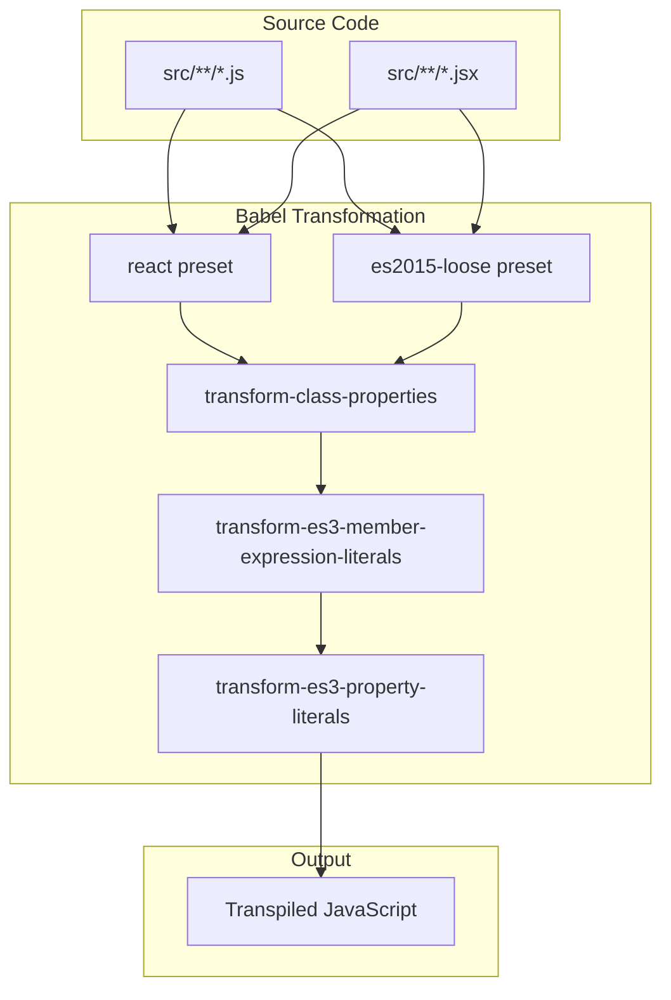
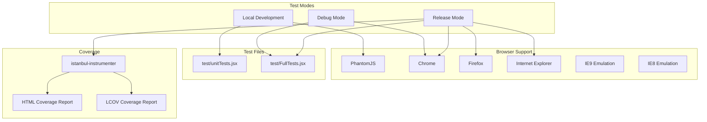
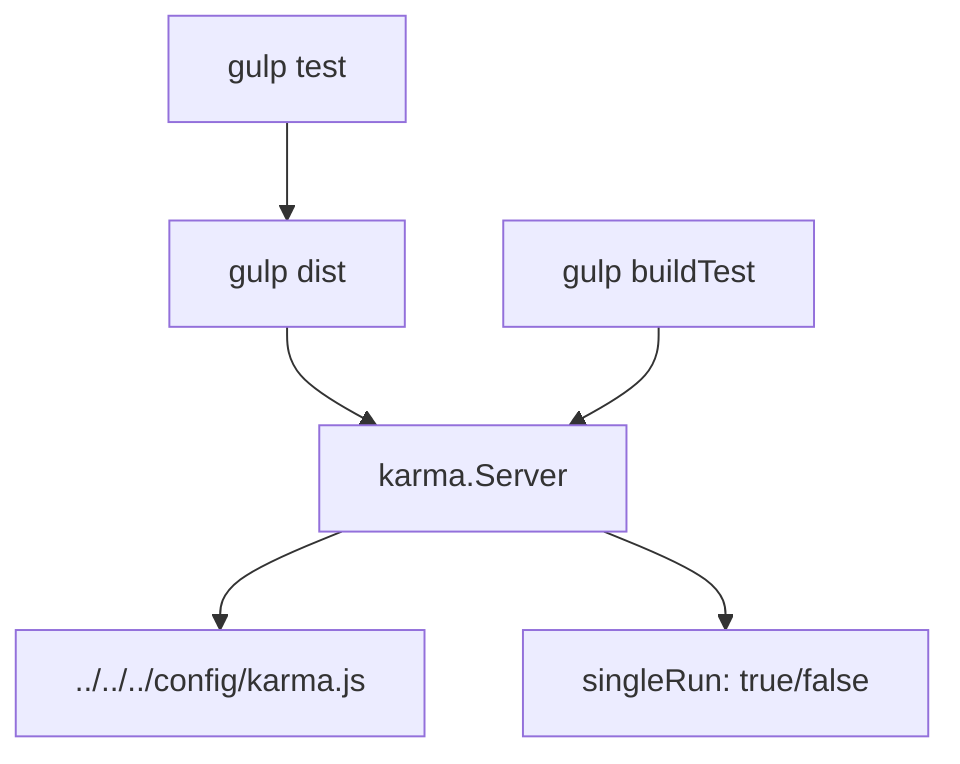
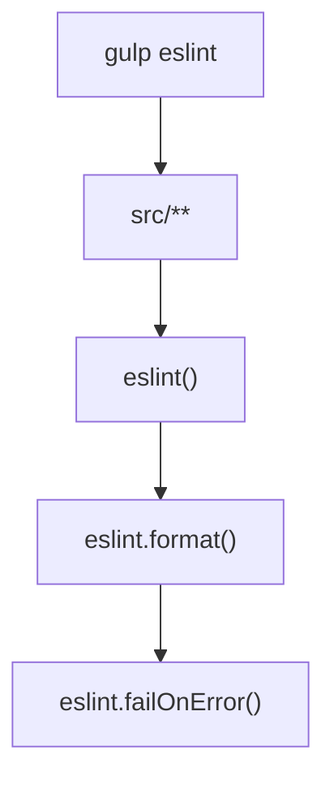
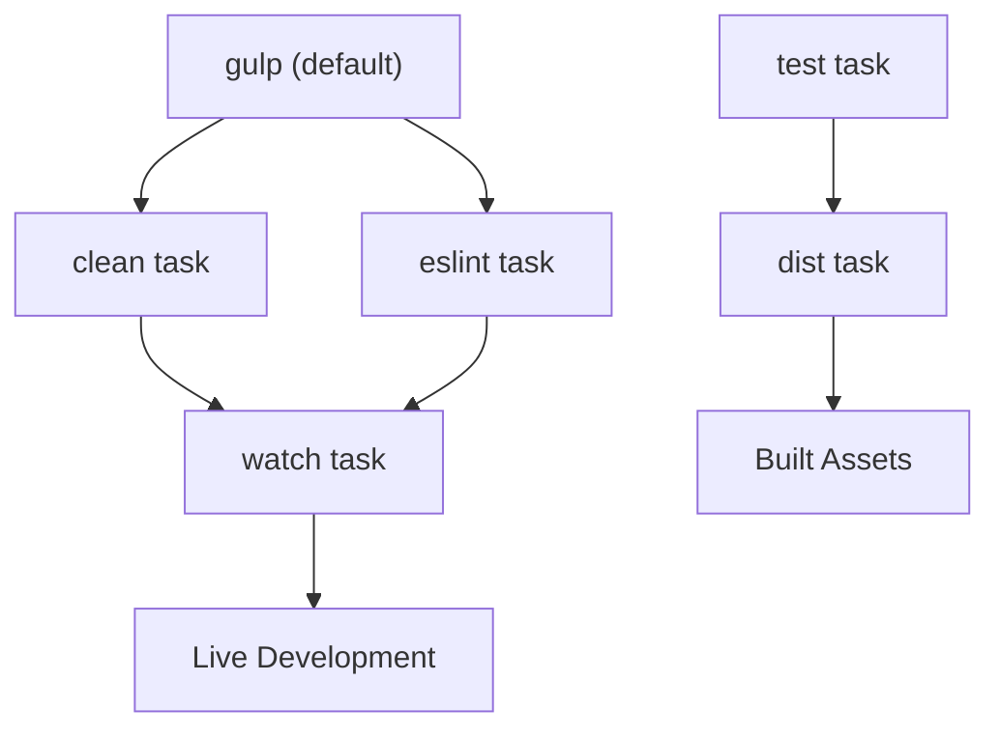

# Build System

Relevant source files

The following files were used as context for generating this wiki page:

- [.babelrc](.babelrc)
- [config/karma.js](config/karma.js)
- [gulp/tasks/default.js](gulp/tasks/default.js)
- [gulp/tasks/eslint.js](gulp/tasks/eslint.js)
- [gulp/tasks/flow.js](gulp/tasks/flow.js)
- [gulp/tasks/tests.js](gulp/tasks/tests.js)
- [package.json](package.json)

This document covers the development infrastructure and build system for react-data-grid, including dependency management, compilation pipeline, testing framework, and code quality tools. For information about continuous integration and deployment processes, see [CI/CD Pipeline](#8.3). For guidance on running tests and test utilities, see [Testing](#8.2).

## Overview

The react-data-grid build system is built around **Gulp** as the primary task runner, with **Webpack** for module bundling, **Babel** for JavaScript transpilation, and **Karma** with **Jasmine** for testing. The system supports multiple development modes including debug builds, release builds, and continuous development with file watching.

### Build System Architecture

Sources: [package.json:1-120](), [gulp/tasks/default.js:1-6](), [gulp/tasks/tests.js:1-28](), [config/karma.js:1-191]()

## Package Management

The project uses **npm** for dependency management with a comprehensive `package.json` configuration that defines both runtime and development dependencies.

### Key Dependencies

| Category | Package | Purpose |
|----------|---------|---------|
| **Runtime** | `react`, `react-dom` | Core React framework (peer dependencies) |
| **Runtime** | `classnames`, `object-assign` | Utility libraries |
| **Build** | `gulp`, `webpack`, `babel-core` | Primary build tools |
| **Testing** | `karma`, `jasmine-core`, `enzyme` | Test framework and utilities |
| **Quality** | `eslint`, `babel-eslint` | Code linting and style enforcement |

The main entry point is defined as `src/index.js` in [package.json:5](), and the project supports React version `~0.14.6` as specified in [package.json:22-24]().

### NPM Scripts

Sources: [package.json:6-11]()

## Build Pipeline

The compilation pipeline transforms ES6/React code into browser-compatible JavaScript using **Babel** and bundles modules using **Webpack**.

### Babel Configuration

The `.babelrc` file configures JavaScript transpilation with the following presets and plugins:

- **Presets**: `react` and `es2015-loose` for React JSX and ES6 features
- **Plugins**: Class properties transformation and ES3 compatibility transforms

Sources: [.babelrc:1-9]()

### Webpack Integration

Webpack is integrated into both the build process and test environment, handling module resolution and bundling. The configuration supports:

- **Module Resolution**: Extensions for `.js`, `.jsx`, `.webpack.js`, `.web.js` files
- **Development**: Source maps for debugging (`inline-source-map`)
- **Testing**: Integration with Karma test runner through `karma-webpack`

Sources: [config/karma.js:95-112](), [package.json:89]()

## Testing Infrastructure

The testing system uses **Karma** as the test runner with **Jasmine** as the testing framework, providing comprehensive browser testing capabilities.

### Karma Configuration

The test setup supports multiple execution modes and browser environments:

The Karma configuration dynamically adjusts based on command-line arguments:
- **Local mode**: Uses PhantomJS and unit tests only [config/karma.js:36-47]()
- **Debug mode**: Uses Chrome with full test suite [config/karma.js:43-45]()  
- **Release mode**: Tests across all browsers with code coverage [config/karma.js:41-42]()

### Test Execution

Test tasks are defined in the Gulp workflow:

Sources: [gulp/tasks/tests.js:8-27](), [config/karma.js:12-17]()

## Code Quality Tools

The build system integrates multiple code quality tools to maintain consistent code standards.

### ESLint Integration

**ESLint** provides JavaScript linting with React-specific rules:

The ESLint configuration includes:
- **Parser**: `babel-eslint` for ES6/JSX support [package.json:41]()
- **Plugins**: `eslint-plugin-react` for React-specific rules [package.json:57]()
- **Integration**: Runs as part of the default build task [gulp/tasks/default.js:3]()

Sources: [gulp/tasks/eslint.js:1-16]()

### Flow Type Checking

**Flow** provides static type checking with platform-specific configurations:

- **Windows**: Uses local Flow executable at `./flow/flow.exe` [gulp/tasks/flow.js:7]()
- **Cross-platform**: Optional `gulp-flowtype` integration (commented out for security reasons) [gulp/tasks/flow.js:13-29]()

The Flow setup includes separate tasks for main code and examples:
- `gulp flow`: Type checks main codebase [gulp/tasks/flow.js:4-30]()
- `gulp flow-examples`: Type checks example code [gulp/tasks/flow.js:33-38]()

Sources: [gulp/tasks/flow.js:1-39]()

## Development Workflow

The build system provides a streamlined development workflow with multiple entry points:

### Task Dependencies

The default task sequence ensures code quality checks run before starting the development server [gulp/tasks/default.js:3-5]().

### Build Outputs

The build system generates multiple output formats:

| Output | Purpose | Location |
|--------|---------|----------|
| **Distribution** | Production-ready library | `dist/` directory |
| **Examples** | Demo applications | `examples/build/` |
| **Test Coverage** | Code coverage reports | `test/coverage/` |
| **Test Results** | JUnit XML reports | `test/coverage/test-results.xml` |

Sources: [gulp/tasks/default.js:1-6](), [config/karma.js:132-147]()

## Configuration Files

The build system relies on several key configuration files:

| File | Purpose | Key Features |
|------|---------|-------------|
| `package.json` | Package definition and scripts | Dependencies, npm scripts, project metadata |
| `.babelrc` | Babel transpilation settings | React/ES6 presets, ES3 compatibility |
| `config/karma.js` | Test runner configuration | Multi-browser support, coverage reporting |
| `gulp/tasks/*.js` | Build task definitions | Modular task organization |

These configuration files work together to provide a comprehensive development environment that supports modern JavaScript development while maintaining compatibility with older browsers.

Sources: [package.json:1-120](), [.babelrc:1-9](), [config/karma.js:1-191](), [gulp/tasks/default.js:1-6](), [gulp/tasks/eslint.js:1-16](), [gulp/tasks/flow.js:1-39](), [gulp/tasks/tests.js:1-28]()
