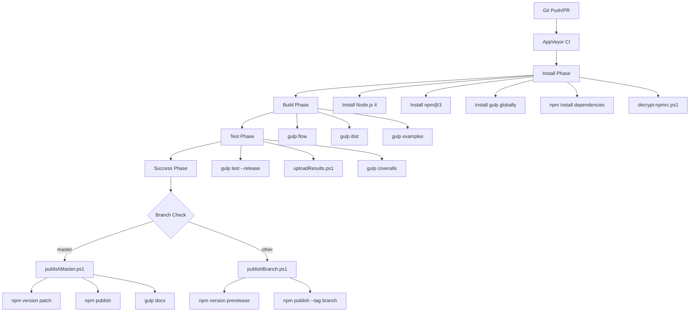
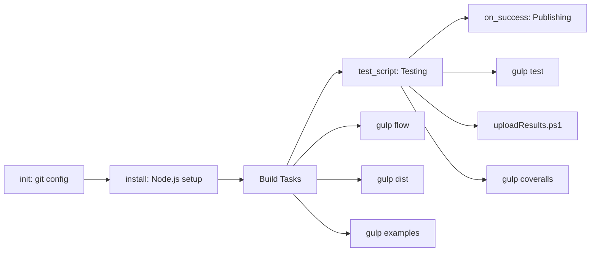
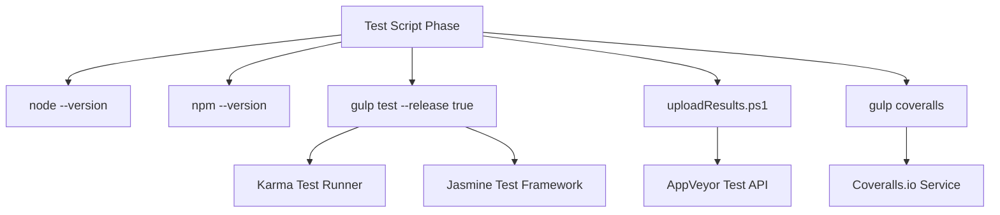
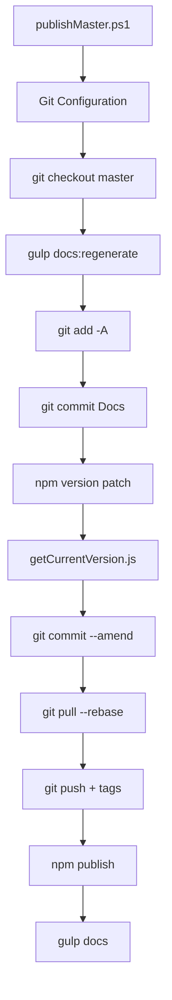
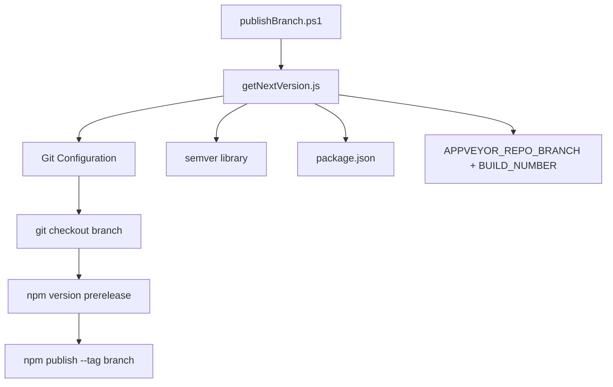
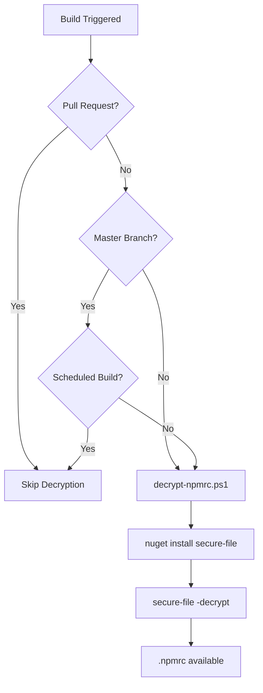

# CI/CD Pipeline

Relevant source files

The following files were used as context for generating this wiki page:

- [appveyor.yml](appveyor.yml)
- [ci/publish/decrypt-npmrc.ps1](ci/publish/decrypt-npmrc.ps1)
- [ci/publish/getCurrentVersion.js](ci/publish/getCurrentVersion.js)
- [ci/publish/getNextVersion.js](ci/publish/getNextVersion.js)
- [ci/publish/publishBranch.ps1](ci/publish/publishBranch.ps1)
- [ci/publish/publishMaster.ps1](ci/publish/publishMaster.ps1)

## Purpose and Scope

This document describes the continuous integration and continuous deployment (CI/CD) pipeline for the react-data-grid project. The pipeline is implemented using AppVeyor for Windows-based builds and includes automated testing, code coverage reporting, version management, and npm package publishing.

For information about the build system configuration and development tools, see [Build System](#8.1). For details about testing frameworks and test execution, see [Testing](#8.2).

## CI/CD Architecture Overview

The react-data-grid project uses AppVeyor as its primary CI/CD platform, configured through `appveyor.yml`. The pipeline supports different workflows for master branch commits versus feature branch development.

Sources: [appveyor.yml:1-65](), [ci/publish/publishMaster.ps1:1-29](), [ci/publish/publishBranch.ps1:1-16]()

## AppVeyor Configuration

The CI/CD pipeline is configured through `appveyor.yml`, which defines the complete build lifecycle including environment setup, dependencies, testing, and deployment.

### Environment Variables

| Variable | Purpose | Source |
|----------|---------|---------|
| `COVERALLS_REPO_TOKEN` | Authentication for Coveralls.io code coverage | Secure environment variable |
| `COVERALLS_SERVICE_NAME` | Identifies AppVeyor as CI service | Static: `appveyor` |
| `COVERALLS_GIT_COMMIT` | Current commit hash | `$(APPVEYOR_REPO_COMMIT)` |
| `COVERALLS_GIT_BRANCH` | Current branch name | `$(APPVEYOR_REPO_BRANCH)` |
| `COVERALLS_SERVICE_JOB_ID` | Build identifier | `$(APPVEYOR_BUILD_ID)` |
| `access_token` | GitHub API token for automated commits | Encrypted secure variable |
| `npmrc_token` | Decryption key for npm credentials | Encrypted secure variable |

### Build Configuration

The pipeline is configured to skip the default MSBuild step and uses custom install/test scripts instead:

Sources: [appveyor.yml:3-4](), [appveyor.yml:5-16](), [appveyor.yml:18-46](), [appveyor.yml:55-64]()

## Build Process

The build process consists of several phases executed sequentially during the install step:

### Dependency Installation

1. **Node.js Setup**: Installs Node.js version 4 and upgrades npm to version 3
2. **Global Dependencies**: Installs gulp globally for task execution
3. **Project Dependencies**: Runs `npm install` to install all package.json dependencies
4. **Credential Decryption**: Conditionally decrypts npm credentials for publishing

### Build Tasks Execution

The build executes three primary gulp tasks:

| Task | Purpose | Output |
|------|---------|---------|
| `gulp flow` | Type checking with Flow | Validation |
| `gulp dist` | Creates distribution files | `dist/` directory |
| `gulp examples` | Builds example demonstrations | `examples/build/` |

Sources: [appveyor.yml:28-36]()

## Testing Pipeline

The testing phase runs comprehensive test suites and generates coverage reports:

The test execution includes:

- **Version Reporting**: Outputs Node.js and npm versions for debugging
- **Unit Testing**: Executes `gulp test` with release flag enabled
- **Results Upload**: Uploads test results to AppVeyor via PowerShell script
- **Coverage Reporting**: Sends coverage data to Coveralls.io

Sources: [appveyor.yml:39-46](), [test/uploadResults.ps1]()

## Publishing Strategy

The publishing strategy differs based on the target branch and build context:

### Master Branch Publishing

When changes are merged to the master branch (non-PR, non-scheduled builds), the `publishMaster.ps1` script executes:

The master publishing process:

1. **Documentation Regeneration**: Runs `gulp docs:regenerate` to update generated docs
2. **Version Bumping**: Uses `npm version patch` to increment patch version
3. **Git Operations**: Commits changes and pushes to remote repository with tags
4. **npm Publishing**: Publishes the new version to the npm registry
5. **Documentation Site**: Regenerates public documentation site

Sources: [ci/publish/publishMaster.ps1:1-29](), [ci/publish/getCurrentVersion.js:1-5]()

### Branch Publishing

For non-master branches, the `publishBranch.ps1` script creates pre-release versions:

Branch publishing features:

- **Pre-release Versioning**: Generates versions like `1.2.3-feature-branch.123`
- **Tagged Publishing**: Publishes with branch name as npm tag instead of `latest`
- **Version Format**: `{major}.{minor}.{patch}-{branchName}{buildNumber}`

The `getNextVersion.js` utility constructs pre-release versions by combining:
- Current version from package.json
- Branch name from `APPVEYOR_REPO_BRANCH`
- Build number from `APPVEYOR_BUILD_NUMBER`

Sources: [ci/publish/publishBranch.ps1:1-16](), [ci/publish/getNextVersion.js:1-25]()

## Security and Credentials Management

The pipeline implements secure credential management for npm publishing:

### Encrypted Credentials

- **npmrc File**: npm credentials are stored in encrypted `.npmrc.enc` file
- **Decryption Script**: `decrypt-npmrc.ps1` uses secure-file tool with encrypted token
- **Conditional Decryption**: Credentials only decrypted for non-PR builds on master or non-master branches

The decryption process uses:
- **secure-file**: NuGet package for file decryption
- **npmrc_token**: Environment variable containing decryption key
- **Conditional Logic**: Only decrypts when publishing is intended

Sources: [appveyor.yml:20-27](), [ci/publish/decrypt-npmrc.ps1:1-4]()

## Build Conditions and Triggers

The CI/CD pipeline implements sophisticated conditional logic to determine appropriate actions:

| Condition | Master Branch | Non-Master Branch |
|-----------|---------------|-------------------|
| Pull Request | No publishing | No publishing |
| Scheduled Build | No publishing | No publishing |
| Regular Commit | Publish stable version | Publish pre-release with tag |

The conditional publishing logic in `appveyor.yml` uses PowerShell expressions to evaluate:
- `$env:APPVEYOR_SCHEDULED_BUILD` - Scheduled build flag
- `$env:appveyor_pull_request_number` - Pull request indicator  
- `$env:APPVEYOR_REPO_BRANCH` - Current branch name

Sources: [appveyor.yml:58-64]()
