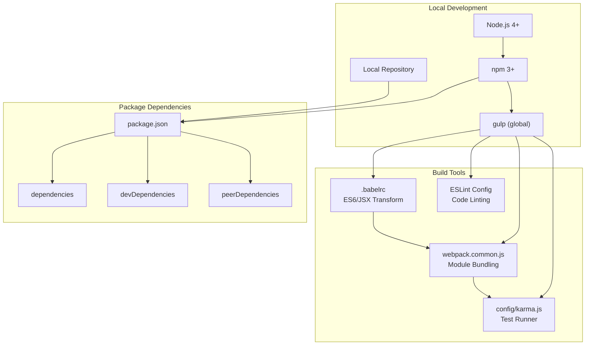
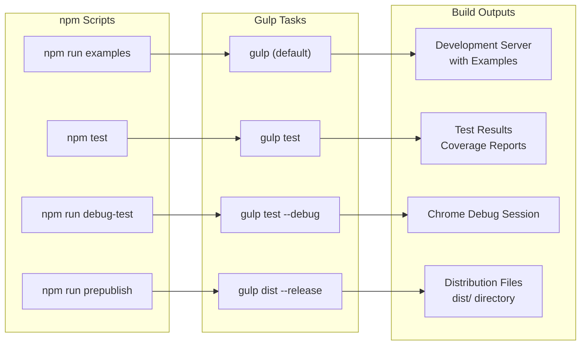
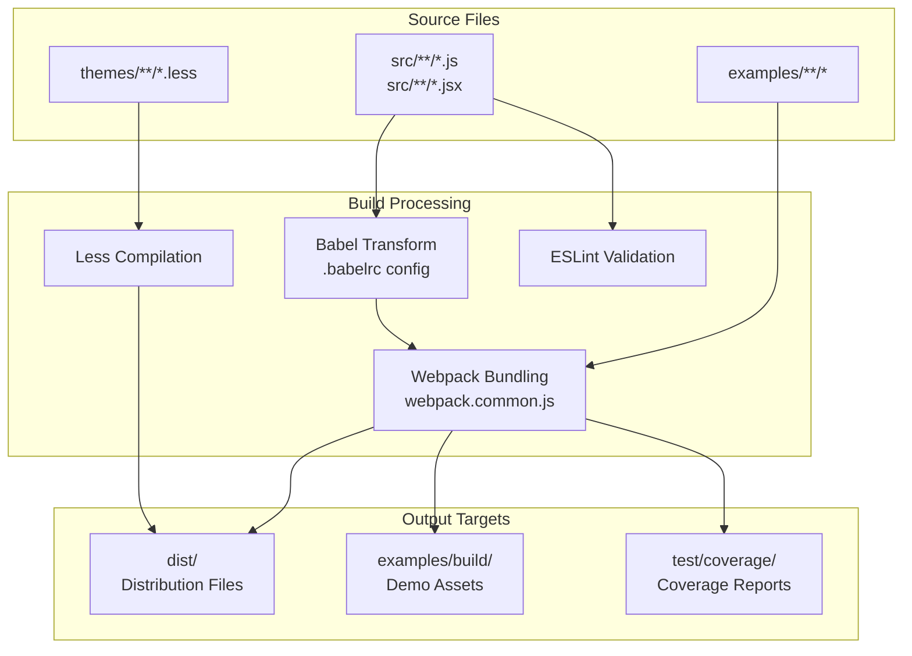
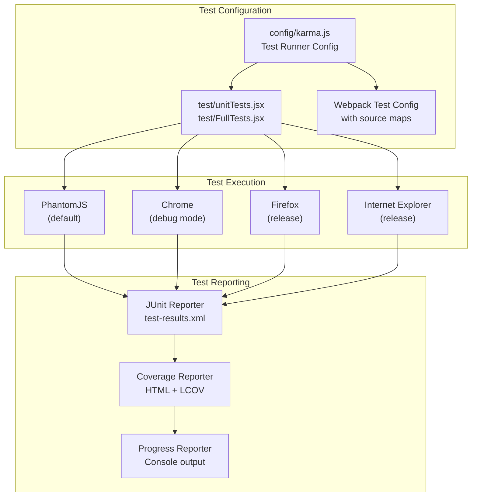
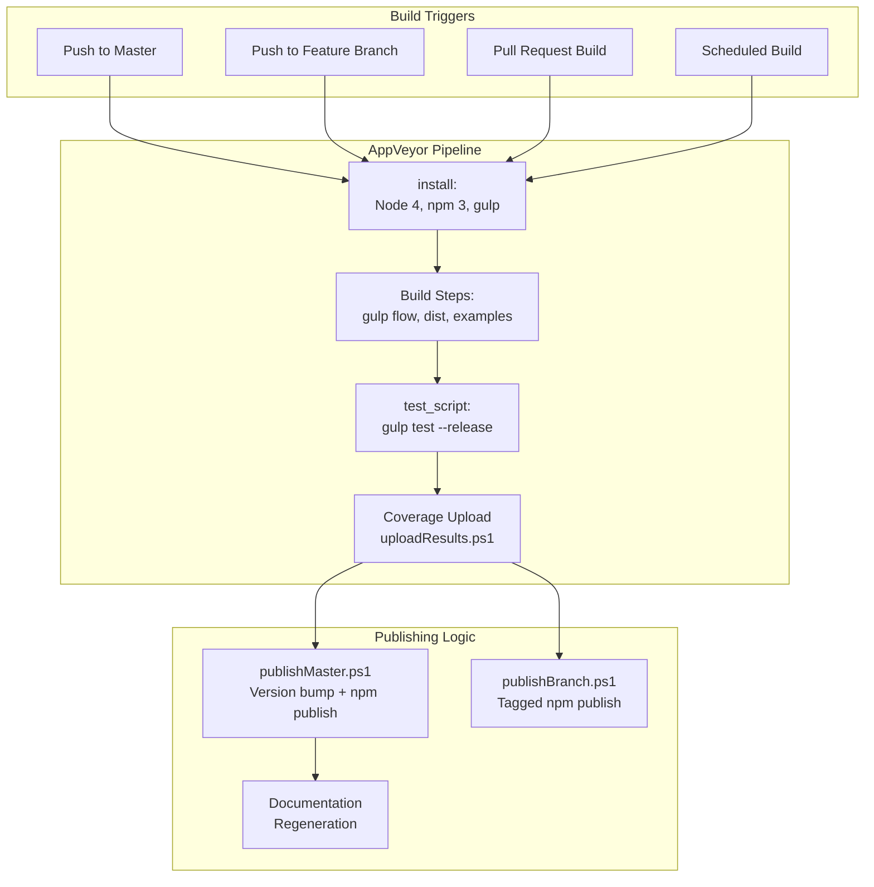

# Development Guide

Relevant source files

The following files were used as context for generating this wiki page:

- [.babelrc](.babelrc)
- [appveyor.yml](appveyor.yml)
- [ci/publish/decrypt-npmrc.ps1](ci/publish/decrypt-npmrc.ps1)
- [ci/publish/getCurrentVersion.js](ci/publish/getCurrentVersion.js)
- [ci/publish/getNextVersion.js](ci/publish/getNextVersion.js)
- [ci/publish/publishBranch.ps1](ci/publish/publishBranch.ps1)
- [ci/publish/publishMaster.ps1](ci/publish/publishMaster.ps1)
- [config/karma.js](config/karma.js)
- [package.json](package.json)

This document provides essential information for contributors and developers working on the react-data-grid codebase. It covers the development environment setup, build processes, testing infrastructure, and contribution workflows. This guide focuses on the technical infrastructure required to develop, test, and release the react-data-grid component.

For detailed information about specific development processes, see [Build System](#8.1), [Testing](#8.2), and [CI/CD Pipeline](#8.3).

## Prerequisites and Setup

The react-data-grid project requires Node.js 4+ and uses npm for package management. The development environment relies on several key technologies:

| Technology | Purpose | Configuration |
|------------|---------|---------------|
| Node.js 4+ | Runtime environment | Required for all build processes |
| npm 3+ | Package management | Specified in AppVeyor configuration |
| Gulp | Task automation | Global installation required |
| Babel | ES6/JSX transpilation | Configured via `.babelrc` |
| Webpack | Module bundling | Used by both build and test systems |
| Karma + Jasmine | Test execution | Configured in `config/karma.js` |

The project uses React 0.14.6 as a peer dependency, indicating compatibility requirements for the development environment.

**Development Environment Diagram**

Sources: [package.json:1-120](), [appveyor.yml:28-36](), [.babelrc:1-9](), [config/karma.js:1-191]()

## Development Workflow

The development workflow centers around npm scripts defined in `package.json` and Gulp tasks for build automation. The primary development commands are:

- `npm run examples` - Starts local development server with examples
- `npm test` - Runs the complete test suite
- `npm run debug-test` - Runs tests in debug mode with Chrome
- `npm run prepublish` - Builds distribution files for release

**Development Command Flow**

Sources: [package.json:6-11]()

## Build System Architecture

The build system uses Gulp as the primary task runner, orchestrating Babel for transpilation, Webpack for module bundling, and various other tools for optimization and packaging. The system supports both development and production builds with different optimization levels.

Key build configurations:
- **Babel**: Transpiles ES6/JSX using `es2015-loose` and `react` presets
- **Webpack**: Handles module resolution and bundling
- **ESLint**: Enforces code quality standards
- **Less**: Compiles stylesheets from the themes directory

**Build Pipeline Architecture**

Sources: [.babelrc:1-9](), [package.json:38-112]()

## Testing Infrastructure

The testing system uses Karma as the test runner with Jasmine as the testing framework. The configuration supports multiple browsers and generates comprehensive coverage reports using Istanbul.

Testing capabilities include:
- **Unit Tests**: Isolated component testing
- **Integration Tests**: Full system testing  
- **Cross-browser Testing**: Chrome, Firefox, IE support
- **Coverage Reporting**: HTML and LCOV formats
- **Debug Mode**: Chrome debugging with source maps

**Testing System Architecture**  

Sources: [config/karma.js:14-190]()

## CI/CD Pipeline  

The project uses AppVeyor for continuous integration on Windows, with automated testing, building, and publishing workflows. The pipeline handles different behaviors based on branch and build type.

CI/CD features:
- **Multi-browser Testing**: Chrome, Firefox, IE across different versions
- **Coverage Reporting**: Automated coverage uploads to Coveralls
- **Automated Publishing**: NPM package releases for master and feature branches
- **Documentation Generation**: Automatic docs regeneration on master

**CI/CD Workflow**

Sources: [appveyor.yml:1-65](), [ci/publish/publishMaster.ps1:1-29](), [ci/publish/publishBranch.ps1:1-16]()

## Development Dependencies

The project maintains a comprehensive set of development dependencies for building, testing, and quality assurance:

| Category | Key Dependencies | Purpose |
|----------|-----------------|---------|
| **Build Tools** | `babel-core`, `webpack`, `gulp` | Core build infrastructure |
| **Testing** | `karma`, `jasmine-core`, `enzyme` | Test execution and utilities |
| **Code Quality** | `eslint`, `babel-eslint` | Linting and code standards |
| **Browser Support** | `karma-chrome-launcher`, `karma-firefox-launcher`, `karma-ie-launcher` | Cross-browser testing |
| **Coverage** | `karma-coverage`, `istanbul-instrumenter-loader` | Code coverage analysis |
| **Utilities** | `lodash`, `minimist`, `semver` | General utilities and helpers |

The production dependencies are minimal, focusing on React ecosystem components and essential utilities like `classnames` and `object-assign`.

Sources: [package.json:25-112]()
