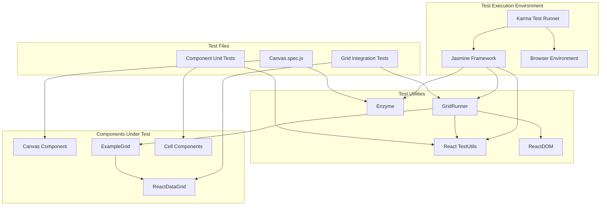

# Testing

<details>
<summary>Relevant source files</summary>

The following files were used as context for generating this wiki page:

- [src/DOMMetrics.js](src/DOMMetrics.js)
- [src/__tests__/Canvas.spec.js](src/__tests__/Canvas.spec.js)
- [src/addons/__tests__/GridRunner.js](src/addons/__tests__/GridRunner.js)
- [src/addons/data/RowFilterer.js](src/addons/data/RowFilterer.js)
- [themes/react-data-grid.less](themes/react-data-grid.less)

</details>


This document covers the testing infrastructure, utilities, and patterns used in the react-data-grid codebase. It explains how to run tests, understand the test utilities, and follow established testing patterns when contributing to the project.

For information about the build system that manages test execution, see [Build System](#8.1). For details about the CI/CD pipeline that runs tests automatically, see [CI/CD Pipeline](#8.3).

## Testing Framework and Tools

The react-data-grid project uses a comprehensive testing setup built around Jasmine and Karma, with additional tools for React component testing.

### Core Testing Stack

The testing framework consists of several integrated tools:

| Tool | Purpose | Configuration |
|------|---------|---------------|
| Jasmine | Test framework and assertion library | Built-in expectations and spies |
| Karma | Test runner for browser environments | Configured in build system |
| React TestUtils | React component testing utilities | For DOM manipulation and event simulation |
| Enzyme | React component testing library | For component mounting and querying |
| ReactDOM | React rendering utilities | For test component rendering |

The Canvas test demonstrates the basic testing setup:

```javascript
// Basic test structure using Jasmine and Enzyme
describe('Canvas Tests', () => {
  let testElement;
  let testElementNode;

  beforeEach(() => {
    testElement = renderComponent();
    testElementNode = testElement.node;
  });

  it('should create a new instance of Canvas', () => {
    expect(testElement).toBeDefined();
  });
});
```

**Sources:** [src/__tests__/Canvas.spec.js:33-44]()

## Test Utilities

### GridRunner Test Utility

The `GridRunner` class provides a comprehensive testing utility for grid interactions and assertions. It serves as the primary tool for integration testing of grid functionality.

```mermaid
classDiagram
    class GridRunner {
        +grid: ReactComponent
        +handleCellDragSpy: jasmine.Spy
        +renderIntoBody: boolean
        +constructor({renderIntoBody})
        +dispose()
        +changeCell(options)
        +selectCell({cellIdx, rowIdx})
        +clickIntoEditor({cellIdx, rowIdx})
        +setValue(val)
        +keyDown(ev, element)
        +copy()
        +drag(options)
        +hasCommitted(val)
        +hasSelected(options)
        +hasCopied(options)
        +hasDragged(options)
    }
    
    class TestUtils {
        +renderIntoDocument()
        +scryRenderedDOMComponentsWithClass()
        +Simulate.click()
        +Simulate.doubleClick()
        +Simulate.keyDown()
        +Simulate.contextMenu()
        +Simulate.dragStart()
        +Simulate.dragEnter()
        +Simulate.dragEnd()
    }
    
    class ReactDOM {
        +render()
        +findDOMNode()
        +unmountComponentAtNode()
    }
    
    class ExampleGrid {
        +handleCellDrag: Function
    }
    
    GridRunner --> TestUtils : "uses for DOM interaction"
    GridRunner --> ReactDOM : "uses for rendering"
    GridRunner --> ExampleGrid : "renders for testing"
```

The GridRunner provides three categories of methods:

**Action Methods** - Simulate user interactions:
- `selectCell({cellIdx, rowIdx})` - Click on a cell to select it
- `clickIntoEditor({cellIdx, rowIdx})` - Double-click to enter edit mode  
- `setValue(val)` - Set editor input value
- `keyDown(ev, element)` - Simulate keyboard events
- `copy()` - Simulate Ctrl+C copy operation
- `drag({from, to, col, ...})` - Simulate drag and drop operations

**Assertion Methods** - Verify grid state:
- `hasCommitted(val)` - Assert cell value was committed
- `hasSelected({rowIdx, cellIdx})` - Assert cell selection
- `hasCopied({cellIdx, rowIdx})` - Assert copy operation
- `hasDragged({from, to, col, cellKey})` - Assert drag operation results

**Utility Methods** - Test lifecycle management:
- `dispose()` - Clean up test resources
- `changeCell(options)` - High-level cell editing workflow

**Sources:** [src/addons/__tests__/GridRunner.js:1-244]()

### Test Setup Patterns

#### Component Rendering

Tests use two rendering approaches depending on the testing scenario:

```javascript
// Standard rendering for unit tests
TestUtils.renderIntoDocument(<ExampleGrid handleCellDrag={this.handleCellDragSpy}/>)

// Body rendering for integration tests requiring real DOM
ReactDOM.render(<ExampleGrid handleCellDrag={this.handleCellDragSpy}/>, document.body)
```

The body rendering approach is required for tests that need actual DOM positioning, such as cursor selection tests.

#### Mock Setup

Tests consistently use Jasmine spies for event handling verification:

```javascript
this.handleCellDragSpy = jasmine.createSpy('handleCellDrag');
expect(this.handleCellDragSpy).toHaveBeenCalled();
expect(this.handleCellDragSpy.calls.first().args[0]).toEqual(expectedData);
```

**Sources:** [src/addons/__tests__/GridRunner.js:16-19](), [src/addons/__tests__/GridRunner.js:227-231]()

## Testing Architecture



**Sources:** [src/addons/__tests__/GridRunner.js:1-6](), [src/__tests__/Canvas.spec.js:1-4]()

## Test Patterns and Examples

### Row Selection Testing

The Canvas component tests demonstrate comprehensive row selection testing patterns:

```javascript
describe('Row Selection', () => {
  describe('selectBy index', () => {
    it('renders row selected', () => {
      let props = { 
        displayStart: 0, 
        displayEnd: 1, 
        rowGetter, 
        rowsCount: 1, 
        rowSelection: { indexes: [0] } 
      };
      testElement = renderComponent(props);
      
      let selectedRows = testElement.find('.row-selected .react-grid-Row');
      expect(selectedRows.length).toBe(1);
    });
  });
  
  describe('selectBy keys', () => {
    it('renders row selected', () => {
      let props = { 
        rowSelection: { 
          keys: { rowKey: 'id', values: [1] } 
        } 
      };
      // Test implementation...
    });
  });
});
```

This pattern tests multiple selection modes:
- Selection by row indexes
- Selection by data keys  
- Selection by `isSelectedKey` property

**Sources:** [src/__tests__/Canvas.spec.js:57-96]()

### Drag and Drop Testing

The GridRunner provides sophisticated drag and drop testing capabilities:

```javascript
drag({from, to, col, beforeDragEnter = null, beforeDragEnd = null}) {
  this.selectCell({cellIdx: col, rowIdx: from});
  
  const rows = TestUtils.scryRenderedDOMComponentsWithClass(this.grid, 'react-grid-Row');
  let over = [this.row];
  
  // Build array of cells to drag over
  for (let i = fromIterator++; i < to; i++) {
    over.push(this.getCells(rows[i])[col]);
  }
  
  // Simulate drag sequence: dragStart -> dragEnter -> dragEnd
  TestUtils.Simulate.dragStart(ReactDOM.findDOMNode(this.row));
  over.forEach((r) => {
    TestUtils.Simulate.dragEnter(ReactDOM.findDOMNode(r));
  });
  TestUtils.Simulate.dragEnd(ReactDOM.findDOMNode(toCell));
}
```

The drag test validates both the event sequence and the resulting data changes across affected rows.

**Sources:** [src/addons/__tests__/GridRunner.js:132-159](), [src/addons/__tests__/GridRunner.js:225-242]()

### Cell Editing Workflows

GridRunner provides high-level testing workflows that combine multiple actions:

```javascript
changeCell({
  select: {cell: selectCell, row: selectRow}, 
  val, 
  ev, 
  expectToSelect: {row: expectRow, cell: expectCell}
}) {
  this
    .clickIntoEditor({cellIdx: selectCell, rowIdx: selectRow})
    .setValue(val)
    .keyDown(ev)
    .hasCommitted(val)
    .hasSelected({cellIdx: expectCell, rowIdx: expectRow})
    .dispose();
}
```

This pattern demonstrates the fluent interface approach used throughout the test utilities, allowing readable test workflows.

**Sources:** [src/addons/__tests__/GridRunner.js:34-42]()

## Test Organization and Structure

### File Naming Conventions

Test files follow the pattern `ComponentName.spec.js` and are located in `__tests__` directories alongside the components they test:

```
src/
├── __tests__/
│   └── Canvas.spec.js
├── addons/
│   └── __tests__/
│       └── GridRunner.js
└── Canvas.js
```

### Test Props and Mocking

Tests define comprehensive test props objects that include all required component dependencies:

```javascript
let testProps = {
  rowHeight: 25,
  height: 200,
  displayStart: 1,
  displayEnd: 10,
  rowsCount: 1,
  columns: [],
  selectedRows: null,
  rowGetter: function() { return []; },
  cellMetaData: {
    selected: {},
    dragged: {},
    onCellClick: () => {},
    onCellDoubleClick: () => {},
    onCommit: () => {},
    onCommitCancel: () => {},
    copied: {},
    handleDragEnterRow: () => {},
    handleTerminateDrag: () => {}
  }
};
```

This approach ensures tests have all required props and provides consistent mock implementations.

**Sources:** [src/__tests__/Canvas.spec.js:5-25]()

## Running Tests

Tests are executed through the Karma test runner configured in the build system. The testing framework supports both unit tests and integration tests that render components into the actual DOM for more comprehensive testing scenarios.

For specific build and test execution commands, refer to the [Build System](#8.1) documentation.

**Sources:** [src/addons/__tests__/GridRunner.js:10-27](), [src/__tests__/Canvas.spec.js:27-31]()
