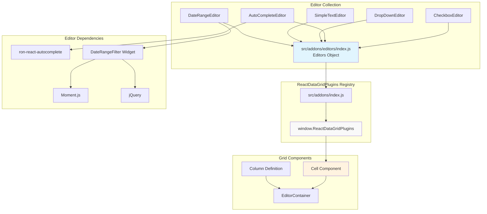
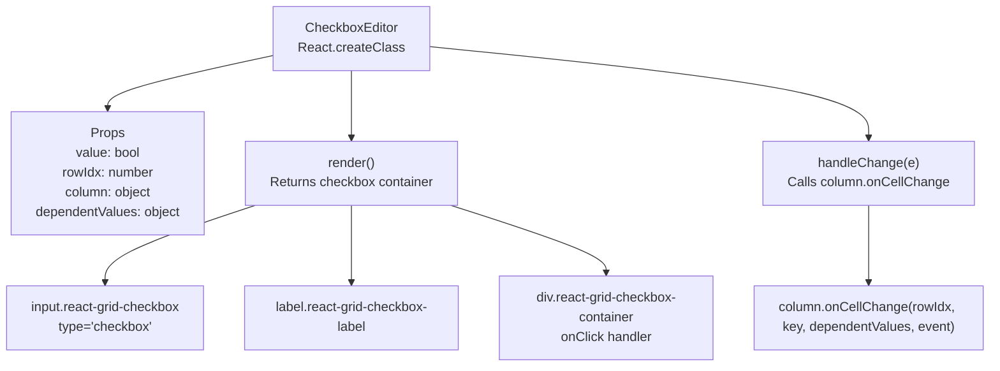
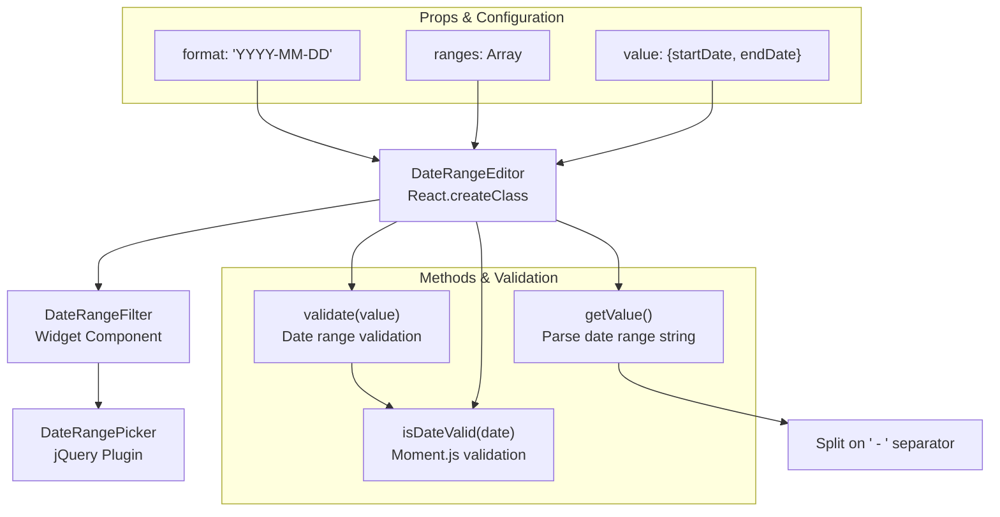
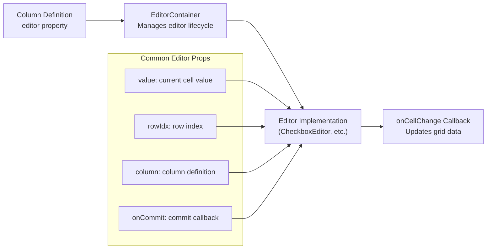

# Built-in Editors

Relevant source files

The following files were used as context for generating this wiki page:

- [src/addons/editors/AutoCompleteEditor.js](src/addons/editors/AutoCompleteEditor.js)
- [src/addons/editors/CheckboxEditor.js](src/addons/editors/CheckboxEditor.js)
- [src/addons/editors/DateRangeEditor.js](src/addons/editors/DateRangeEditor.js)
- [src/addons/editors/__tests__/AutoCompleteEditor.spec.js](src/addons/editors/__tests__/AutoCompleteEditor.spec.js)
- [src/addons/editors/__tests__/CheckboxEditor.spec.js](src/addons/editors/__tests__/CheckboxEditor.spec.js)
- [src/addons/editors/index.js](src/addons/editors/index.js)
- [src/addons/editors/widgets/DateRangeFilter.js](src/addons/editors/widgets/DateRangeFilter.js)

This document covers the built-in editor components provided by react-data-grid for cell editing functionality. These editors handle different data types and input patterns within grid cells. For information about the editor lifecycle and management system, see [EditorContainer and Editor Lifecycle](#4.1).

## Overview

React-data-grid provides several pre-built editor components that can be used for in-cell editing. These editors are organized as a collection in the addons system and support various data types including text, boolean, date ranges, and autocomplete functionality.

The main editor collection is exported from [src/addons/editors/index.js:1-8]() and includes:

| Editor | Purpose | Data Type |
|--------|---------|-----------|
| `CheckboxEditor` | Boolean value selection | Boolean |
| `AutoCompleteEditor` | Text input with suggestions | String/Object |
| `DropDownEditor` | Selection from predefined options | String |
| `SimpleTextEditor` | Basic text input | String |
| `DateRangeEditor` | Date range selection | Date range object |

Sources: [src/addons/editors/index.js:1-8]()

## Editor Architecture

The following diagram shows how the built-in editors relate to the grid system and plugin architecture:

Sources: [src/addons/editors/index.js:1-8](), [src/addons/editors/AutoCompleteEditor.js:1-4](), [src/addons/editors/DateRangeEditor.js:1-4]()

## CheckboxEditor

The `CheckboxEditor` provides a simple boolean input mechanism using a checkbox interface.

### Implementation Details

The CheckboxEditor component structure:

Key implementation details from [src/addons/editors/CheckboxEditor.js:15-27]():
- The `handleChange` method calls `this.props.column.onCellChange` with row index, column key, dependent values, and the event
- The checkbox state is derived from `this.props.value`, defaulting to `false` if null
- Click handling is attached to the container div rather than the input directly

Sources: [src/addons/editors/CheckboxEditor.js:1-30]()

## AutoCompleteEditor

The `AutoCompleteEditor` provides sophisticated autocomplete functionality using the `ron-react-autocomplete` library.

### Core Methods

The AutoCompleteEditor has several key methods for managing autocomplete behavior:

| Method | Purpose | Return Type |
|--------|---------|-------------|
| `getValue()` | Extracts current editor value | Object |
| `getLabel(item)` | Formats display labels | String |
| `hasResults()` | Checks if suggestions exist | Boolean |
| `isFocusedOnSuggestion()` | Checks suggestion focus state | Boolean |
| `constuctValueFromParams(obj, props)` | Builds pipe-separated values | String |

### Value Construction Logic

The `getValue()` method at [src/addons/editors/AutoCompleteEditor.js:38-52]() implements complex value resolution:

1. If results exist and a suggestion is focused, use the focused value
2. If `valueParams` are provided, construct a pipe-separated string from specified object properties
3. Otherwise, use the raw search term
4. Return an object keyed by `column.key`

### Display Value Handling

The `getEditorDisplayValue()` method at [src/addons/editors/AutoCompleteEditor.js:54-63]() supports custom display formatting:
- Uses `editorDisplayValue` prop function if provided
- Falls back to raw value display
- Returns formatted object for ReactAutocomplete component

Sources: [src/addons/editors/AutoCompleteEditor.js:1-107]()

## DateRangeEditor

The `DateRangeEditor` handles date range input using a sophisticated date picker widget.

### Architecture

### Validation Logic

The DateRangeEditor implements multi-level validation at [src/addons/editors/DateRangeEditor.js:49-54]():

1. **Individual Date Validation**: Uses `isDateValid()` to check each date against the specified format
2. **Range Validation**: Ensures start date is before or equal to end date using Moment.js comparison
3. **Format Validation**: The `getValue()` method expects exactly two dates separated by `' - '`

### Integration with DateRangeFilter

The DateRangeEditor delegates most UI functionality to the `DateRangeFilter` widget, which wraps a jQuery-based date picker. The filter handles:
- Calendar display and navigation
- Date selection interactions  
- Apply/cancel operations
- Custom date range definitions

Sources: [src/addons/editors/DateRangeEditor.js:1-70](), [src/addons/editors/widgets/DateRangeFilter.js:1137-1201]()

## Editor Integration Pattern

All built-in editors follow a consistent integration pattern with the grid system:

### Common Props Interface

All editors receive a standard set of props for grid integration:
- `value`: The current cell value to edit
- `rowIdx`: Zero-based row index for the cell
- `column`: Column definition object containing metadata and callbacks
- `onCommit`: Callback function to commit the edited value

The `column` prop typically includes:
- `key`: Column identifier for data binding
- `onCellChange`: Callback for immediate value changes (used by CheckboxEditor)

Sources: [src/addons/editors/CheckboxEditor.js:5-13](), [src/addons/editors/AutoCompleteEditor.js:13-26]()
