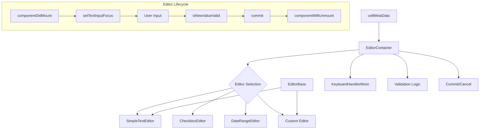
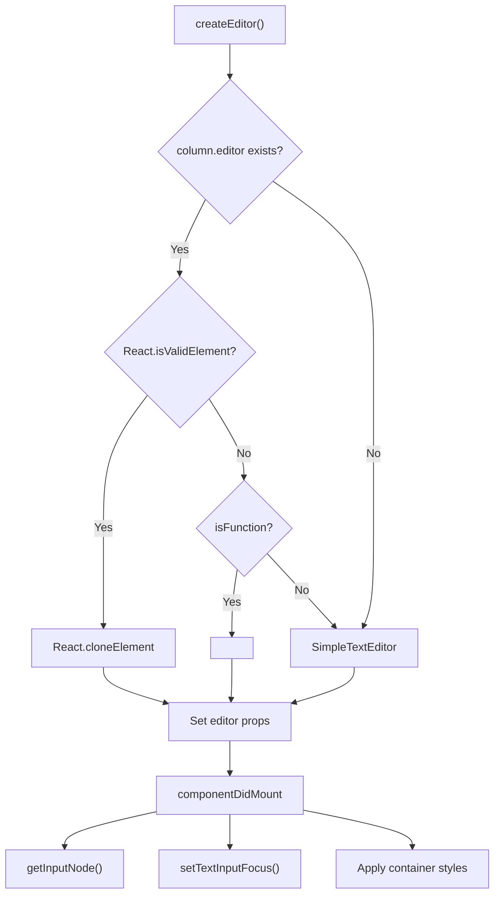
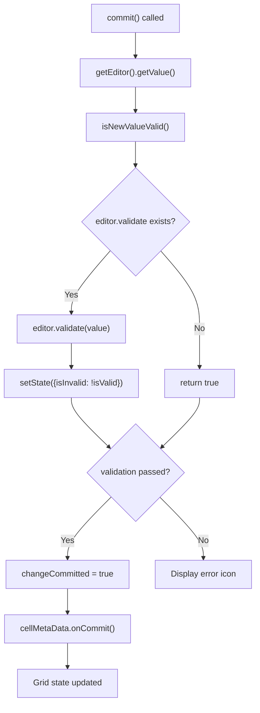
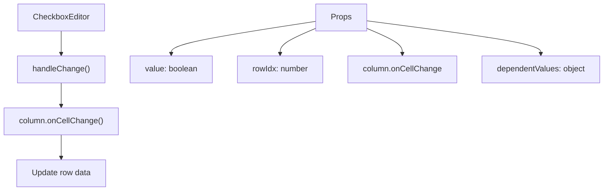
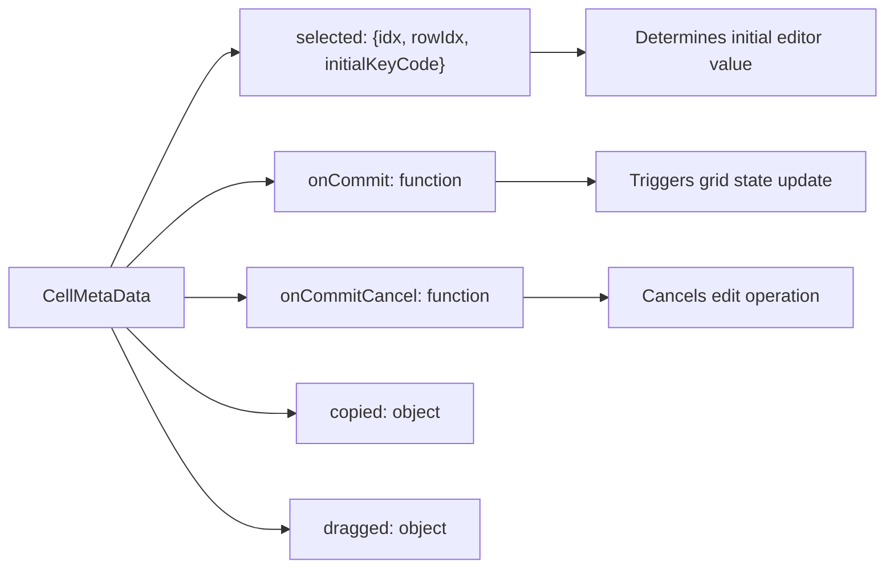

# Editor System

Relevant source files

The following files were used as context for generating this wiki page:

- [src/addons/editors/CheckboxEditor.js](src/addons/editors/CheckboxEditor.js)
- [src/addons/editors/DateRangeEditor.js](src/addons/editors/DateRangeEditor.js)
- [src/addons/editors/EditorBase.js](src/addons/editors/EditorBase.js)
- [src/addons/editors/EditorContainer.js](src/addons/editors/EditorContainer.js)
- [src/addons/editors/__tests__/CheckboxEditor.spec.js](src/addons/editors/__tests__/CheckboxEditor.spec.js)
- [src/addons/editors/__tests__/EditorContainer.spec.js](src/addons/editors/__tests__/EditorContainer.spec.js)
- [src/addons/editors/__tests__/SimpleTextEditor.spec.js](src/addons/editors/__tests__/SimpleTextEditor.spec.js)
- [src/addons/editors/index.js](src/addons/editors/index.js)
- [src/addons/editors/widgets/DateRangeFilter.js](src/addons/editors/widgets/DateRangeFilter.js)

The Editor System provides the architecture for in-cell editing functionality within the react-data-grid. This system handles the complete lifecycle of cell editing, from activation to validation and commitment of changes. It supports both built-in editor types and custom editor implementations through a flexible plugin-based architecture.

For information about the broader plugin system that editors integrate with, see [Plugin System and Addons](#5). For details on cell rendering and interaction patterns, see [Cell and Row Components](#3.1).

## Editor Architecture Overview

The editor system follows a container-component pattern where `EditorContainer` manages the editing lifecycle and coordinates with individual editor components that handle specific data types and input methods.

**Sources:** [src/addons/editors/EditorContainer.js:1-295](), [src/addons/editors/EditorBase.js:1-44](), [src/addons/editors/index.js:1-9]()

## EditorContainer Lifecycle Management

The `EditorContainer` component serves as the central coordinator for all editing operations, managing the complete lifecycle from editor activation to value commitment.

### Editor Creation and Mounting

The editor creation process dynamically selects the appropriate editor based on the column configuration:

**Sources:** [src/addons/editors/EditorContainer.js:51-75](), [src/addons/editors/EditorContainer.js:34-43]()

### Keyboard Event Handling

The editor system implements comprehensive keyboard navigation that integrates with grid navigation while allowing in-cell editing:

| Key | Method | Behavior |
|-----|--------|----------|
| Enter | `onPressEnter()` | Commits value and moves to next row |
| Tab | `onPressTab()` | Commits value and moves to next cell |
| Escape | `onPressEscape()` | Cancels edit if no dropdown open |
| Arrow Up/Down | `onPressArrowUp/Down()` | Commits or handles dropdown navigation |
| Arrow Left/Right | `onPressArrowLeft/Right()` | Commits at input boundaries |

**Sources:** [src/addons/editors/EditorContainer.js:77-128]()

### Value Validation and Commitment

The commit process includes validation and state management:

**Sources:** [src/addons/editors/EditorContainer.js:181-198]()

## Built-in Editor Types

### SimpleTextEditor

The default text input editor that handles basic string input with full keyboard navigation support.

**Sources:** [src/addons/editors/SimpleTextEditor.js]() (referenced in tests)

### CheckboxEditor

Handles boolean values with click-based toggling:

**Sources:** [src/addons/editors/CheckboxEditor.js:1-31]()

### DateRangeEditor

Provides date range selection using an integrated date picker widget:

**Sources:** [src/addons/editors/DateRangeEditor.js:1-71](), [src/addons/editors/widgets/DateRangeFilter.js:1-1202]()

## EditorBase Foundation

The `EditorBase` class provides common functionality for custom editors:

| Method | Purpose | Default Implementation |
|--------|---------|----------------------|
| `getStyle()` | Returns editor CSS styles | `{width: '100%'}` |
| `getValue()` | Extracts edited value | Returns object with column key |
| `getInputNode()` | Gets input DOM element | Finds first input element |
| `inheritContainerStyles()` | Style inheritance flag | `true` |

**Sources:** [src/addons/editors/EditorBase.js:5-42]()

## Integration with Grid System

The editor system integrates with the broader grid architecture through several key interfaces:

### CellMetaData Interface

The `cellMetaData` prop provides the communication channel between editors and the grid:

**Sources:** [src/addons/editors/EditorContainer.js:15-23]()

### Column Configuration

Editors are configured through column definitions that specify which editor to use and provide editor-specific options:

**Sources:** [src/addons/editors/EditorContainer.js:65-72]()

## Custom Editor Development

### Editor Registration

Custom editors can be provided through the column `editor` property in three ways:

1. **React Element**: `column.editor = <CustomEditor />`
2. **React Component**: `column.editor = CustomEditor`
3. **Function**: `column.editor = function(props) { return <input />; }`

### Required Editor Interface

Custom editors must implement:

- `getValue()`: Return the edited value
- `getInputNode()`: Return the input DOM node for focus management
- Optional `validate(value)`: Return boolean for value validation
- Optional `hasResults()`: Return boolean for dropdown state
- Optional `isSelectOpen()`: Return boolean for dropdown visibility

**Sources:** [src/addons/editors/EditorContainer.js:130-144](), [src/addons/editors/EditorContainer.js:154-160]()

### Focus and Navigation Integration

Custom editors must handle focus correctly to integrate with grid navigation patterns. The `setTextInputFocus()` method demonstrates the required focus management for text inputs.

**Sources:** [src/addons/editors/EditorContainer.js:251-264]()
