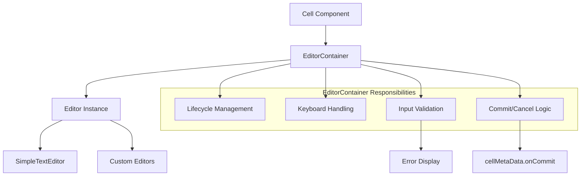
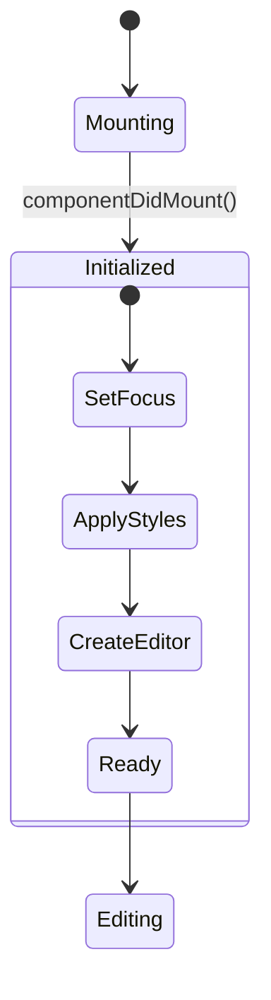
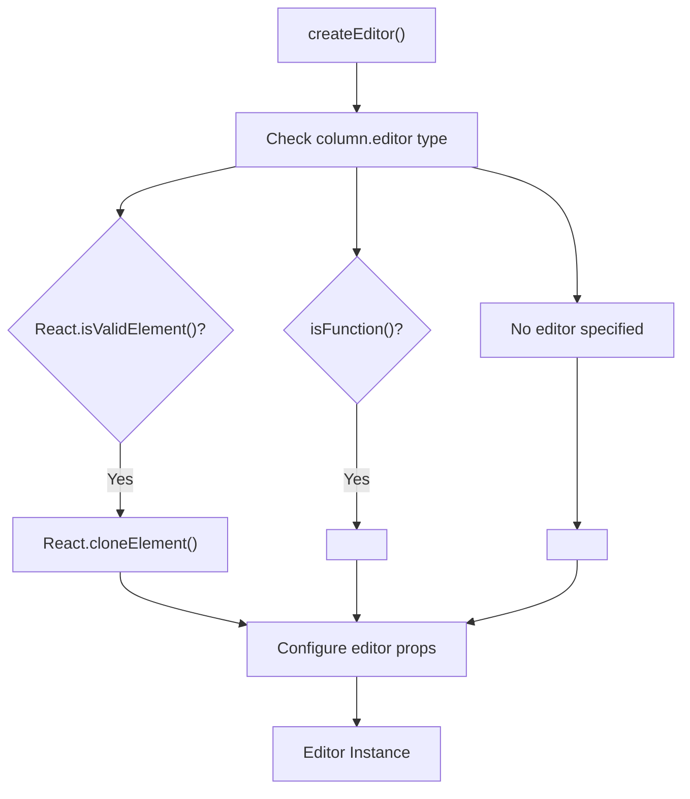
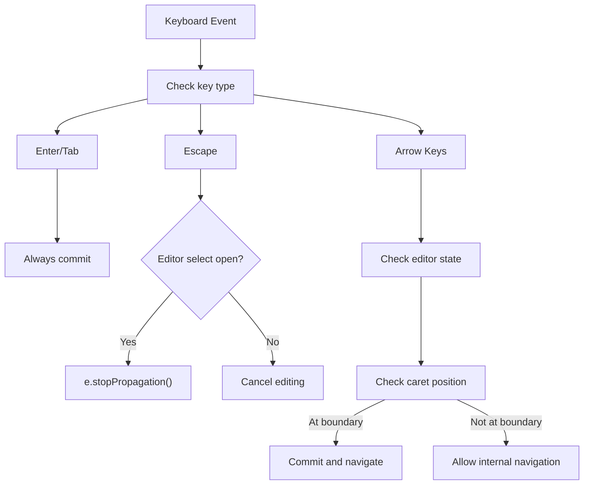
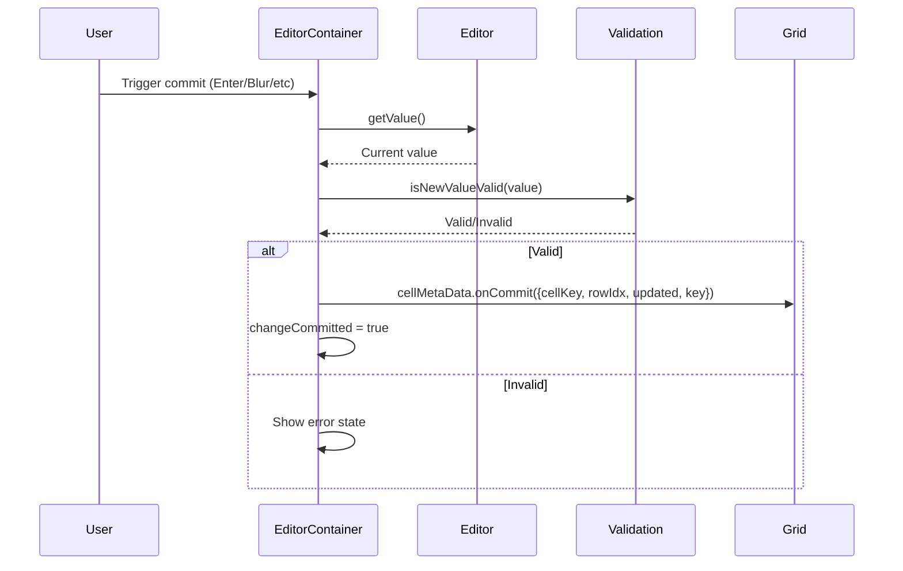
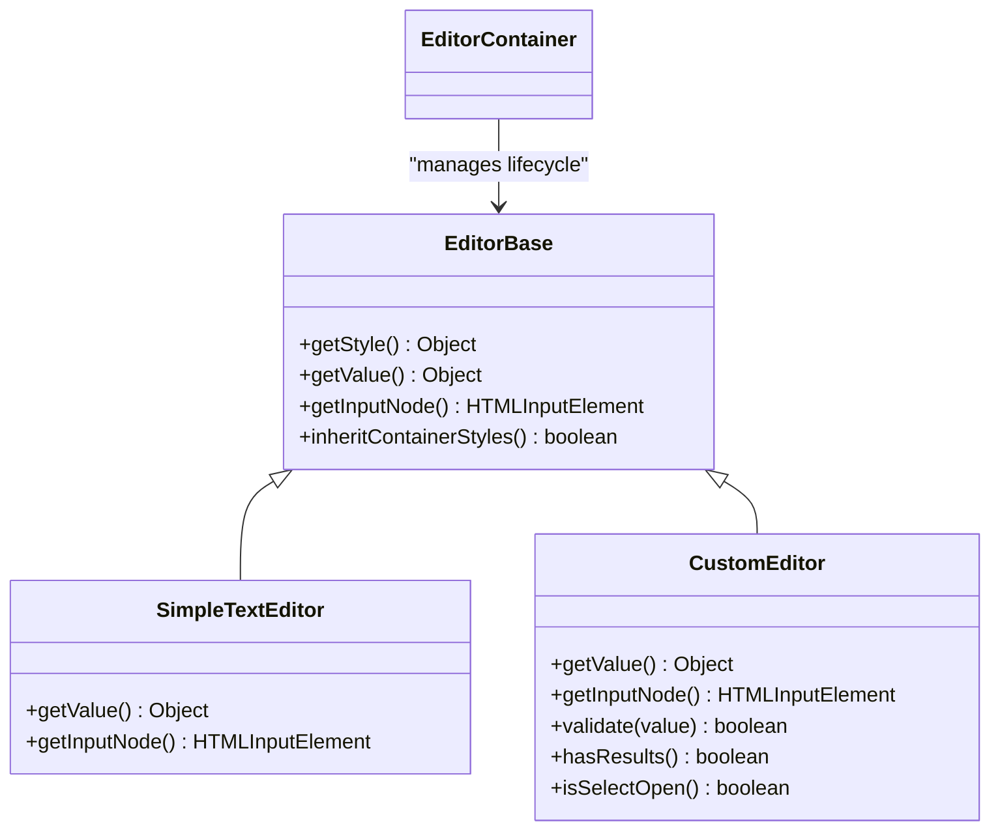
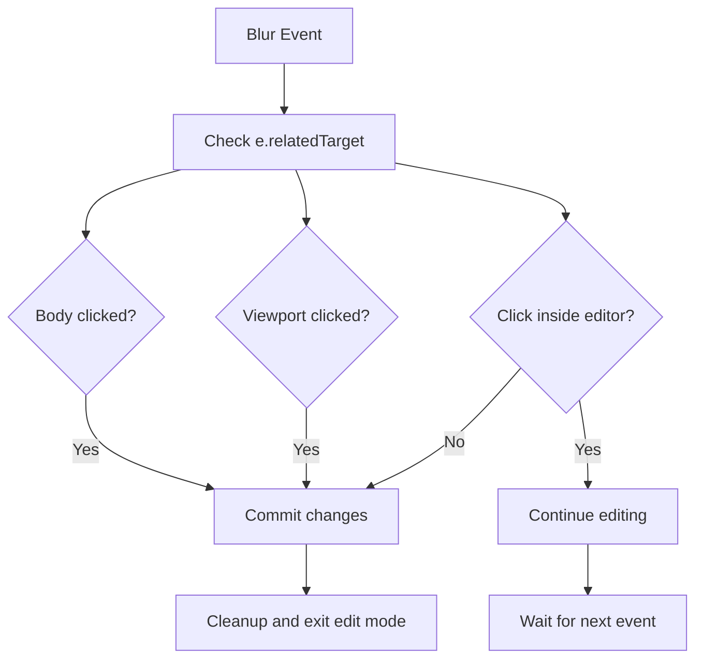

# EditorContainer and Editor Lifecycle

<details>
<summary>Relevant source files</summary>

The following files were used as context for generating this wiki page:

- [src/addons/editors/EditorBase.js](src/addons/editors/EditorBase.js)
- [src/addons/editors/EditorContainer.js](src/addons/editors/EditorContainer.js)
- [src/addons/editors/__tests__/EditorContainer.spec.js](src/addons/editors/__tests__/EditorContainer.spec.js)
- [src/addons/editors/__tests__/SimpleTextEditor.spec.js](src/addons/editors/__tests__/SimpleTextEditor.spec.js)

</details>


This document explains the `EditorContainer` component and the complete lifecycle of cell editors within the React Data Grid. It covers how editors are instantiated, managed, validated, and committed during cell editing operations.

For information about specific built-in editor types and their configurations, see [Built-in Editors](#4.2). For broader context about the plugin system that enables custom editors, see [Plugin Architecture](#5.1).

## EditorContainer Overview

The `EditorContainer` component acts as a wrapper and lifecycle manager for all cell editors in the grid. It handles the creation, keyboard interaction, validation, and commit/cancel logic for any editor type, whether built-in or custom.

### Core Responsibilities

| Responsibility | Description |
|---|---|
| Editor instantiation | Creates appropriate editor based on column configuration |
| Lifecycle management | Handles mount/unmount and focus management |
| Keyboard navigation | Processes keyboard events and grid navigation |
| Validation | Validates editor input and displays error states |
| Commit/Cancel | Manages when and how changes are saved or discarded |

The `EditorContainer` serves as a bridge between the grid's cell rendering system and individual editor components, providing a consistent interface regardless of the underlying editor implementation.



**Sources:** [src/addons/editors/EditorContainer.js:8-26](), [src/addons/editors/EditorContainer.js:51-75]()

## Editor Lifecycle Phases

The editor lifecycle consists of five distinct phases, each with specific responsibilities and state transitions.

### Phase 1: Initialization and Mount

When a cell enters edit mode, `EditorContainer` is instantiated and mounted. The component immediately:

1. Determines the initial editor value based on the triggering event
2. Creates the appropriate editor instance
3. Sets focus and applies styling
4. Initializes validation state



The initial value logic handles special cases where the user triggered editing with specific keys:

- `Delete` or `Backspace`: Start with empty string
- `Enter`: Use current cell value
- Printable characters: Use the typed character
- Other cases: Use current cell value

**Sources:** [src/addons/editors/EditorContainer.js:30-43](), [src/addons/editors/EditorContainer.js:162-173]()

### Phase 2: Editor Creation and Configuration

The `createEditor` method instantiates the appropriate editor based on the column configuration. It supports three editor types:

| Editor Type | Detection Logic | Implementation |
|---|---|---|
| React Element | `React.isValidElement(CustomEditor)` | Clone element with props |
| React Component | `isFunction(CustomEditor)` | Instantiate component |
| Default | No custom editor specified | Use `SimpleTextEditor` |



All editors receive a standardized set of props including `value`, `onCommit`, `onBlur`, `column`, `rowData`, `height`, and keyboard event handlers.

**Sources:** [src/addons/editors/EditorContainer.js:51-75]()

### Phase 3: Active Editing and Interaction

During the editing phase, `EditorContainer` manages all user interactions through keyboard and mouse events. The keyboard handling system uses the `keyboardHandlerMixin` to process navigation and editing actions.

#### Keyboard Navigation Logic

| Key | Condition | Action |
|---|---|---|
| Enter | Always | Commit and move to next row |
| Tab | Always | Commit and move to next column |
| Escape | Editor not open | Cancel editing |
| Arrow Up/Down | Editor has no results | Commit and navigate |
| Arrow Left | Caret not at beginning | Allow internal navigation |
| Arrow Right | Caret not at end | Allow internal navigation |

The container intelligently handles keyboard events to prevent conflicts between editor-internal navigation and grid navigation:



**Sources:** [src/addons/editors/EditorContainer.js:77-128](), [src/addons/editors/EditorContainer.js:214-223]()

### Phase 4: Validation and Error Handling

Before committing any changes, `EditorContainer` validates the new value if the editor provides a `validate` method. The validation system:

1. Calls `editor.validate(value)` if available
2. Updates internal state with validation result
3. Displays error indicators for invalid values
4. Prevents commit of invalid data

```mermaid
stateDiagram-v2
    [*] --> ValidateValue
    ValidateValue --> HasValidator{"Editor has validate()?"}
    
    HasValidator -->|Yes| CallValidator : "editor.validate(value)"
    HasValidator -->|No| Valid : "Default valid"
    
    CallValidator --> ValidResult{"Validation result?"}
    ValidResult -->|True| Valid
    ValidResult -->|False| Invalid
    
    Valid --> UpdateState : "setState({isInvalid: false})"
    Invalid --> UpdateState : "setState({isInvalid: true})"
    
    UpdateState --> RenderIcon
    RenderIcon --> [*]
```

Invalid states trigger visual feedback through CSS classes and status icons, providing immediate user feedback about data quality issues.

**Sources:** [src/addons/editors/EditorContainer.js:190-198](), [src/addons/editors/EditorContainer.js:279-283]()

### Phase 5: Commit and Cleanup

The commit process can be triggered by various events (keyboard, blur, unmount). The `commit` method:

1. Retrieves the current editor value
2. Validates the value
3. If valid, marks as committed and calls `cellMetaData.onCommit`
4. Passes the updated value with cell coordinates to the parent grid



The component also handles automatic cleanup on unmount, ensuring that uncommitted changes are saved unless the user explicitly cancelled with Escape.

**Sources:** [src/addons/editors/EditorContainer.js:181-188](), [src/addons/editors/EditorContainer.js:45-49]()

## Custom Editor Integration

Custom editors integrate with `EditorContainer` through a well-defined interface. All custom editors should extend `EditorBase` or implement the required methods directly.

### Required Editor Methods

| Method | Purpose | Return Type |
|---|---|---|
| `getValue()` | Return current editor value | `Object` with column key |
| `getInputNode()` | Return the DOM input element | `HTMLInputElement` |

### Optional Editor Methods

| Method | Purpose | Default Behavior |
|---|---|---|
| `validate(value)` | Validate input value | No validation |
| `hasResults()` | Check if autocomplete/dropdown has results | `false` |
| `isSelectOpen()` | Check if dropdown is open | `false` |

The `EditorBase` class provides default implementations for common patterns:



**Sources:** [src/addons/editors/EditorBase.js:5-32](), [src/addons/editors/EditorContainer.js:130-144]()

## Focus and Blur Management

The `EditorContainer` implements sophisticated focus management to handle complex user interaction scenarios including clicks inside/outside the editor and navigation between grid elements.

### Focus Initialization

When an editor is mounted, focus is set based on the triggering event:
- For printable characters: Select all text, allowing immediate replacement
- For navigation keys: Select all text for easy editing
- For Enter: Position cursor appropriately for editing

### Blur Event Handling

The blur handling logic determines whether to commit or maintain editing based on where focus moved:



This ensures that users can interact with complex editors (with multiple inputs, buttons, dropdowns) without accidentally committing incomplete changes.

**Sources:** [src/addons/editors/EditorContainer.js:225-249](), [src/addons/editors/EditorContainer.js:251-264]()
