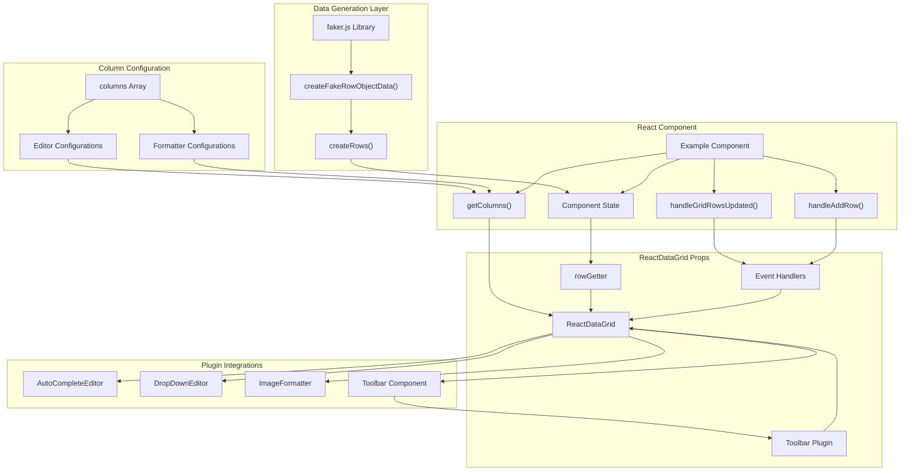
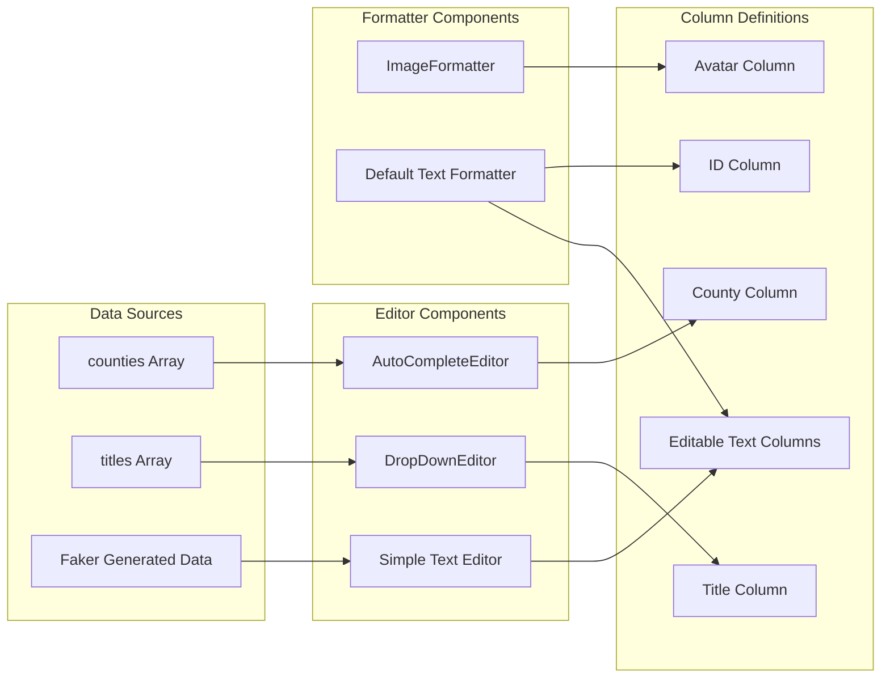
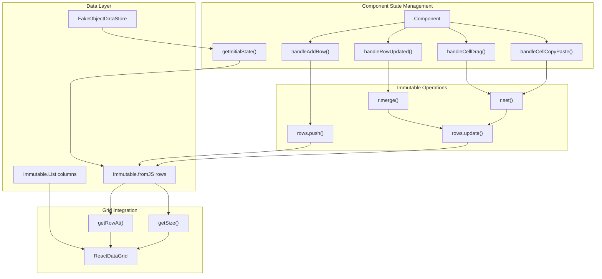
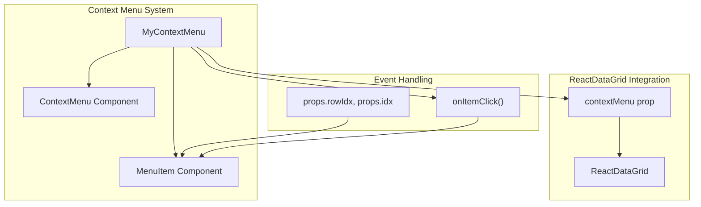
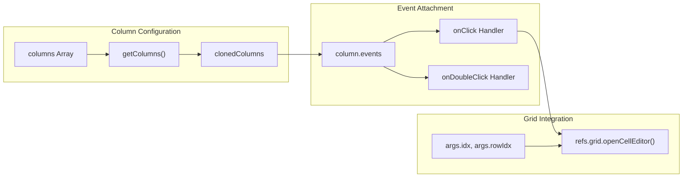
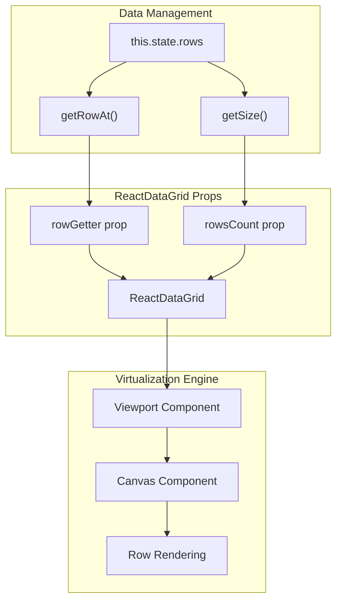

# Advanced Examples

Relevant source files

The following files were used as context for generating this wiki page:

- [examples/scripts/example13-all-features.js](examples/scripts/example13-all-features.js)
- [examples/scripts/example14-all-features-immutable.js](examples/scripts/example14-all-features-immutable.js)
- [src/addons/cells/headerCells/FilterableHeaderCell.js](src/addons/cells/headerCells/FilterableHeaderCell.js)

## Purpose and Scope

This document covers complex implementations of react-data-grid that demonstrate multiple features working together in production-ready scenarios. These examples showcase comprehensive data grid functionality including custom editors, formatters, toolbars, context menus, drag operations, and large dataset handling.

For basic grid setup and simple examples, see [Basic Examples](#7.1). For detailed information about specific features like filtering and sorting, see [Advanced Features](#6).

## Comprehensive Feature Integration

The advanced examples demonstrate how react-data-grid's plugin architecture enables sophisticated data grid applications. The primary advanced examples are:

| Example | File | Key Features |
|---------|------|--------------|
| All Features | `example13-all-features.js` | Custom editors, formatters, toolbar, large datasets |
| All Features (Immutable) | `example14-all-features-immutable.js` | Immutable.js integration, context menus, drag operations |

### All Features Example Architecture

The comprehensive example in [examples/scripts/example13-all-features.js]() demonstrates a production-ready grid implementation:

**Sources:** [examples/scripts/example13-all-features.js:1-255]()

### Advanced Editor Integration

The examples demonstrate sophisticated editor configuration using the plugin system:

**Sources:** [examples/scripts/example13-all-features.js:41-179](), [examples/scripts/example13-all-features.js:75-179]()

## Immutable.js Integration Pattern

The immutable example demonstrates advanced state management patterns:

### Immutable Data Flow Architecture

**Sources:** [examples/scripts/example14-all-features-immutable.js:160-234]()

## Context Menu Integration

The immutable example includes advanced context menu functionality:

### Context Menu Component Structure

The `MyContextMenu` component demonstrates custom context menu integration:

**Sources:** [examples/scripts/example14-all-features-immutable.js:147-158](), [examples/scripts/example14-all-features-immutable.js:217]()

## Advanced Event Handling Patterns

Both examples demonstrate sophisticated event handling for complex user interactions:

### Event Handler Configuration

| Event Type | Handler Function | Purpose |
|------------|------------------|---------|
| `onGridRowsUpdated` | `handleGridRowsUpdated()` | Batch row updates |
| `onRowUpdated` | `handleRowUpdated()` | Single row updates with Immutable |
| `onCellsDragged` | `handleCellDrag()` | Cell drag operations |
| `onCellCopyPaste` | `handleCellCopyPaste()` | Copy/paste functionality |
| `onClick` | Custom column events | Column-specific interactions |
| `onDoubleClick` | Custom column events | Column-specific interactions |

### Column Event Configuration

The examples show how to attach custom events to specific columns:

**Sources:** [examples/scripts/example13-all-features.js:189-200](), [examples/scripts/example13-all-features.js:103-107]()

## Performance Optimization Features

The advanced examples demonstrate performance optimization techniques for large datasets:

### Large Dataset Configuration

| Feature | Configuration | Value | Purpose |
|---------|---------------|-------|---------|
| Row Count | `rowsCount` | 2000+ | Large dataset testing |
| Row Height | `rowHeight` | 50px | Consistent virtualization |
| Min Height | `minHeight` | 600px | Viewport optimization |
| Scroll Timeout | `rowScrollTimeout` | 200ms | Debounced scrolling |

### Virtualization Integration

The examples leverage the grid's virtualization system through proper data accessor patterns:

**Sources:** [examples/scripts/example13-all-features.js:224-233](), [examples/scripts/example13-all-features.js:241-242]()

## Plugin Integration Patterns

The examples demonstrate comprehensive plugin usage through the global registry:

### Plugin Registry Access

Both examples access plugins through the global `ReactDataGridPlugins` object:

| Plugin Category | Access Pattern | Examples |
|----------------|----------------|----------|
| Editors | `ReactDataGridPlugins.Editors` | `AutoComplete`, `DropDownEditor` |
| Formatters | `ReactDataGridPlugins.Formatters` | `ImageFormatter` |
| Toolbar | `ReactDataGridPlugins.Toolbar` | `Toolbar` |
| Menu | `ReactDataGridPlugins.Menu` | `ContextMenu`, `MenuItem` |

**Sources:** [examples/scripts/example13-all-features.js:6-9](), [examples/scripts/example14-all-features-immutable.js:5-11]()
