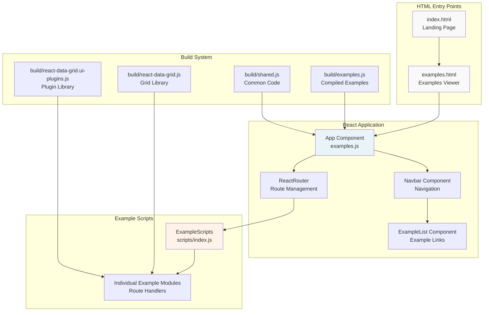
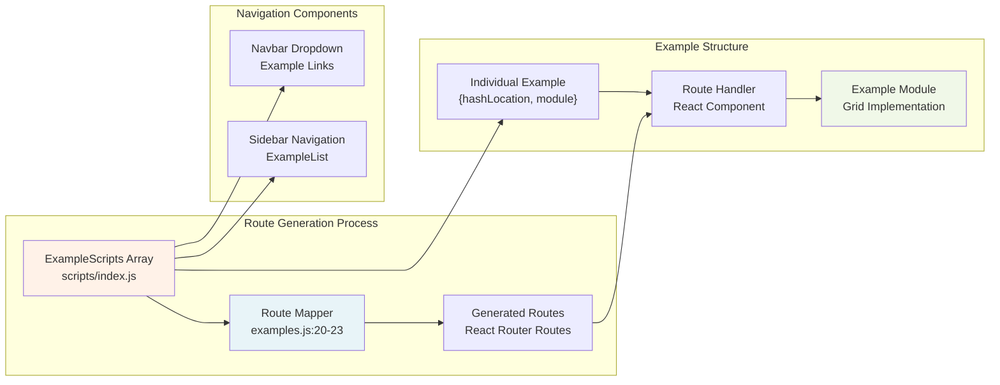
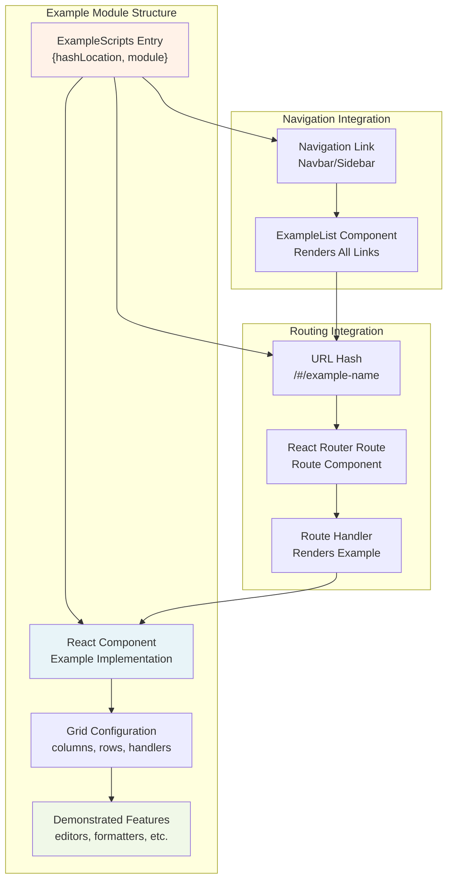

# Basic Examples

Relevant source files

The following files were used as context for generating this wiki page:

- [examples/assets/css/main.css](examples/assets/css/main.css)
- [examples/assets/images/datagrid1.png](examples/assets/images/datagrid1.png)
- [examples/components/Navbar.js](examples/components/Navbar.js)
- [examples/examples.html](examples/examples.html)
- [examples/examples.js](examples/examples.js)
- [examples/index.html](examples/index.html)

This page documents the basic examples system in the React Data Grid project, including the structure of example files, the routing system, and how examples are organized and displayed. These examples serve as practical demonstrations of core grid functionality for users getting started with the library.

For more complex implementations featuring all advanced features, see [Advanced Examples](#7.2). For understanding the underlying component architecture, see [Core Architecture](#2).

## Example System Architecture

The examples system is built as a standalone React application that demonstrates various grid configurations and features. The system uses React Router for navigation between different example implementations.

Sources: [examples/index.html:1-190](), [examples/examples.html:1-64](), [examples/examples.js:1-34](), [examples/components/Navbar.js:1-43]()

## Example Loading and Routing System

The examples use a dynamic routing system where each example is loaded as a separate module and mapped to a specific route. This allows for modular organization of examples and easy navigation between different demonstrations.

Sources: [examples/examples.js:20-29](), [examples/examples.js:31-34](), [examples/components/Navbar.js:27-30]()

## HTML Structure and Asset Loading

The examples system uses two main HTML entry points that load the necessary dependencies and provide the structure for displaying examples.

| HTML File | Purpose | Target Element | Key Dependencies |
|-----------|---------|----------------|------------------|
| `index.html` | Landing page with grid showcase | `#grid-examples-div` | React, Grid library, Basic styling |
| `examples.html` | Full examples viewer | `#example`, `#grid-examples-div` | React Router, All plugins, CodeMirror |

### Key Asset Loading Pattern

Both HTML files follow a consistent pattern for loading dependencies:

1. **Core Libraries**: React, ReactDOM, jQuery
2. **Grid Components**: `react-data-grid.js`, `react-data-grid.ui-plugins.js`
3. **Build Artifacts**: `shared.js`, `examples.js` (or `index.js`)
4. **Styling**: Bootstrap, custom CSS, grid themes

Sources: [examples/index.html:19-28](), [examples/examples.html:55-61]()

## Example Organization Structure

The examples follow a modular structure where each example is self-contained and demonstrates specific grid features:

Sources: [examples/examples.js:20-23](), [examples/components/Navbar.js:29](), [examples/examples.js:34]()

## Main Application Component

The main `App` component in [examples/examples.js:9-18]() serves as the root container for all examples. It provides the basic layout structure and integrates with React Router's `RouteHandler` to display the selected example.

Key characteristics:
- Uses `RouteHandler` for dynamic content rendering
- Provides consistent page header across all examples
- Integrates with the routing system for example navigation

The application initialization occurs in [examples/examples.js:31-34](), where:
- Routes are processed and the router is started
- The main example content is rendered to `#example`
- The sidebar navigation is rendered to `#grid-examples-div`

## Development and Build Integration

The examples system integrates with the project's build system to provide both development and production capabilities:

| Build Artifact | Purpose | Contains |
|-----------------|---------|-----------|
| `build/examples.js` | Compiled example code | All example modules and routing |
| `build/shared.js` | Common utilities | Shared code between examples |
| `build/react-data-grid.js` | Core grid library | Main ReactDataGrid component |
| `build/react-data-grid.ui-plugins.js` | Plugin extensions | Editors, formatters, tools |

The build system ensures that examples have access to:
- Latest grid component builds
- All available plugins and extensions  
- Proper asset compilation and optimization
- Development tools like CodeMirror for code display

Sources: [examples/examples.html:58-61](), [examples/index.html:25-28]()
