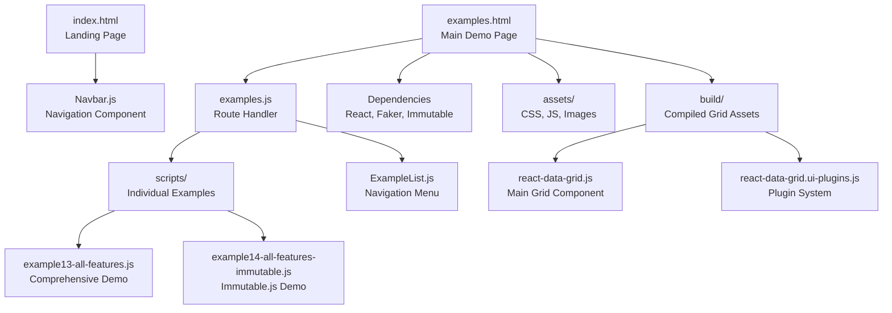
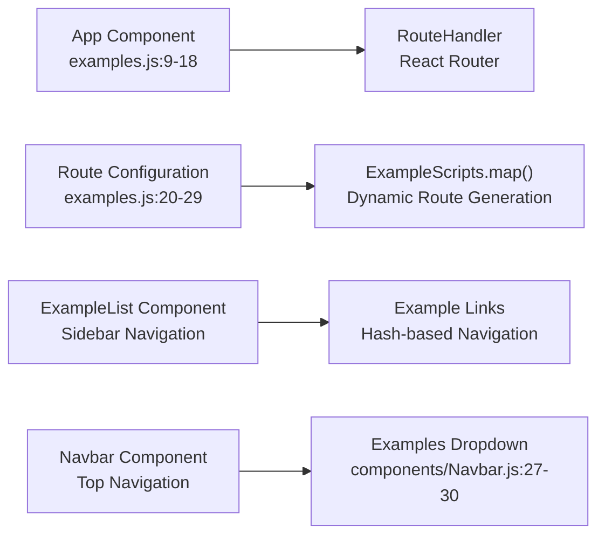
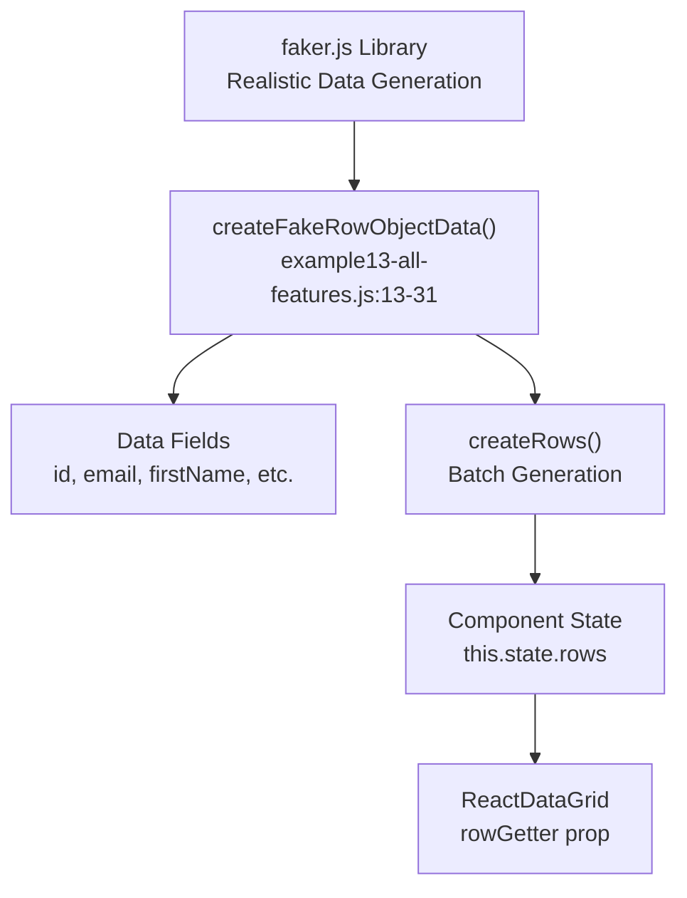
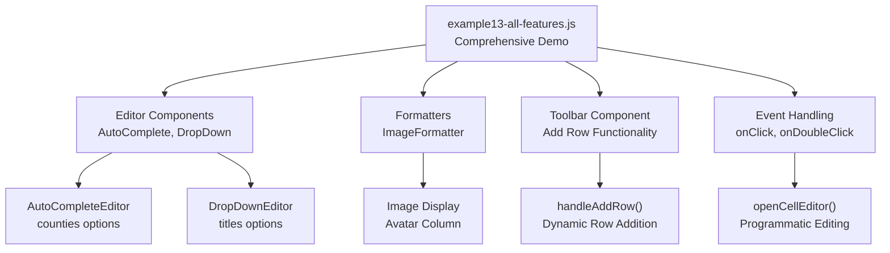
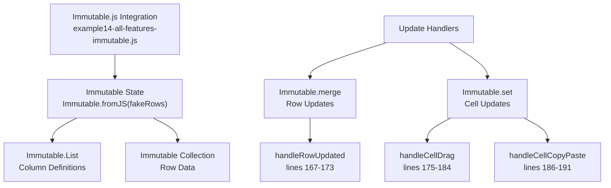
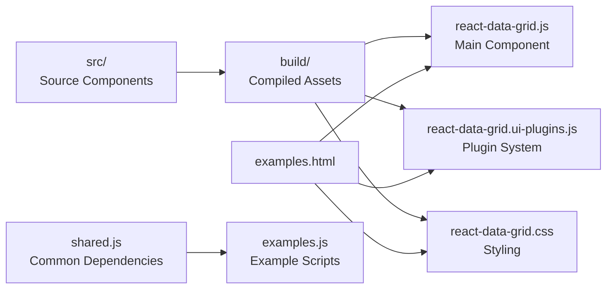
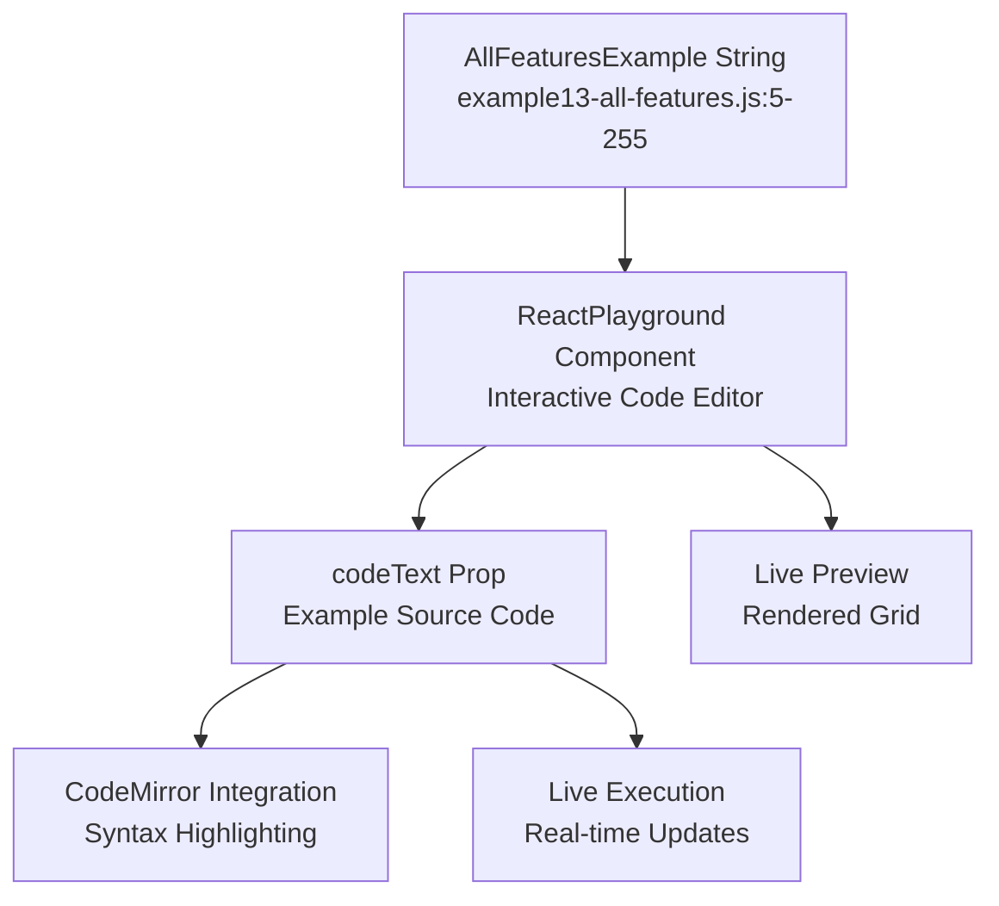

# Examples and Demos

Relevant source files

The following files were used as context for generating this wiki page:

- [examples/assets/css/main.css](examples/assets/css/main.css)
- [examples/assets/images/datagrid1.png](examples/assets/images/datagrid1.png)
- [examples/components/Navbar.js](examples/components/Navbar.js)
- [examples/examples.html](examples/examples.html)
- [examples/examples.js](examples/examples.js)
- [examples/index.html](examples/index.html)
- [examples/scripts/example13-all-features.js](examples/scripts/example13-all-features.js)
- [examples/scripts/example14-all-features-immutable.js](examples/scripts/example14-all-features-immutable.js)
- [src/addons/cells/headerCells/FilterableHeaderCell.js](src/addons/cells/headerCells/FilterableHeaderCell.js)

This document covers the examples and demonstration system built into the react-data-grid project, including the interactive demo site, example implementations, and the infrastructure that supports them. The examples serve as both documentation and testing tools, showcasing various grid features and usage patterns.

For installation and basic setup information, see [Installation and Getting Started](#1.1). For detailed API documentation, see [API Reference](#9).

## Example System Architecture

The examples system is built as a React application with client-side routing, designed to showcase different grid configurations and features in an interactive format.

### Example Application Structure

Sources: [examples/examples.html:1-65](), [examples/examples.js:1-35](), [examples/components/Navbar.js:1-44]()

### Routing and Navigation System

The examples application uses React Router to provide navigation between different demonstration scenarios:

The routing system maps example scripts to hash-based URLs, allowing direct navigation to specific demonstrations.

Sources: [examples/examples.js:20-34](), [examples/components/Navbar.js:27-30]()

## Basic Examples

### Simple Grid Implementation

Basic examples demonstrate fundamental grid functionality with minimal configuration:

| Feature | Implementation | Example File |
|---------|---------------|--------------|
| Data Display | Static row rendering | `scripts/example01-basic.js` |
| Column Definition | Basic column configuration | `scripts/example02-columns.js` |
| Cell Editing | Simple text editors | `scripts/example03-editing.js` |

### Data Generation and Management

Examples use the `faker.js` library for generating realistic test data:

The data generation creates comprehensive test datasets with various field types including images, addresses, and business information.

Sources: [examples/scripts/example13-all-features.js:13-39]()

## Advanced Examples

### Comprehensive Feature Demonstration

The most complete example (`example13-all-features.js`) showcases the full capability set of the grid system:

This example demonstrates advanced plugin integration, custom editors, and complex event handling patterns.

Sources: [examples/scripts/example13-all-features.js:75-254]()

### Immutable.js Integration

The `example14-all-features-immutable.js` demonstrates integration with Immutable.js for state management:

This pattern shows how to integrate the grid with immutable data structures for better performance and predictable state updates.

Sources: [examples/scripts/example14-all-features-immutable.js:160-234]()

## Demo Infrastructure

### Build System Integration

The examples are integrated with the project's build system to ensure they use the latest compiled grid components:

The build system ensures examples always use the current version of grid components during development.

Sources: [examples/examples.html:58-61](), [examples/index.html:25-27]()

### Styling and Assets

Examples include comprehensive styling and asset management:

| Asset Type | Location | Purpose |
|------------|----------|---------|
| CSS Frameworks | `assets/css/bootstrap.min.css` | Layout and components |
| Custom Styles | `assets/css/main.css` | Demo-specific styling |
| Grid Styles | `build/react-data-grid.css` | Component styling |
| JavaScript Libraries | `assets/js/` | Supporting functionality |

The styling system provides a professional appearance while highlighting grid functionality.

Sources: [examples/examples.html:23-28](), [examples/assets/css/main.css:1-570]()

### Interactive Playground

Examples use `ReactPlayground` component for live code editing and execution:

This system allows users to modify example code and see results immediately, enhancing the learning experience.

Sources: [examples/scripts/example13-all-features.js:266](), [examples/examples.html:17-18]()
