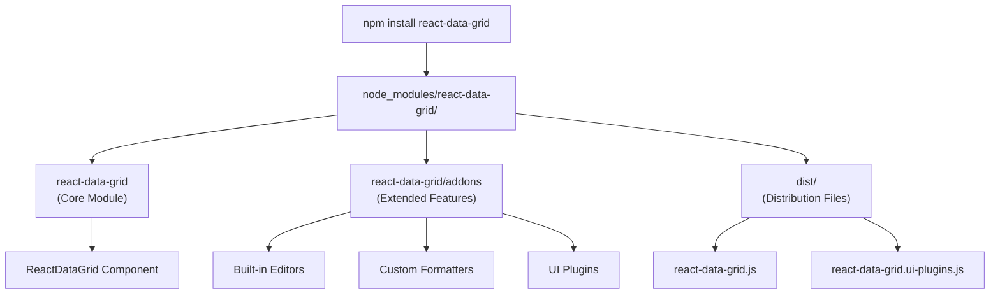
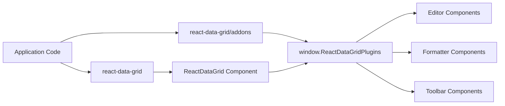
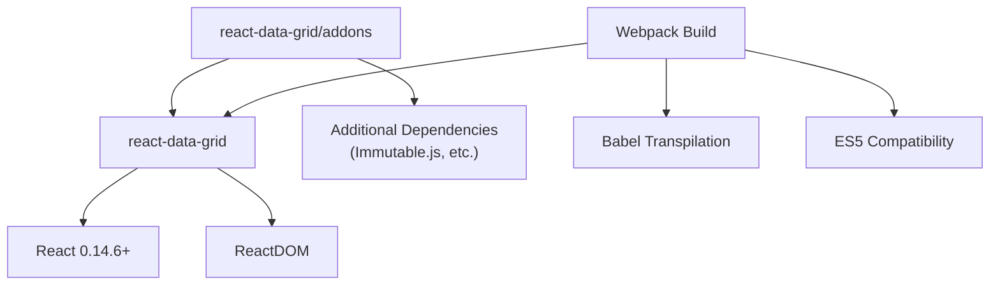

# Installation and Getting Started

<details>
<summary>Relevant source files</summary>

The following files were used as context for generating this wiki page:

- [README.md](README.md)
- [examples/documentation.html](examples/documentation.html)
- [examples/scripts/documentation01-gettingstarted.js](examples/scripts/documentation01-gettingstarted.js)
- [gulp/tasks/examples.js](gulp/tasks/examples.js)

</details>


This document covers the installation process and initial setup for react-data-grid. It explains the available installation methods, module structure, and basic usage patterns needed to integrate the grid component into your application.

For information about the core architecture and component hierarchy, see [Core Architecture](#2). For details about the plugin system and addons functionality, see [Plugin System and Addons](#5).

## Installation Methods

React-data-grid provides two primary installation approaches: npm package installation for modern build systems, and direct distribution scripts for traditional web applications.

### NPM Installation

The standard installation method uses npm to install the package and its dependencies:

```bash
npm install react-data-grid
```

This approach is recommended for applications using CommonJS modules, ES6 imports, or modern bundlers like webpack or browserify, as indicated in [README.md:17-19]().

The npm installation provides access to two distinct modules:
- `react-data-grid` - Core grid functionality
- `react-data-grid/addons` - Extended features including editors, formatters, and UI plugins



Sources: [README.md:13-19](), [README.md:27-48]()

### Distribution Scripts

For applications that don't use module bundlers, react-data-grid provides pre-built distribution files that can be included directly in HTML:

```html
<script src="//fb.me/react-0.14.6.js"></script>
<script type="text/javascript" src="react-data-grid/dist/react-data-grid.js"></script>
```

For extended features, include the addons distribution file:

```html
<script type="text/javascript" src="react-data-grid/dist/react-data-grid.ui-plugins.js"></script>
```

The distribution approach is demonstrated in [examples/documentation.html:82-84]() where both `react-data-grid.ui-plugins.js` and `react-data-grid.js` are loaded.

Sources: [examples/scripts/documentation01-gettingstarted.js:23-32](), [examples/documentation.html:82-84]()

## Module Structure and Import Patterns

React-data-grid's module architecture has undergone significant changes between versions, particularly around how addons are structured and imported.

### Version 1.0.0+ Module Structure

Starting with version 1.0.0, the modules are completely independent:

```javascript
// Core grid only
var ReactDataGrid = require('react-data-grid');

// Core grid + addons (requires both imports)
var ReactDataGrid = require('react-data-grid');
require('react-data-grid/addons'); // Registers plugins globally
```



The addons module populates the global `window.ReactDataGridPlugins` registry, which is referenced by core components as shown in the plugin architecture.

Sources: [README.md:40-48](), [README.md:44-46]()

### Version 0.x.x Legacy Structure

In the legacy 0.x.x versions, `react-data-grid/addons` included the core grid:

```javascript
// 0.x.x - addons included core grid
var ReactDataGrid = require('react-data-grid/addons'); // Contains everything
```

This approach had dependency issues with older browsers and caused bundling bloat, as noted in [README.md:36-38]().

Sources: [README.md:31-38]()

## Basic Usage Patterns

### CommonJS/Node.js Environment

For applications using CommonJS or Node.js build environments:

```javascript
var React = require('react');
var ReactDataGrid = require('react-data-grid');

// For extended features
require('react-data-grid/addons');
```

### ES6/Modern JavaScript

The same patterns apply for ES6 import syntax:

```javascript
import React from 'react';
import ReactDataGrid from 'react-data-grid';
import 'react-data-grid/addons'; // Side-effect import for plugins
```

### Build System Integration

The webpack configuration in [gulp/tasks/examples.js:11-43]() demonstrates how react-data-grid integrates with build systems:

- Uses UMD library target for broad compatibility
- Externalizes React dependencies to avoid duplication
- Handles babel transpilation for modern JavaScript features

Sources: [examples/scripts/documentation01-gettingstarted.js:11-21](), [gulp/tasks/examples.js:11-43]()

## Dependency Requirements

React-data-grid requires React as a peer dependency. The examples demonstrate compatibility with React 0.14.6 as shown in [examples/documentation.html:29-30]().



Additional dependencies for advanced features may include libraries like Immutable.js for data handling, as referenced in [examples/documentation.html:26]().

Sources: [examples/documentation.html:29-30](), [examples/documentation.html:26](), [gulp/tasks/examples.js:30-36]()

## Migration Considerations

When upgrading from version 0.x.x to 1.0.0+, applications must modify their import statements:

**Before (0.x.x):**
```javascript
var ReactDataGrid = require('react-data-grid/addons'); // Everything included
```

**After (1.0.0+):**
```javascript
var ReactDataGrid = require('react-data-grid');
require('react-data-grid/addons'); // Separate addon import required
```

This breaking change separates concerns and resolves browser compatibility issues while maintaining the same functionality, as documented in [README.md:49-51]().

Sources: [README.md:49-51](), [README.md:40-42]()
