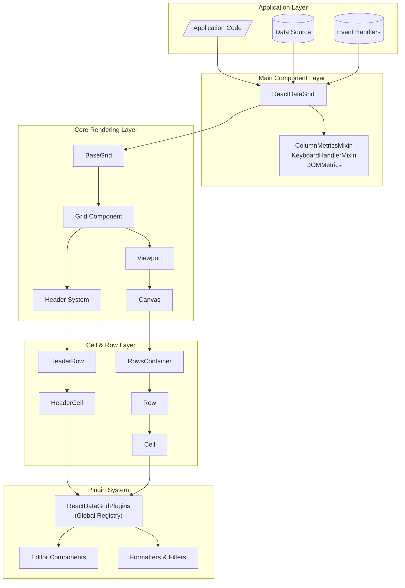
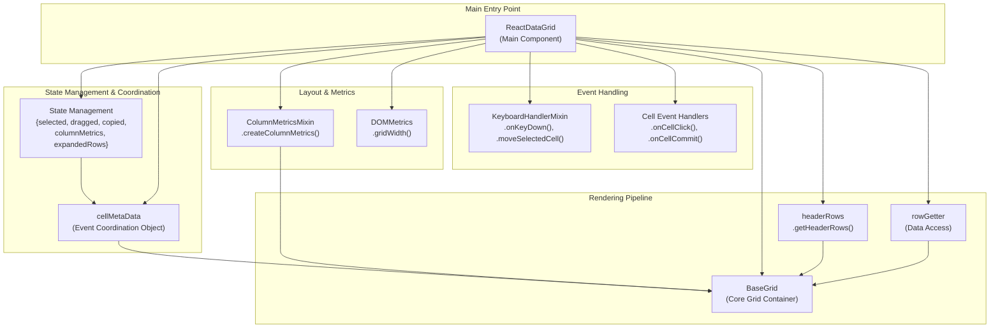
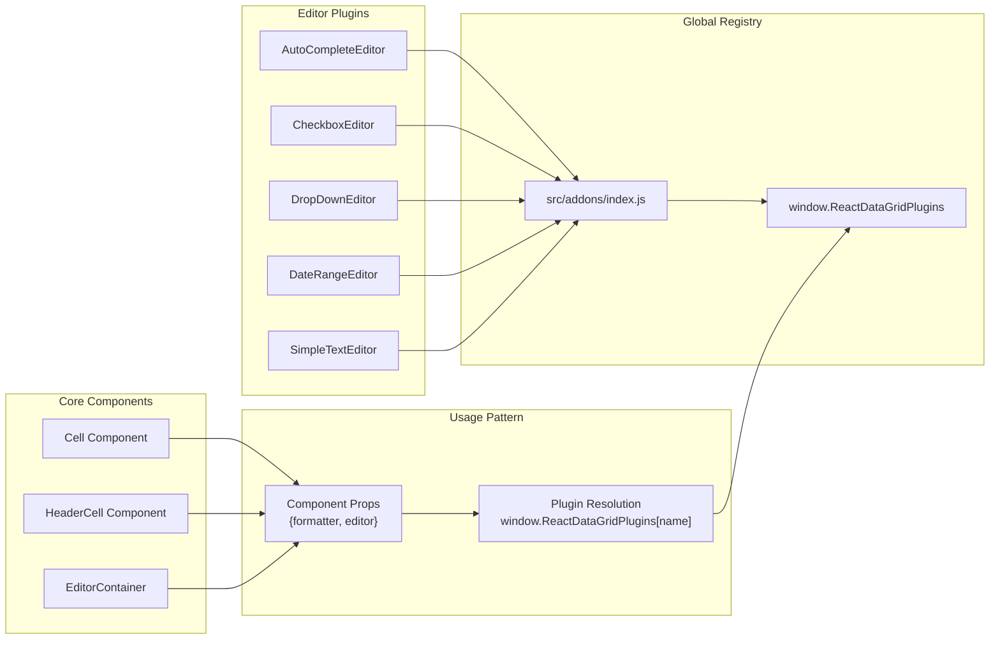
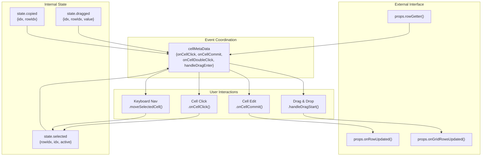

# Overview

<details>
<summary>Relevant source files</summary>

The following files were used as context for generating this wiki page:

- [README.md](README.md)
- [src/AppConstants.js](src/AppConstants.js)
- [src/ReactDataGrid.js](src/ReactDataGrid.js)
- [src/__tests__/AppConstants.spec.js](src/__tests__/AppConstants.spec.js)
- [themes/react-data-grid.css](themes/react-data-grid.css)

</details>


## Purpose and Scope

This document provides an overview of the React Data Grid codebase, introducing its architecture, key components, and fundamental concepts. React Data Grid is an advanced JavaScript spreadsheet-like grid component built using React that provides Excel-like functionality including virtualized rendering, inline editing, keyboard navigation, and extensive customization capabilities.

For detailed installation instructions and basic usage patterns, see [Installation and Getting Started](#1.1). For comprehensive component documentation, see [Core Components](#3). For information about extending functionality, see [Plugin System and Addons](#5).

## What is React Data Grid

React Data Grid is a high-performance, feature-rich data grid component designed to handle large datasets efficiently. As described in [README.md:6](), it provides "Excel-like grid component built with React, with editors, keyboard navigation, copy & paste, and the like".

The library is distributed as two main modules as outlined in [README.md:27-47]():
- `react-data-grid` - Core grid functionality
- `react-data-grid/addons` - Extended plugins and editors

## Key Features

The grid provides comprehensive spreadsheet-like functionality including:

- **Lightning fast virtual rendering** - Can render hundreds of thousands of rows without performance degradation
- **Rich editing capabilities** - Built-in editors for various data types with custom editor support
- **Advanced navigation** - Full keyboard navigation and cell selection modes
- **Data manipulation** - Copy/paste, drag-and-drop, cell drag-down operations
- **Column management** - Resizable, sortable, filterable, and frozen columns
- **Row operations** - Row selection, grouping, and expansion capabilities
- **Extensible architecture** - Plugin system for custom formatters, editors, and UI components

## High-Level Architecture

React Data Grid follows a layered architecture with clear separation of concerns:



*Sources: [src/ReactDataGrid.js:1-48](), [README.md:23-24]()*

## Component Hierarchy

The main `ReactDataGrid` component orchestrates the entire grid through a well-defined component hierarchy:



*Sources: [src/ReactDataGrid.js:42-48](), [src/ReactDataGrid.js:124-133](), [src/ReactDataGrid.js:841-860]()*

## Plugin System Overview

React Data Grid uses a global plugin registry system that enables extensible functionality without tight coupling:



*Sources: [src/ReactDataGrid.js:7](), [README.md:27-47]()*

## Data Flow and Event System

The grid implements a centralized event coordination system using the `cellMetaData` object:



*Sources: [src/ReactDataGrid.js:841-860](), [src/ReactDataGrid.js:289-309](), [src/ReactDataGrid.js:644-658]()*

## Update Actions and Constants

The grid defines standardized update actions for tracking data changes:

| Action | Constant | Usage |
|--------|----------|-------|  
| Cell Edit | `CELL_UPDATE` | Individual cell value changes |
| Column Fill | `COLUMN_FILL` | Drag-down fill operations |
| Copy/Paste | `COPY_PASTE` | Clipboard operations |
| Cell Drag | `CELL_DRAG` | Drag and drop cell moves |

*Sources: [src/AppConstants.js:3-10](), [src/ReactDataGrid.js:308](), [src/ReactDataGrid.js:345](), [src/ReactDataGrid.js:417](), [src/ReactDataGrid.js:387]()*

## Getting Started

To begin using React Data Grid, install the package via npm as shown in [README.md:13-14]():

```bash
npm install react-data-grid
```

The basic usage pattern involves importing the main component and providing required props including `columns`, `rowGetter`, `rowsCount`, `rowHeight`, and `minHeight`. For advanced features including rich editors and plugins, also import `react-data-grid/addons`.

For detailed setup instructions and examples, see [Installation and Getting Started](#1.1). For complete component documentation and API reference, see [API Reference](#9).

*Sources: [README.md:10-19](), [README.md:40-47](), [src/ReactDataGrid.js:50-109]()*
