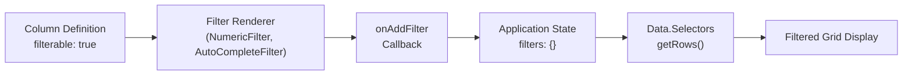
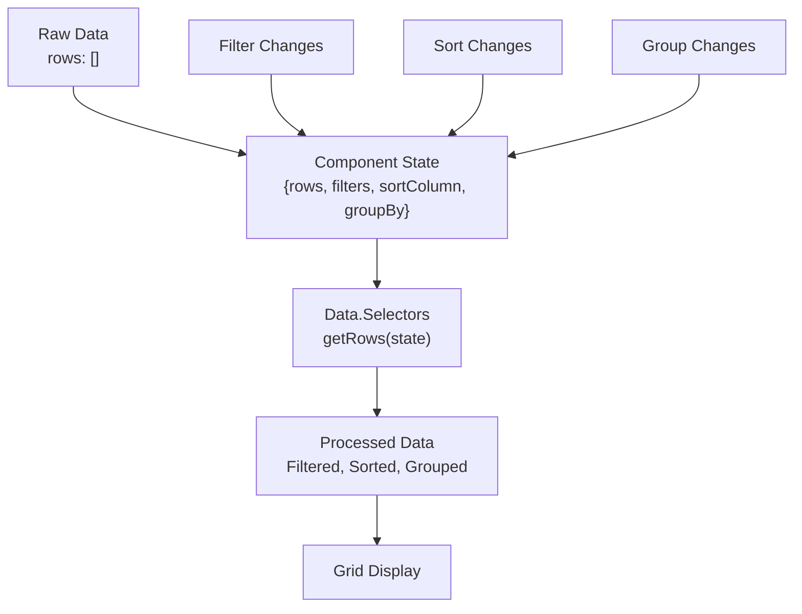

# Available Plugins

<details>
<summary>Relevant source files</summary>

The following files were used as context for generating this wiki page:

- [examples/examples.less](examples/examples.less)
- [examples/scripts/example09-filterable-grid.js](examples/scripts/example09-filterable-grid.js)
- [examples/scripts/example13-all-features.js](examples/scripts/example13-all-features.js)
- [examples/scripts/example14-all-features-immutable.js](examples/scripts/example14-all-features-immutable.js)
- [examples/scripts/example16-filterable-sortable-grid.js](examples/scripts/example16-filterable-sortable-grid.js)
- [examples/scripts/example21-grouping.js](examples/scripts/example21-grouping.js)
- [examples/scripts/example22-custom-filters.js](examples/scripts/example22-custom-filters.js)
- [src/addons/cells/headerCells/FilterableHeaderCell.js](src/addons/cells/headerCells/FilterableHeaderCell.js)

</details>


This document catalogs all available plugins in the ReactDataGrid plugin ecosystem and demonstrates how to use them in your grid implementations. Plugins extend the grid's functionality through the global `ReactDataGridPlugins` registry and provide specialized components for editing, formatting, filtering, and user interface enhancements.

For information about how the plugin architecture works internally, see [Plugin Architecture](#5.1). For examples of plugin usage in complete applications, see [Advanced Examples](#7.2).

## Plugin Registry Structure

The ReactDataGrid plugin system organizes available plugins into logical namespaces within the global `ReactDataGridPlugins` object. Each namespace contains related functionality that can be mixed and matched to create rich grid experiences.

### Plugin Organization

```mermaid
graph TB
    REGISTRY["ReactDataGridPlugins<br/>(Global Registry)"]
    
    EDITORS["Editors<br/>Namespace"]
    FORMATTERS["Formatters<br/>Namespace"] 
    TOOLBAR["Toolbar<br/>Components"]
    MENU["Menu<br/>Namespace"]
    DATA["Data<br/>Namespace"]
    FILTERS["Filters<br/>Namespace"]
    TOOLSPANEL["ToolsPanel<br/>Namespace"]
    DRAGGABLE["Draggable<br/>Namespace"]
    
    REGISTRY --> EDITORS
    REGISTRY --> FORMATTERS
    REGISTRY --> TOOLBAR
    REGISTRY --> MENU
    REGISTRY --> DATA
    REGISTRY --> FILTERS
    REGISTRY --> TOOLSPANEL
    REGISTRY --> DRAGGABLE
    
    EDITORS --> AUTOCOMPLETE["AutoComplete"]
    EDITORS --> DROPDOWN["DropDownEditor"]
    EDITORS --> CHECKBOX["CheckboxEditor"]
    EDITORS --> SIMPLE["SimpleTextEditor"]
    EDITORS --> DATERANGE["DateRangeEditor"]
    
    FORMATTERS --> IMAGE["ImageFormatter"]
    
    MENU --> CONTEXT["ContextMenu"]
    MENU --> MENUITEM["MenuItem"]
    
    DATA --> SELECTORS["Selectors"]
    
    FILTERS --> NUMERIC["NumericFilter"]
    FILTERS --> AUTOFILTER["AutoCompleteFilter"]
    
    TOOLSPANEL --> ADVANCED["AdvancedToolbar"]
    TOOLSPANEL --> GROUPED["GroupedColumnsPanel"]
    
    DRAGGABLE --> CONTAINER["Container"]
```



**Sources:** [examples/scripts/example13-all-features.js:1-271](), [examples/scripts/example14-all-features-immutable.js:1-242](), [examples/scripts/example21-grouping.js:1-218](), [examples/scripts/example22-custom-filters.js:1-146]()

## Editor Plugins

Editor plugins provide specialized input components for different data types and user interaction patterns. They are specified in column definitions using the `editor` property.

| Plugin | Namespace | Purpose | Configuration |
|--------|-----------|---------|---------------|
| `AutoComplete` | `ReactDataGridPlugins.Editors.AutoComplete` | Autocomplete text input with suggestions | `<AutoCompleteEditor options={arrayOfOptions}/>` |
| `DropDownEditor` | `ReactDataGridPlugins.Editors.DropDownEditor` | Dropdown selection from predefined options | `<DropDownEditor options={arrayOfValues}/>` |
| `CheckboxEditor` | `ReactDataGridPlugins.Editors` | Boolean checkbox input | Available in Editors namespace |
| `SimpleTextEditor` | `ReactDataGridPlugins.Editors` | Basic text input | Default editor for editable cells |
| `DateRangeEditor` | `ReactDataGridPlugins.Editors` | Date range selection | Available in Editors namespace |

### Editor Usage Example

```javascript
// Column definition with AutoComplete editor
{
  key: 'county',
  name: 'County',
  editor: <AutoCompleteEditor options={counties}/>,
  width: 200,
  resizable: true
}

// Column definition with DropDown editor  
{
  key: 'title',
  name: 'Title',
  editor: <DropDownEditor options={titles}/>,
  width: 200,
  resizable: true
}
```

**Sources:** [examples/scripts/example13-all-features.js:6-10](), [examples/scripts/example13-all-features.js:93-107](), [examples/scripts/example14-all-features-immutable.js:5-8](), [examples/scripts/example14-all-features-immutable.js:64-74]()

## Formatter Plugins

Formatter plugins control how cell data is displayed and rendered. They transform raw data values into formatted visual representations.

### Available Formatters

| Plugin | Namespace | Purpose | Usage |
|--------|-----------|---------|-------|
| `ImageFormatter` | `ReactDataGridPlugins.Formatters.ImageFormatter` | Renders image URLs as `` elements | `formatter: ReactDataGridPlugins.Formatters.ImageFormatter` |

### Formatter Usage Example

```javascript
// Column with image formatter
{
  key: 'avartar',
  name: 'Avartar', 
  width: 60,
  formatter: ReactDataGridPlugins.Formatters.ImageFormatter,
  resizable: true,
  headerRenderer: <ReactDataGridPlugins.Formatters.ImageFormatter value={faker.image.cats()} />
}
```

**Sources:** [examples/scripts/example13-all-features.js:86-89](), [examples/scripts/example14-all-features-immutable.js:58-60](), [examples/scripts/example21-grouping.js:52-54]()

## Filter Plugins

Filter plugins provide specialized filtering interfaces for different data types and filtering strategies.

### Core Filter Components

| Plugin | Namespace | Purpose | Configuration |
|--------|-----------|---------|---------------|
| `NumericFilter` | `ReactDataGridPlugins.Filters.NumericFilter` | Numeric range filtering | `filterRenderer: Filters.NumericFilter` |
| `AutoCompleteFilter` | `ReactDataGridPlugins.Filters.AutoCompleteFilter` | Autocomplete-based filtering | `filterRenderer: Filters.AutoCompleteFilter` |
| `FilterableHeaderCell` | Built-in component | Basic text-based filtering | Automatic when `filterable: true` |

### Filter Integration Pattern



### Filter Usage Example

```javascript
// Column with custom filter
{
  key: 'id',
  name: 'ID',
  width: 120,
  filterable: true,
  filterRenderer: Filters.NumericFilter
},
{
  key: 'priority',
  name: 'Priority', 
  filterable: true,
  filterRenderer: Filters.AutoCompleteFilter
}
```

**Sources:** [examples/scripts/example22-custom-filters.js:6-8](), [examples/scripts/example22-custom-filters.js:33-74](), [src/addons/cells/headerCells/FilterableHeaderCell.js:1-42]()

## Toolbar and UI Plugins

Toolbar plugins provide user interface components for grid management and interaction.

### Toolbar Components

| Plugin | Namespace | Purpose | Features |
|--------|-----------|---------|----------|
| `Toolbar` | `ReactDataGridPlugins.Toolbar` | Basic toolbar with common actions | Add row, filter toggle |
| `AdvancedToolbar` | `ReactDataGridPlugins.ToolsPanel.AdvancedToolbar` | Advanced toolbar with extended features | Enhanced UI for complex operations |
| `GroupedColumnsPanel` | `ReactDataGridPlugins.ToolsPanel.GroupedColumnsPanel` | Column grouping management | Drag-and-drop column grouping interface |

### Toolbar Usage Example

```javascript
// Basic toolbar usage
<ReactDataGrid
  toolbar={<Toolbar onAddRow={this.handleAddRow}/>}
  // ... other props
/>

// Advanced toolbar with grouping
<ReactDataGrid
  toolbar={
    <CustomToolbar 
      groupBy={this.state.groupBy} 
      onColumnGroupAdded={this.onColumnGroupAdded}
      onColumnGroupDeleted={this.onColumnGroupDeleted}
    />
  }
  // ... other props  
/>
```

**Sources:** [examples/scripts/example13-all-features.js:244](), [examples/scripts/example21-grouping.js:7](), [examples/scripts/example21-grouping.js:129-135](), [examples/scripts/example21-grouping.js:189]()

## Menu Plugins

Menu plugins provide contextual menu functionality for enhanced user interactions.

### Menu Components

| Plugin | Namespace | Purpose | Usage |
|--------|-----------|---------|-------|
| `ContextMenu` | `ReactDataGridPlugins.Menu.ContextMenu` | Right-click context menu container | `<ContextMenu>...</ContextMenu>` |
| `MenuItem` | `ReactDataGridPlugins.Menu.MenuItem` | Individual menu item component | `<MenuItem onClick={handler}>Label</MenuItem>` |

### Context Menu Implementation

```javascript
var MyContextMenu = React.createClass({
  onItemClick: function(e, data) {
    // Handle menu item click
  },
  render: function() {
    return (
      <ContextMenu>
        <MenuItem 
          data={{rowIdx: this.props.rowIdx, idx: this.props.idx}} 
          onClick={this.onItemClick}
        >
          {this.props.rowIdx},{this.props.idx}
        </MenuItem>
      </ContextMenu>
    );
  }
});

// Grid usage
<ReactDataGrid
  contextMenu={<MyContextMenu />}
  // ... other props
/>
```

**Sources:** [examples/scripts/example14-all-features-immutable.js:11](), [examples/scripts/example14-all-features-immutable.js:147-158](), [examples/scripts/example14-all-features-immutable.js:217]()

## Data Processing Plugins

Data processing plugins handle grid data transformation, filtering, sorting, and selection operations.

### Data Components

| Plugin | Namespace | Purpose | Methods |
|--------|-----------|---------|---------|
| `Selectors` | `ReactDataGridPlugins.Data.Selectors` | Data querying and transformation | `getRows(state)` - Apply filters, sorting, grouping |

### Data Processing Flow



### Data Selector Usage

```javascript
// Component using data selectors
getRows: function() {
  return Selectors.getRows(this.state);
},

rowGetter: function(rowIdx) {
  var rows = this.getRows();
  return rows[rowIdx];
},

getSize: function() {
  return this.getRows().length;
}
```

**Sources:** [examples/scripts/example09-filterable-grid.js:7](), [examples/scripts/example09-filterable-grid.js:84-94](), [examples/scripts/example16-filterable-sortable-grid.js:88-98](), [examples/scripts/example21-grouping.js:8](), [examples/scripts/example21-grouping.js:144-156]()

## Drag and Drop Plugins

Drag and drop plugins enable column reordering and grouping through user interface interactions.

### Draggable Components

| Plugin | Namespace | Purpose | Usage |
|--------|-----------|---------|-------|
| `Container` | `ReactDataGridPlugins.Draggable.Container` | Drag-and-drop context provider | Wraps grid component to enable dragging |

### Drag and Drop Integration

```javascript
// Enable drag and drop for column grouping
<DraggableContainer>
  <ReactDataGrid
    enableDragAndDrop={true}
    columns={columns} // with draggable: true on columns
    // ... other props
  />
</DraggableContainer>
```

**Sources:** [examples/scripts/example21-grouping.js:10](), [examples/scripts/example21-grouping.js:180-194]()

## Plugin Integration Patterns

### Column-Level Plugin Configuration

```javascript
// Comprehensive column definition with multiple plugins
{
  key: 'county',
  name: 'County', 
  editor: <AutoCompleteEditor options={counties}/>,
  formatter: ReactDataGridPlugins.Formatters.ImageFormatter,
  filterable: true,
  filterRenderer: Filters.AutoCompleteFilter,
  sortable: true,
  draggable: true,
  resizable: true,
  width: 200,
  events: {
    onDoubleClick: function() {
      console.log("Column double clicked");
    }
  }
}
```

### Grid-Level Plugin Configuration

```javascript
<ReactDataGrid
  // Editor integration
  columns={columns}
  onGridRowsUpdated={this.handleGridRowsUpdated}
  
  // Filter integration  
  onAddFilter={this.handleFilterChange}
  onClearFilters={this.onClearFilters}
  getValidFilterValues={this.getValidFilterValues}
  
  // Toolbar integration
  toolbar={<Toolbar enableFilter={true} onAddRow={this.handleAddRow}/>}
  
  // Menu integration
  contextMenu={<MyContextMenu />}
  
  // Drag and drop integration
  enableDragAndDrop={true}
  onRowExpandToggle={this.onRowExpandToggle}
  
  // Data processing
  rowGetter={this.rowGetter} // Uses Data.Selectors
  rowsCount={this.getSize()}
/>
```

**Sources:** [examples/scripts/example13-all-features.js:237-254](), [examples/scripts/example14-all-features-immutable.js:216-233](), [examples/scripts/example22-custom-filters.js:112-125]()
