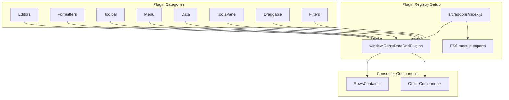
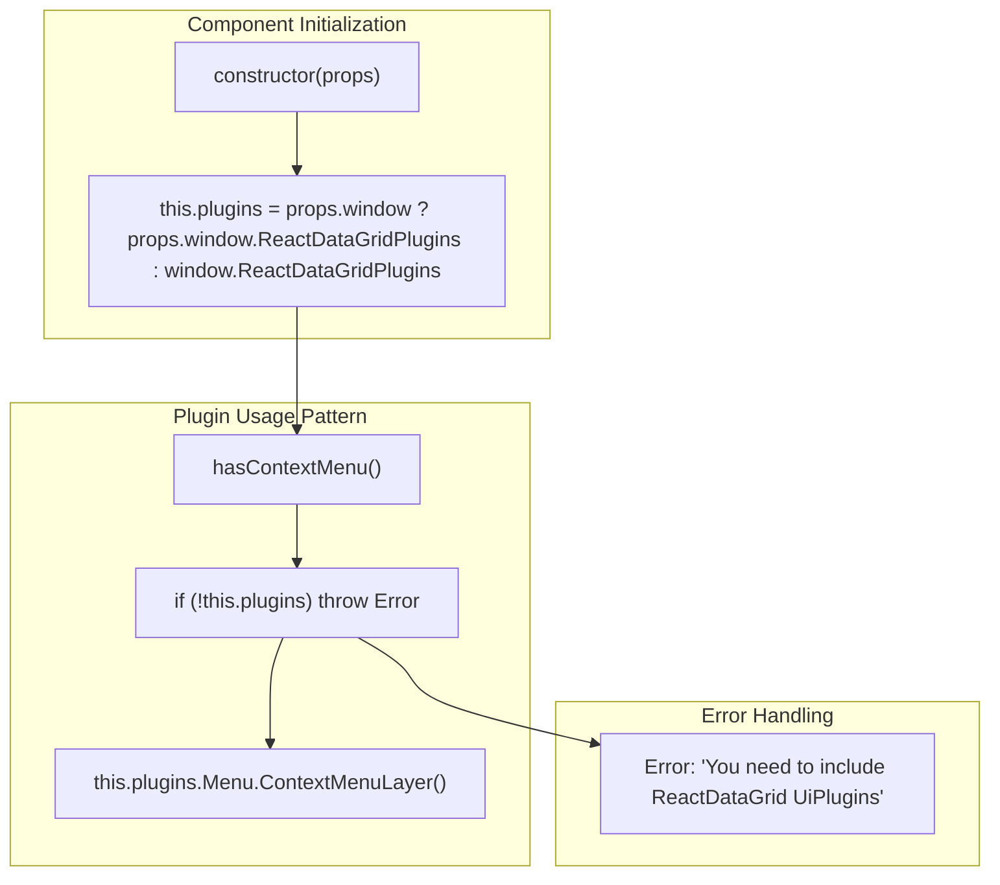
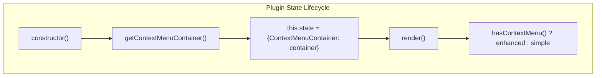

# Plugin Architecture

<details>
<summary>Relevant source files</summary>

The following files were used as context for generating this wiki page:

- [src/RowsContainer.js](src/RowsContainer.js)
- [src/__tests__/RowsContainer.spec.js](src/__tests__/RowsContainer.spec.js)
- [src/addons/index.js](src/addons/index.js)

</details>


This document explains the plugin architecture used by react-data-grid to provide extensible functionality. The plugin system allows components to dynamically discover and integrate additional capabilities without tight coupling to the core grid implementation.

For information about specific available plugins and their configuration, see [Available Plugins](#5.2). For editor-specific plugin integration, see [EditorContainer and Editor Lifecycle](#4.1).

## Overview

The react-data-grid plugin architecture is built around a global registry pattern that exposes plugins through `window.ReactDataGridPlugins`. This design allows components to conditionally access extended functionality while maintaining modularity and avoiding dependency issues when plugins are not needed.

## Global Plugin Registry

The plugin system centers on a global registry defined in [src/addons/index.js:10]().


**Plugin Registry Architecture**

The registry aggregates all plugin categories into a single global object accessible throughout the application. Each plugin category corresponds to a specific functional area of the grid system.

Sources: [src/addons/index.js:1-12]()

## Plugin Categories

The plugin system organizes functionality into distinct categories, each serving specific grid capabilities:

| Plugin Category | Purpose | Source Module |
|-----------------|---------|---------------|
| `Editors` | Cell editing components | `./editors` |
| `Formatters` | Cell value formatting | `./formatters` |  
| `Toolbar` | Grid toolbar components | `./toolbars/Toolbar` |
| `ToolsPanel` | Additional toolbar panels | `./toolbars` |
| `Data` | Data manipulation utilities | `./data/` |
| `Menu` | Context menu components | `./menu` |
| `Draggable` | Drag and drop functionality | `./draggable` |
| `Filters` | Column filtering components | `./cells/headerCells/filters` |

Sources: [src/addons/index.js:1-8]()

## Component Plugin Integration Pattern

Components access plugins through a consistent pattern that handles both global and injected plugin registries.


**Component Plugin Access Pattern**

The `RowsContainer` component demonstrates the standard plugin integration approach:

1. **Plugin Registry Access**: Components first attempt to use injected plugins via `props.window`, falling back to the global registry [src/RowsContainer.js:19]()

2. **Conditional Plugin Usage**: Components check for plugin availability before attempting to use them [src/RowsContainer.js:35-37]()

3. **Error Handling**: Clear error messages guide developers when required plugins are missing [src/RowsContainer.js:29]()

4. **Dynamic Plugin Integration**: Plugins are used to enhance component functionality without requiring them in all use cases [src/RowsContainer.js:31]()

Sources: [src/RowsContainer.js:16-33]()

## Plugin Discovery and Validation

Components implement plugin discovery patterns that gracefully handle missing plugins:

```javascript
hasContextMenu() {
  return this.props.contextMenu && React.isValidElement(this.props.contextMenu);
}

getContextMenuContainer() {
  if (this.hasContextMenu()) {
    if (!this.plugins) {
      throw new Error('You need to include ReactDataGrid UiPlugins in order to initialise context menu');
    }
    return this.plugins.Menu.ContextMenuLayer('reactDataGridContextMenu')(SimpleRowsContainer);
  }
}
```

This pattern ensures that:
- Plugin functionality is only activated when explicitly requested
- Missing plugins generate helpful error messages
- Components remain functional when plugins are not available

Sources: [src/RowsContainer.js:26-33](), [src/RowsContainer.js:35-37]()

## Plugin State Management

Components that use plugins manage plugin-related state through standard React patterns:


**Plugin State Management Flow**

The `RowsContainer` stores plugin-derived components in state to avoid repeated plugin lookups during rendering cycles.

Sources: [src/RowsContainer.js:23](), [src/RowsContainer.js:47-49]()

## Testing Plugin Integration

The testing patterns demonstrate how to handle plugin dependencies in unit tests:

```javascript
// Test without plugins
componentWithoutContextMenu = ReactTestUtils.renderIntoDocument(
  <RowsContainer window={{ ReactDataGridPlugins: undefined }} />
);

// Test with plugins (using global registry)
componentWithContextMenu = ReactTestUtils.renderIntoDocument(
  <RowsContainer 
    contextMenu={<ReactDataGridContextMenu />}
    rowIdx={fakeRowIdx}
    idx={fakeIdx} />
);
```

Testing approaches include:
- **Plugin Injection**: Tests can override the global registry by providing a custom `window` prop
- **Plugin Validation**: Tests verify that plugin-enhanced components function correctly
- **Prop Propagation**: Tests ensure that plugin components receive appropriate props

Sources: [src/__tests__/RowsContainer.spec.js:14](), [src/__tests__/RowsContainer.spec.js:28-34]()

## Plugin Architecture Benefits

The plugin architecture provides several advantages:

1. **Modular Loading**: Applications can include only needed functionality
2. **Runtime Discovery**: Components adapt behavior based on available plugins  
3. **Dependency Isolation**: Core grid functionality works without plugins
4. **Extensibility**: New plugin categories can be added without core changes
5. **Testing Flexibility**: Plugin dependencies can be mocked or injected during testing

This architecture enables react-data-grid to serve both simple use cases with minimal overhead and complex applications requiring extensive customization.

Sources: [src/addons/index.js:10-11](), [src/RowsContainer.js:16-24]()
