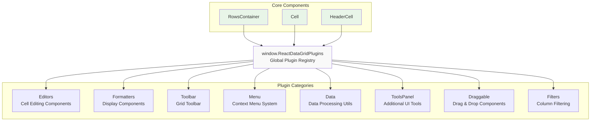
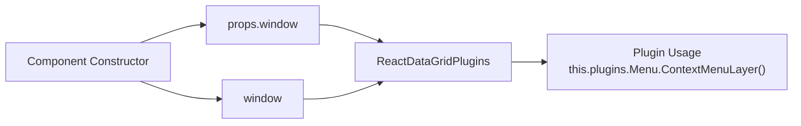
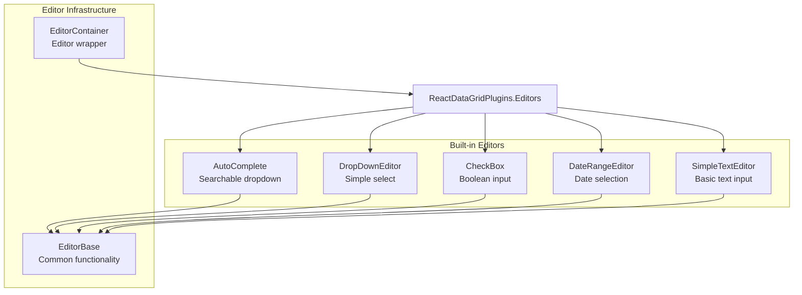
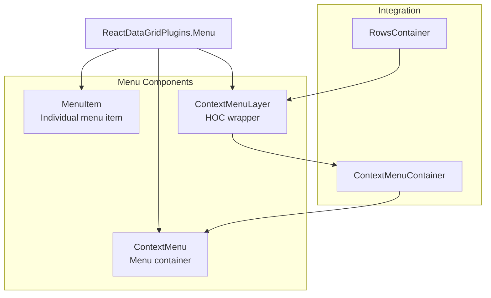
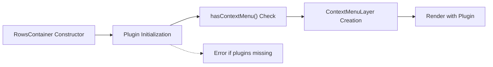
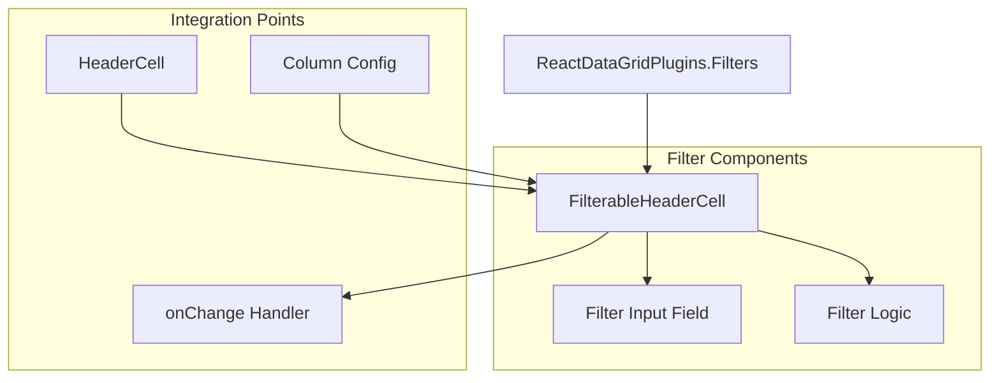

# Plugin System and Addons

<details>
<summary>Relevant source files</summary>

The following files were used as context for generating this wiki page:

- [examples/scripts/example13-all-features.js](examples/scripts/example13-all-features.js)
- [examples/scripts/example14-all-features-immutable.js](examples/scripts/example14-all-features-immutable.js)
- [src/RowsContainer.js](src/RowsContainer.js)
- [src/__tests__/RowsContainer.spec.js](src/__tests__/RowsContainer.spec.js)
- [src/addons/cells/headerCells/FilterableHeaderCell.js](src/addons/cells/headerCells/FilterableHeaderCell.js)
- [src/addons/index.js](src/addons/index.js)

</details>


The plugin system provides a modular architecture for extending react-data-grid functionality without modifying core components. This system uses a global registry pattern that allows third-party developers to add editors, formatters, toolbar components, and other UI enhancements. This document covers the plugin architecture, available plugin categories, and integration patterns.

For information about specific built-in editors, see [Built-in Editors](#4.2). For details about the editor lifecycle and validation, see [EditorContainer and Editor Lifecycle](#4.1).

## Plugin Architecture Overview

The plugin system is built around a global registry pattern where all plugins are registered under `window.ReactDataGridPlugins`. This allows core grid components to dynamically access plugin functionality without direct imports or tight coupling.

### Plugin Registry Structure



**Sources:** [src/addons/index.js:1-12](), [src/RowsContainer.js:19-33]()

## Global Plugin Registry

The plugin registry is initialized in the main addons index file, which aggregates all available plugins and exposes them globally.

### Registry Implementation

The global registry is created by the `src/addons/index.js` file, which imports all plugin categories and assigns them to the global window object:

| Plugin Category | Purpose | Key Components |
|----------------|---------|----------------|
| `Editors` | Cell editing components | AutoComplete, CheckBox, DropDown |
| `Formatters` | Cell display formatters | ImageFormatter, various display helpers |
| `Toolbar` | Grid toolbar components | Toolbar with add/filter controls |
| `Menu` | Context menu system | ContextMenu, MenuItem components |
| `Data` | Data processing utilities | Selectors, filters, data helpers |
| `ToolsPanel` | Additional UI panels | Extended toolbar functionality |
| `Draggable` | Drag and drop support | Draggable component wrapper |
| `Filters` | Column filtering | Header cell filter components |

### Registry Access Pattern

Components access plugins through a consistent pattern that handles both normal and test environments:



**Sources:** [src/RowsContainer.js:19-33](), [src/addons/index.js:10-11]()

## Plugin Categories and Components

### Editor Plugins

Editor plugins provide specialized cell editing functionality beyond basic text input. These are accessed via `ReactDataGridPlugins.Editors`:



**Sources:** [examples/scripts/example13-all-features.js:6-9](), [examples/scripts/example14-all-features-immutable.js:5-8]()

### Formatter Plugins

Formatters control how cell data is displayed and are accessed via `ReactDataGridPlugins.Formatters`:

**Example Usage:**
```javascript
formatter: ReactDataGridPlugins.Formatters.ImageFormatter
```

### Menu Plugins

The menu system provides context menu functionality through `ReactDataGridPlugins.Menu`:



**Sources:** [src/RowsContainer.js:26-44](), [examples/scripts/example14-all-features-immutable.js:11,147-158]()

## Component Plugin Integration

### RowsContainer Plugin Usage

The `RowsContainer` component demonstrates the standard pattern for plugin integration:

1. **Plugin Access**: Components access plugins via `props.window` (for testing) or global `window`
2. **Plugin Validation**: Components check plugin availability before usage
3. **Dynamic Loading**: Plugins are loaded on-demand when needed



### Error Handling

The system includes validation to ensure required plugins are available:

- Components check for plugin existence before usage
- Clear error messages indicate missing plugin dependencies
- Graceful fallback behavior when plugins are unavailable

**Sources:** [src/RowsContainer.js:16-33](), [src/__tests__/RowsContainer.spec.js:9-51]()

## Plugin Usage Examples

### Column Configuration with Plugins

Columns can specify editors and formatters from the plugin registry:

| Column Property | Plugin Type | Example |
|----------------|-------------|---------|
| `editor` | Editor Plugin | `<AutoCompleteEditor options={counties}/>` |
| `formatter` | Formatter Plugin | `ReactDataGridPlugins.Formatters.ImageFormatter` |
| `headerRenderer` | Formatter Plugin | `<ImageFormatter value={image} />` |

### Toolbar Integration

The toolbar plugin provides add/filter functionality:

```javascript
toolbar={<Toolbar onAddRow={this.handleAddRow}/>}
```

### Context Menu Setup

Context menus are configured through the `contextMenu` prop and use the Menu plugin system:

```javascript
contextMenu={<MyContextMenu />}
```

**Sources:** [examples/scripts/example13-all-features.js:75-179,244](), [examples/scripts/example14-all-features-immutable.js:47-145,217,226]()

## Filter Plugin System

The filter system provides column-level filtering through specialized header cell components:



The `FilterableHeaderCell` component provides text-based filtering with configurable behavior:

- Supports `filterable: false` to disable filtering per column
- Uses controlled component pattern with internal state
- Integrates with column configuration for customization

**Sources:** [src/addons/cells/headerCells/FilterableHeaderCell.js:1-42](), [src/addons/index.js:8-11]()
