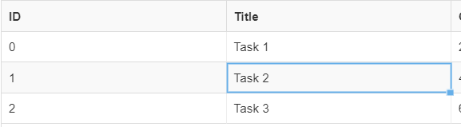

## Data Virtualization
ReactDataGrid has been optimized to render data in a highly efficient manner. The grid data is virtualized both for rows as well as columns, only rendering exactly what is necessary to the viewport to allow for performant grid interaction, like for actions such as scrolling and cell navigation. The calulation for which rows and columms to render to the Canvas happens in the [Viewport](https://github.com/adazzle/react-data-grid/blob/master/packages/react-data-grid/src/Viewport.js). 

It uses input parameters such as gridHeight, rowHeight, scroll length and direction to determine the visible and overscan indexes of the rows and columns. Rows and columns which fall between the visible indexes are rendered to the Canvas and are visble. Rows and columns which fall outside the visible indexes but inside the overscan indexes are also rendered to the Canvas but are not visible. This buffer of rows and columns allows for smooth scrolling with minimal lag even for data sets that contain thousands of rows and columns. 

### Virtualization props
The most important props that the Viewport passes to the Canvas are the following:

- rowOverscanStartIdx - The index of the first invisible row to be rendered to the canvas.
- rowOverscanEndIdx - The index of the last invisible row to be rendered to the canvas.
- rowVisibleStartIdx - The index of the first visible row to be rendered to the canvas.
- rowVisibleEndIdx - The index of the last visible row to be rendered to the canvas.
- colVisibleStartIdx - The index of the first visible column to be rendered to the canvas.
- colVisibleEndIdx - The index of the last visible column to be rendered to the canvas.
- colOverscanStartIdx - The index of the first visible column to be rendered to the canvas.
- colOverscanEndIdx - The index of the last visible column to be rendered to the canvas.

### Virtualization when scrolliing
When the grid is being scrolled, it is important that only the minimal necessary amount of rows and columns are rendered to the canvas. One way that ReactDataGrid optimises this range, is using the scroll direction. See the diagrams below for an example of how the rendered rows are calculated on scrolling

### Scrolling downwards
When scrolling downwards, it is unnecessary to render any columns outside of the visible window. Rendering a buffer of extra columns will only slow down scrolling and create lag. The only buffer that should be rendered is the rows at the bottom of the canvas. These overscan rows will make scrolling appear smoother as the rows already exist in the dom at the time the viewport scrolls to their position. 


### Scrolling upwards
When scrolling upwards, the only buffer that should be rendered is the rows at the top of the canvas.


### Scrolling right
When scrolling right, it is unnecessary to render any rows outside of the visible window. Rendering a buffer of extra rows will only slow down scrolling and create lag. The only buffer that should be rendered are some overflow columns to the right of the canvas. These overscan columns will make horizontal scrolling appear smoother as the columns  already exist in the dom at the time the viewport scrolls to their position. 


### Scrolling Left
When scrolling left, the only buffer that should be rendered is some columns to the left of the canvas. This is reverse of the previous image.


## Interaction Layer

A recent major change to the core RDG architecture was to migrate all the grid interaction functionality, out of the Row and Cell components and into it's own separate layer, known as the InteractionMask. 

The aim of this was 
1. To significantly improve grid interaction performance. Prior to the change, the Cell component had quite a few expensive operations that were called for each render of each Cell. With grids that displayed many cells, the performance overhead was significant, and the grid interaction was noticably laggy.
2. To simplify the Row and Cell components which had become bloated with too much functionality.

The responsibilities of the InteractionMask are
- Render a SelectionMask which is used to control cell selection and navigation on the grid
- Render an EditorContainer when a cell is updated for editing
- Render a DragMask when the DragHandle of a cell is dragged up or down
- Render a CopyMask when a cell is pasted or copied from
- Render a CellRangeSelectionMask when a range of cells is selected

Let's take a look at some of the above functionalty in more detail

### Cell Selection and Navigation
When a cell is selected, either with a mouse click, or with the array keys of the keyboard, the InteractionMask will render a blue ractangular SelectionMask around the border of the cell that was selected.



The InteractionMask keeps track of the selected cell `{idx, rowIdx}` in state. However, the InteractionMask does not know how to relate coordinates on the screen to an actual cells position on the grid. In order to update the state of the selected cells position in the InteractionMask, the InteractionMask needs to listen to events from the Cell component. This is possible as aach Cell component is aware of its position in the grid. Unfortunately, as InteractionMask and Cell sit at the same level in the component heirarchy, it is dificult for the two components to directly communicate with each other. 

### EventBus
To solve this issue as well as similar use cases, we introduced an [EventBus](https://github.com/adazzle/react-data-grid/blob/master/packages/react-data-grid/src/masks/EventBus.js) object to allow for easier communication between sibling components, as well as to provide a way for components to propagate state changes to their descendants deep in the component hierarchy. We originally looked to solve this problem by incorperating a state management solultion like Redux, as well as a custom RxJs state manager. These added too much overhead to what we wanted to achieve and in the end, we decided to create a very simple event bus object that is passed down from the root component, allowing components to publish and subscribe to events.


### Cell Editing
The InteractionMask also keeps track of which cell is being current edited. It listens to both keypresses and mouse double clicks and uses the SelectedCell coordinates to open the [EditorContainer](https://github.com/adazzle/react-data-grid/blob/master/packages/common/editors/EditorContainer.js) in the same position as the SelectedCell.
The EditorContainer will render an editor as defined by `column.editor`. An editor will remain open, until it is commited. By default the EditorContainer will call commit for the following scenarios
 - When the user clicks Enter from the primary input of the editor
 - When the user clicks Tab from the primary input of the editor
 - When the primary input of the editor is unfocussed
 - When the onCommit prop is called manually by the editor

Note that it is entirely possible to change this default behavior by prevent certain events from bubbling up from the editor to the EditorContainer by calling `event.stopPropagation();` from the editor.

Once commit has been called, this callback will propogate up to the root ReactDataGrid component and fire an onGridRowsUpdated event.
See the Editing examples for an overview on how this works.

By default, each cell of ReactDataGrid is readonly. It can be turned on for a given column as described in this article.

### Cell Update scenarios
When editing is enabled, it is possible to update the values of a cell in the following ways
 * Using the supplied editor of the column. The default editor is the [SimpleTextEditor](https://github.com/adazzle/react-data-grid/blob/master/packages/common/editors/SimpleTextEditor.js).
 * Copy/pasting the value from one cell to another <kbd>CTRL</kbd>+<kbd>C</kbd>, <kbd>CTRL</kbd>+<kbd>V</kbd>
 * Update multiple cells by dragging the fill handle of a cell up or down to a destination cell.
 * Update all cells under a given cell by double clicking the cell's fill handle.

### Enabling cell edit
In order for the cells of a column to be editable, you need to do the following:

1. Set the `editable` property of the column to be true.
2. Provide an `onGridRowsUpdated` handler function. The below snippet is an example handler that handles all the above update scenarios. 

```javascript
  onGridRowsUpdated = ({ fromRow, toRow, updated }) => {
    this.setState(state => {
      const rows = state.rows.slice();
      for (let i = fromRow; i <= toRow; i++) {
        rows[i] = { ...rows[i], ...updated };
      }
      return { rows };
    });
  };
```
