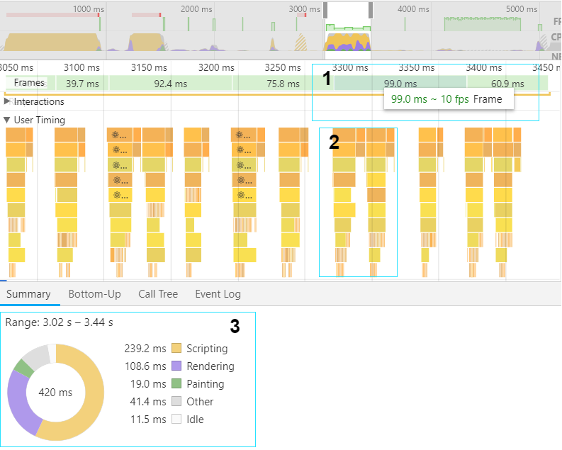

## Overview
ReactDataGrid V5 brought about a large rewrite of the core architecture with the main goal to improve performance of the grid. These performance issues were most noticeable in use cases where many rows and columns needed to be rendered to the screen, as well as when custom cell formatters were used to display the cell content. For cell formatters which were expensive to render, this could dramatically degrade grid performance for operations such as scrolling and cell navigation. It was clear to the naked eye that these issues were present in some of our production applications. We needed a solution to measure and solve the performance problems once and for all.

## Identifying the problems
When using ReactDataGrid in our production environment for very large datasets, we could see performance degradation for the following situations
 - Changing cells by navigating with the arrow keys of the keyboard
 - Scrolling vertically for grids which had many columns
 - Scrolling horizontally for grids which had many rows
 - Updating cell values by dragging the drag handle of a cell upwards or downwards

We needed a way to measure the performance for each situation and ensure that the changes made would significantly improve these measurements.

## Benchmarking
Before optimizing an application, it is critical that you start with a benchmark, such that you can be sure the changes you make are actually improving performance. One of the best tools for measuring performance and identifying perf issues is the Performance tab of the Chrome dev tools. Note: since RDG v5 was released, the React team have released a new [profiler tool](https://reactjs.org/blog/2018/09/10/introducing-the-react-profiler.html) to more easily measure performance. I will demonstrate how we used the chrome dev tools, as well as how the new profiler tool could be used to solve our performance issues.

## Benchmark Example
Here is the example that we will run our benchmarks against. The version of the grid is v4.0.9, the last version before the major architecture changes in v5. The grid has 100 rows and 50 columns all using a custom formatter.
<iframe src="https://codesandbox.io/embed/m78my865w9?autoresize=1&hidenavigation=1&view=preview" style="width:100%; height:600px; border:0; border-radius: 4px; " sandbox="allow-modals allow-forms allow-popups allow-scripts allow-same-origin"></iframe>

## Test: Navigating cells using arrow keys
The image below shows a recorded flame chart which is the result of navigating the first 15 columns from right to left with the arrow keys. For a detailed explanation of how to use the chrome perf tools to analyse runtime performance, please click [here](https://developers.google.com/web/tools/chrome-devtools/evaluate-performance/).




From the image above we can note the following
1. **FPS chart** This chart provides an overview of the frame rate across the duration of a recording. In general, the higher the green bar, the better the frame rate. In this case, the average Frames Per Second (FPS) is very low, approximately 10FPS. For smooth animations, we should at least be trying to achieve a frame rate of 30FPS.
2. **User timing section** This lets you see which components exactly get mounted, updated, and unmounted, how much time they take relative to each other. The UserTimings section shows the whole component hierarchy is being rerendered multiple times. This is probably a good place to start to look to improve.
3. **Summary** This section shows the breakdown of what tasks the Javascript engine is performing during the recorded time. Here we see that a lot of time is spent scripting as opposed to rendering. This is also something that is worth taking a look at.

## A closer look at the user timing section


Here we can see that there are a significant amount of Cell updates for each cell change. Could there be a way to make this more efficient?

## Using the React profiler
As previously mentioned, it is now possible to use the React profiler to analyse the performance of React applications. See [here](https://reactjs.org/blog/2018/09/10/introducing-the-react-profiler.html) for a description on how to use the tool.

## React Profiler Flame chart


The flame chart view represents the state of your application for a particular commit. Each bar in the chart represents a React component (e.g. Row, Cell). The size and color of the bar represent how long it took to render the component and its children. (The width of a bar represents how much time was spent when the component last rendered and the color represents how much time was spent as part of the current commit.)

Looking at the flame chart above shows that the Canvas and Row components are taking the longest time to render and commit. This is due to the amount of children Cell components that Row needs to render. This confirms our previous theory that the majority of the rendering work is being done by Cell. This means that if we have a grid with a lot of cells, each with a custom formatter then that is quite a bit of overhead for the cell navigation operation. 

## React Profiler Rank chart


The ranked chart view represents a single commit. Each bar in the chart represents a React component (e.g. Row, Cell). The chart is ordered so that the components which took the longest to render are at the top. Here we see the Cell component is taking the longest portion of the rendering time.


By the time the navigation operation has finished, we can see that the Row component has been rerendered 17 times. Each one causing an update to its child Cells. This is completely unnecessary and will be our starting point for a solution.

## Minimising unnecessary renders
So far we have investigated that the Row and Cell components are being updated many times each time we change a cell using the keyboard.
One way in which we can prevent a component from updating is to implement a [shouldComponentUpdate](https://reactjs.org/docs/react-component.html#shouldcomponentupdate) function. Use shouldComponentUpdate() to let React know if a component’s output is not affected by the current change in state or props. If the function returns false based on new props and state, then the component will not update when its input changes.

As a best practice, these functions should be simple and efficient. Checks aren’t free, and doing lots of checks can slow down your application. At the time of v4, both Cell and Row implemented shouldComponentUpdate functions that were neither simple or efficient.

### Cell shouldComponentUpdate
```javascript
// Bad example of a shouldComponentUpdate function
shouldComponentUpdate(nextProps: any): boolean {
    let shouldUpdate = this.props.column.width !== nextProps.column.width
      || this.props.column.left !== nextProps.column.left
      || this.props.column.cellClass !== nextProps.column.cellClass
      || this.props.height !== nextProps.height
      || this.props.rowIdx !== nextProps.rowIdx
      || this.isCellSelectionChanging(nextProps)
      || this.isDraggedCellChanging(nextProps)
      || this.isCopyCellChanging(nextProps)
      || this.props.isRowSelected !== nextProps.isRowSelected
      || this.isSelected()
      || this.props.isCellValueChanging(this.props.value, nextProps.value)
      || this.props.forceUpdate === true
      || this.props.className !== nextProps.className
      || this.props.expandableOptions !== nextProps.expandableOptions
      || this.hasChangedDependentValues(nextProps)
      || this.props.column.locked !== nextProps.column.locked;
    return shouldUpdate;
  }
```

This shouldComponentUpdate was becoming so overly complex that it caused unnecessary Cell renders when navigating with the keyboard. It also caused quite a few bugs, whereby Cells were not rendered when they were supposed to be.

## Moving expensive code to a higher level component
If you have some expensive calculations in the render method of a component that is rendered multiple times, you might reduce the number of calls by an order of magnitude by off-loading these calculations to a higher-level component. Looking at the Cell component in v4, we saw that at a high level it had the following responsibilities.

 - Rendering cell content 
 - Listening to keyboard events
 - Rendering a selection component to identify whether cell is selected or not
 - Rendering a highlighted section to identify whether the cell is being dragged up or down
 - Rendering an EditorContainer when the cell is being edited
 - Rendering a highlighted section to identify whether the cell is being copied or not

Looking at the above list we thought of ways in which we could make Cell navigation more efficient by moving some of these responsibilities to a higher level component, one which would not be rendered as many times as the Cell component. We came up with a proof of concept for this called the [InteractionMask](https://github.com/adazzle/react-data-grid/blob/master/packages/react-data-grid/src/masks/InteractionMasks.js).

##  InteractionMask

The responsibilities of the InteractionMask are
- Render a SelectionMask which is used to control cell selection and navigation on the grid
- Render an EditorContainer when a cell is updated for editing
- Render a DragMask when the DragHandle of a cell is dragged up or down
- Render a CopyMask when a cell is pasted or copied from
- Render a CellRangeSelectionMask when a range of cells is selected

Since there is only one InteractionMask, we thought that this could take a lot of the weight off the Row and Cell components and thus speed up grid interactions. Our initial benchmarks were very successful and we decided to implement the functionality in v5.

See the [Implementation Notes](../docs/implementation-notes#interaction-layer) for a more detailed description on how the InteractionMask works.

## Remeasuring performance after changes


The proof of concept for the InteractionMask showed significant performance improvements for the use case of Cell navigation. In the above screenshot, we see the following improvements

 1. **Average FPS > 3x higher.** Each frame is consistently rendered above 30FPS, making the navigation operation appear much smoother.
 2. **Minimised component mounting/updating.** The UserTiming section is much more streamlined than before. In fact, now no Rows or Cells are rendered when we change cells with the keyboard. Only the InteractionMask and its child the SelectionMask are rerendered.
 3. **Reduced scripting time** The scripting time from the initial benchmarks have been significantly reduced.

 Looking at the React profiler we see similar positive results

## Flame Chart with InteractionMask solution
 

 The flame chart shows that Row and Cells components are only rendered once, and are not updated when we change Cell position with the keyboard.

## Rank Chart with InteractionMask solution
 

The rank chart now shows the InteractionMask is the component which took the longest to render. The Cell component no longer appears on this list.

As a result of these enhancements, we are now able to remove the complex shouldComponentUpdate functions from both Row and Cell, greatly simplifying the source code for these components, without affecting performance.

## Conclusion
There are some great community tools to investigate and resolve performance issues in React applications. We have looked at both the Performance tab of [Chrome dev tools](https://developers.google.com/web/tools/chrome-devtools/evaluate-performance/) and the [React Profiler](https://reactjs.org/blog/2018/09/10/introducing-the-react-profiler.html). Before starting any performance optimizations it is vital to create some benchmark tests to ensure that any implemented changes are in fact improving the performance of your application. After that, a proof of concept should be undertaken to check whether your strategy improves the performance or not. We have looked at two strategies to optimize performance in the post, minimising renders both by implementing a shouldComponentUpdate function, as well as moving expensive code to a higher level component. In a future post, we will look at the strategies we used to improve scrolling performance in the grid. Stay tuned!!

Lastly, many thanks to [Aman Mahajan](https://github.com/amanmahajan7) for all his contributions on these performance improvements.
